# Docker

使用的是CentOS7

## 安装Docker

使用以下命令获取阿里云镜像并安装

```shell
curl -fsSL https://get.docker.com | bash -s docker --mirror Aliyun

```

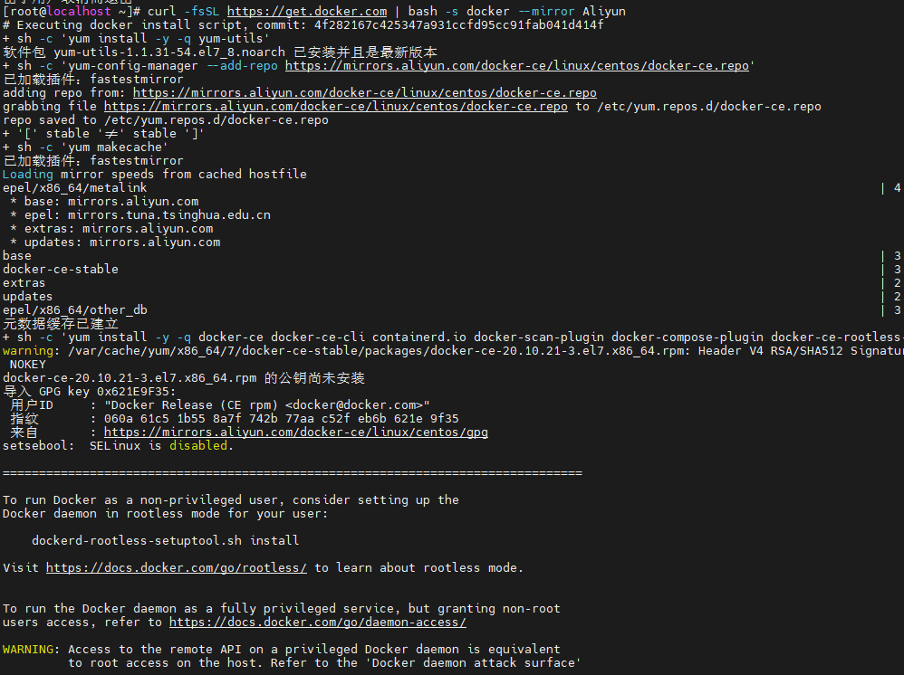

## 启动Docker

直接使用Docker命令我这里报错

```
Cannot connect to the Docker daemon at unix:///var/run/docker.sock. Is the docker daemon running?
```

使用这个命令启动服务

```shell
systemctl restart docker.service
```


## 运行apache镜像

安装apache镜像,因为apache可以直接启动并访问

1. 查找可以使用的apache镜像

   ```shell
   docker search apache
   ```

   我这有以下输出，第一个httpd就是apache服务器。

   ```shell
   NAME                           DESCRIPTION                                     STARS     OFFICIAL   AUTOMATED
   httpd                          The Apache HTTP Server Project                  4248      [OK]
   tomcat                         Apache Tomcat is an open source implementati…   3440      [OK]
   cassandra                      Apache Cassandra is an open-source distribut…   1428      [OK]
   maven                          Apache Maven is a software project managemen…   1427      [OK]
   zookeeper                      Apache ZooKeeper is an open-source server wh…   1295      [OK]
   solr                           Apache Solr is the popular, blazing-fast, op…   934       [OK]
   apache/airflow                 Apache Airflow                                  404
   flink                          Apache Flink® is a powerful open-source dist…   361       [OK]
   apache/nifi                    Unofficial convenience binaries and Docker i…   264                  [OK]
   storm                          Apache Storm is a free and open source distr…   181       [OK]
   apache/superset                Apache Superset                                 169
   apache/zeppelin                Apache Zeppelin                                 165                  [OK]
   groovy                         Apache Groovy is a multi-faceted language fo…   137       [OK]
   apache/skywalking-oap-server   Apache SkyWalking OAP Server                    125
   tomee                          Apache TomEE is an all-Apache Java EE certif…   99        [OK]
   bitnami/apache                 Bitnami Apache Docker Image                     82                   [OK]
   apache/druid                   Apache Druid                                    52
   apache/apisix                  Apache APISIX: Cloud-Native API Gateway         51
   ubuntu/apache2                 Apache, a secure & extensible open-source HT…   47
   apache/nifi-registry           Unofficial convenience binaries for Apache N…   40
   apache/tika                    Apache Tika Server - the content analysis to…   27
   apache/couchdb                 Unofficial convenience binaries for CouchDB,…   22
   apache/apisix-dashboard        https://github.com/apache/apisix-dashboard      22
   apache/fineract                Apache Fineract                                 10
   apache/arrow-dev               Apache Arrow convenience images for developm…   3
   ```

   

2. 拉去apache镜像

   可以直接使用以下命令拉去镜像

   ```shell
   docker pull httpd
   ```

   docker默认会拉去最新版本,可以到官网[DockerHub](https://hub.docker.com) 查看历史版本。我这里安装2.4.54版本,docker官方也会提供拉取命令。

   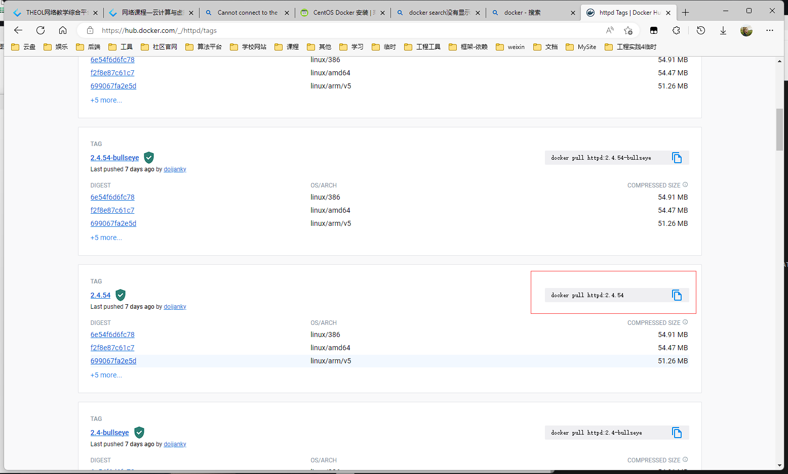

3. 查看是否已经拉取镜像成功

   ```docker
   docker images
   ```

   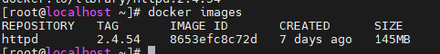

4. 运行镜像

   ```shell
    docker run -d -p 9000:80 httpd:2.4.54
   ```

   

   -p 9000:80 将主机9000端口映射到容器80端口

   运行docker ps -a可以查看容器运行状况

   

5. 访问apache

   使用ip addr 查看虚拟机ip地址

   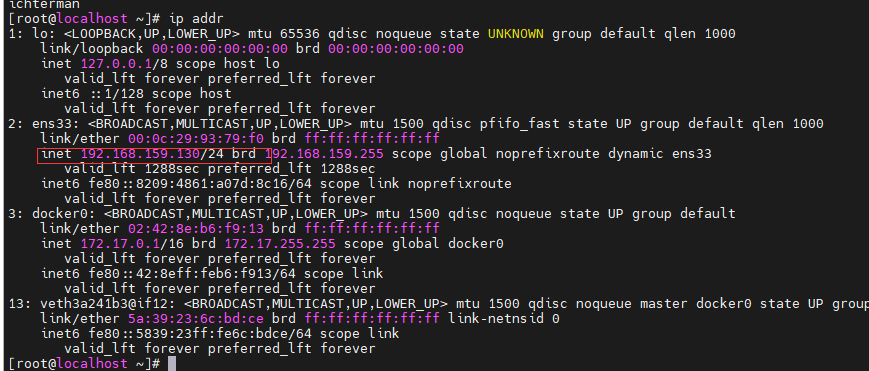

   由于我的虚拟机网卡使用的是NAT模式,可以在真机中直接访问`192.168.159.130:9000`(防火墙对端口已经放行)

   

6. 进入apache

   docker attach 和 dockers exec都可以进入容器,但是docker attache退出后容器会停止,所以使用exec

   ```shell
   docker exec -it e05cef47e1ad /bin/bash
   ```

   

   进入后看到了apache的目录,此时就可以在其中部署一些网站项目了。

7. 停止apache

   使用exit命令退出apache后,docker ps -a查看容器运行状况,赋值容器id,通过id停止容器

   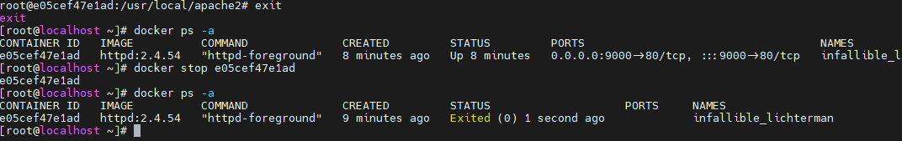


# KVM

## 准备

需要关闭内核隔离。


vmware虚拟机设置开启虚拟化引擎


添加一个硬盘。

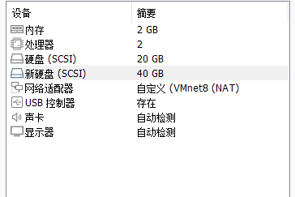

打开虚拟机

## 安装kvm

运行

```shell
grep -Ei 'vmx|svm' /proc/cpuinfo
```


有过滤出vmx或svm关键字就代表支持虚拟化，svm是AMD的CPU。

使用以下命令查看未格式化硬盘

```shell
fdisk -l
```


使用命令格式化硬盘

```shell
fdisk /dev/sdb
```


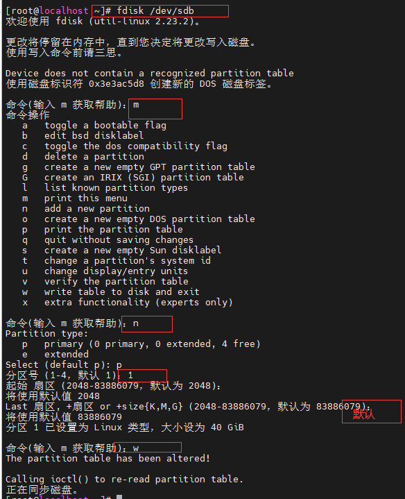

命令 `mkfs.ext4 /dev/sdb` 分区为 ext4 的文件系统格式。

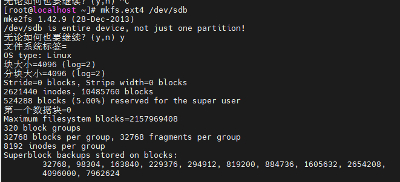

`mkdir /kev`创建kvm文件夹,`chmod 777 /kvm`赋予权限, `mount /dev/sdb /kvm`挂载磁盘


使用` vim /etc/fstab`命令编辑配置文件,开机自动挂载。


运行`yum install -y  virt-*  libvirt  bridge-utils qemu-img`安装kvm

## 配置网卡

到 /etc/sysconfig/network-scripts/目录下,查看所有文件,我的网卡是ifcfg-ens33,将其拷贝一份

```shell
cd /etc/sysconfig/network-scripts/
cp ifcfg-ens33 ifcfg-br0
```

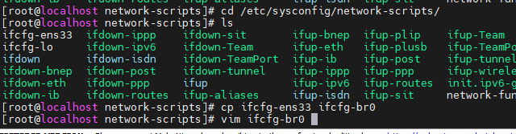

编辑新增的网卡

先前是这样


改成这样：

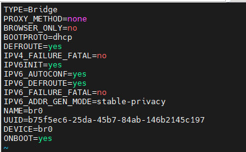

用命令`systemctl restart network`重启网卡

运行`ifconfig `命令查看网卡配置完成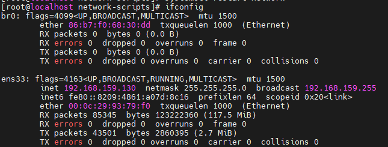

## 启动kvm

使用以下命令

```shell
lsmod |grep kvm #检查kvm模块是否加载
systemctl start libvirtd #启动libvirtd服务
ps aux |grep libvirtd #检查服务进程
brctl show #查看网卡
```


下载一个win7 iso镜像.....,时间太长,此时去安装VNC


## 安装VNC

### 安装ghome

由于我的linux不是图形界面,所以需要安装ghome.

```shell
yum -y upgrade #更新一下
yum -y install grub2-efi fwupdate #安装软件包
yum -y remove kernel #重启后运行命令移除旧内核然后再次重启
yum grouplist #查看可以安装的列表
```


```shell
yum -y groupinstall 'GNOME 桌面' '图形管理工具' #安装这两个工具
startx #启动图形界面
systemctl set-default multi-user.targe #设置默认启动方式 重启进入图形页面
```

运行`yum install  -y  tigervnc-server`安装VNC

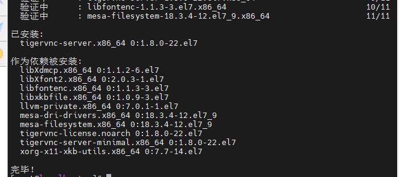

运行`vncserver`启动vnc


## 安装win7

准备好win7镜像和virtio驱动

[virtio驱动下载地址](https://fedorapeople.org/groups/virt/virtio-win/direct-downloads/archive-virtio/)

```shell
mkdir iso
mkdir kvmStory
chmod 777 -R iso
chmod 777 -R kvmStory
```

```shell
qemu-img create -f raw /kvm/kvmStory/win7.img 20G #创建镜像
chmod 777 /kvm/kvmStory/win7.img # 赋权
sysctl -a | grep overcommit #查看可分配内存
sysctl vm.overcommit_memory=1 #修改分配内存策略
osinfo-query os #查看支持的系统
```

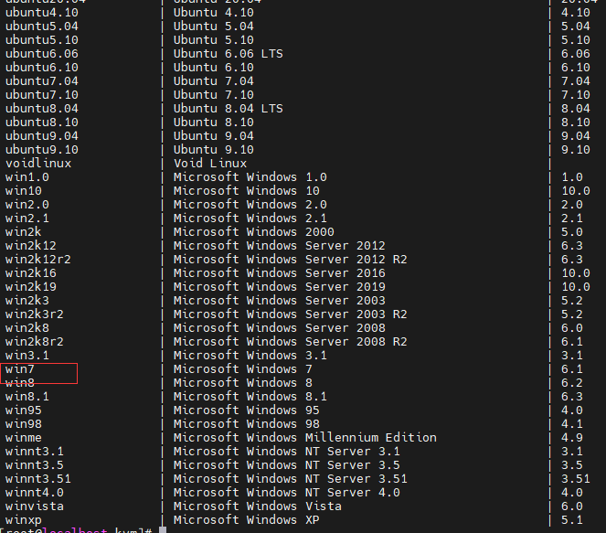

```shell
virt-install \
--name win7 \ #设置名字win7 后面用来启动停止和销毁
--os-variant=win7 --ram 512 --vcpus=1 \
--disk path=/kvm/kvmStroy/win7.img,size=30,format=qcow2,bus=ide \ #img为创建镜像位置
--accelerate --disk device=cdrom,path=/kvm/iso/win7.iso \ #win7镜像位置
--disk device=cdrom,path=/kvm/iso/virtio-win-0.1.103.iso \ #驱动位置
--vnc --vncport=5910 --vnclisten=0.0.0.0 \
--network bridge=br0,model=virtio --noautoconsole
```

## 使用VNC连接win7

通过VNC连接到win7 密码为先前安装时设置的密码 Passw0rd


进入后可以看win7正常运行


正常进入安装。


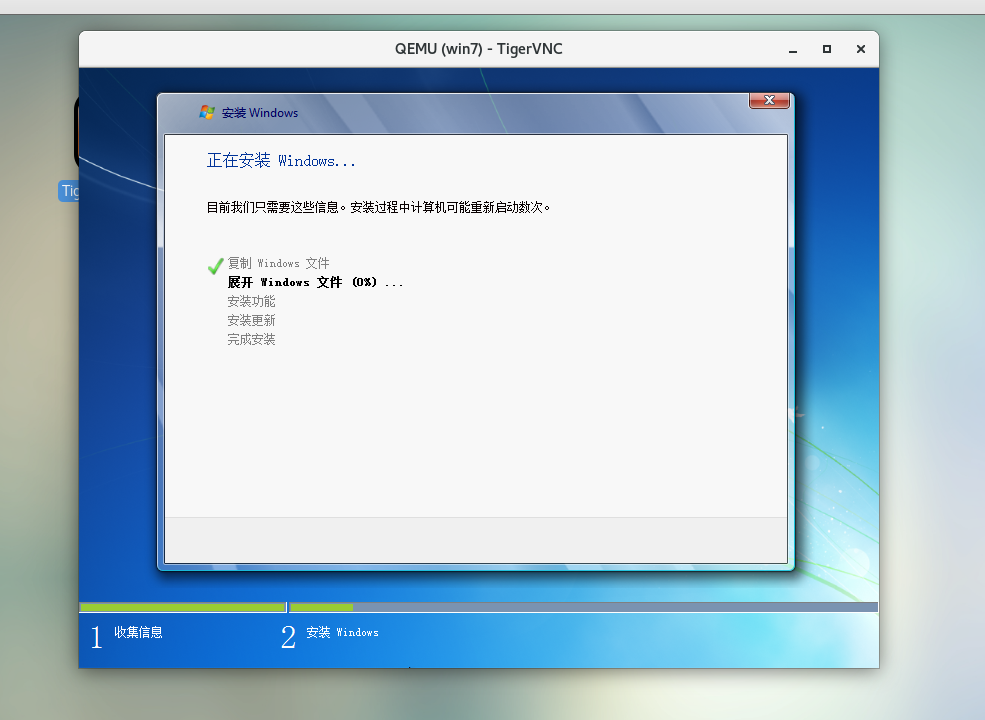

安装过程中突然自动关机,使用`virsh start win7`尝试启动。

等了一会，安装成功

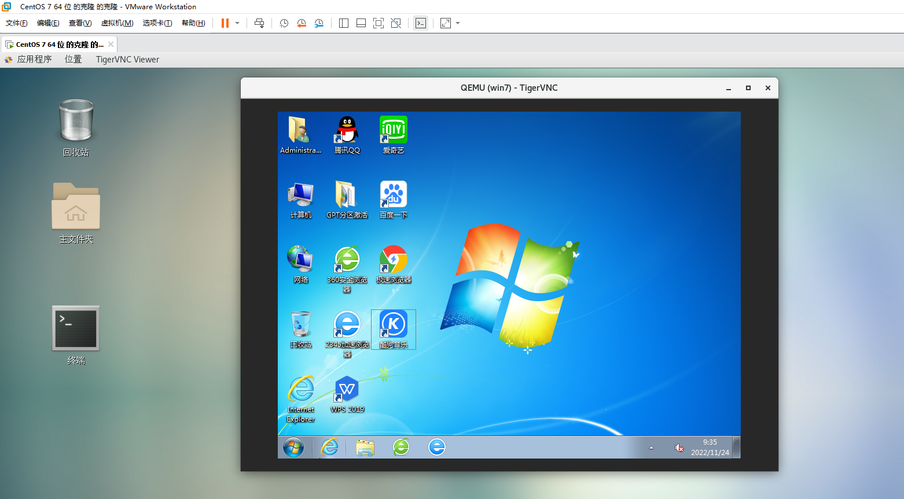

可以正常使用

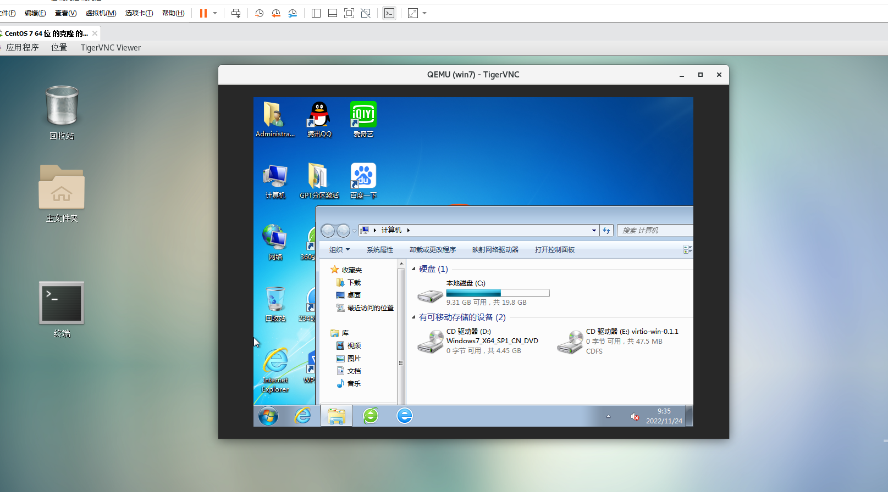

```shell
virsh list --all #列出所有虚拟机
virsh shutdown win7 #停止win7名字的虚拟机
virsh destroy  win7 #强制关闭win7名字的虚拟机
virsh undefine win7 #销毁win7虚拟机
virsh autostart #开机启动虚拟机
```

