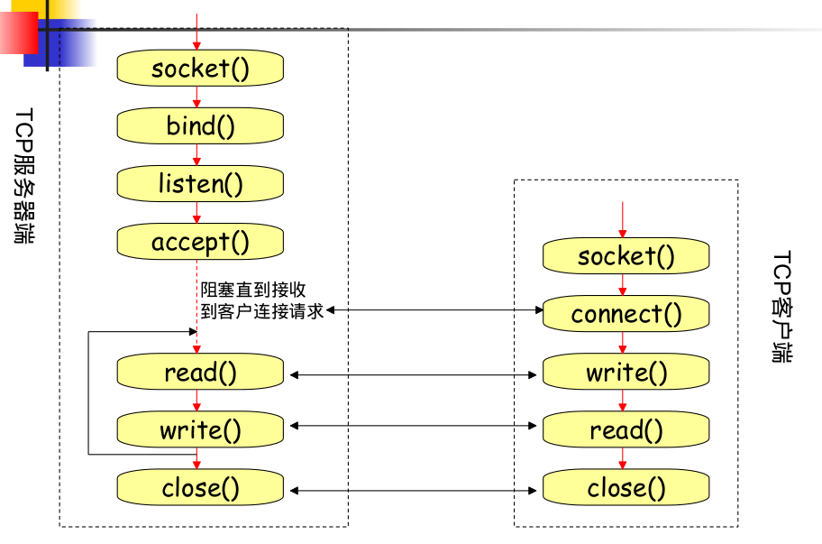
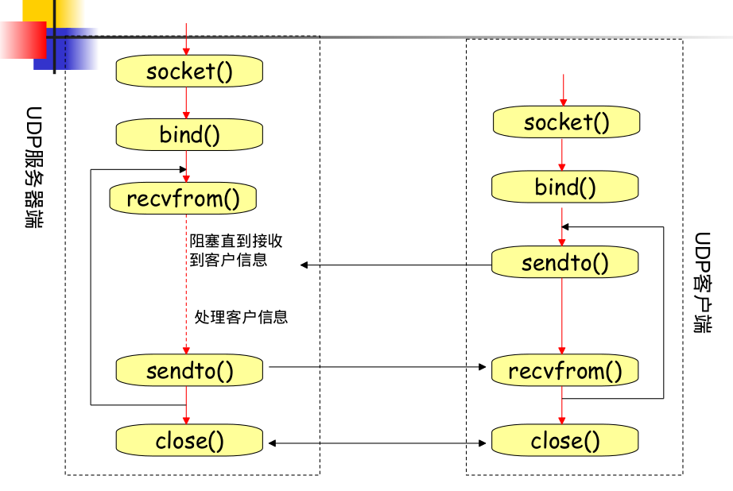
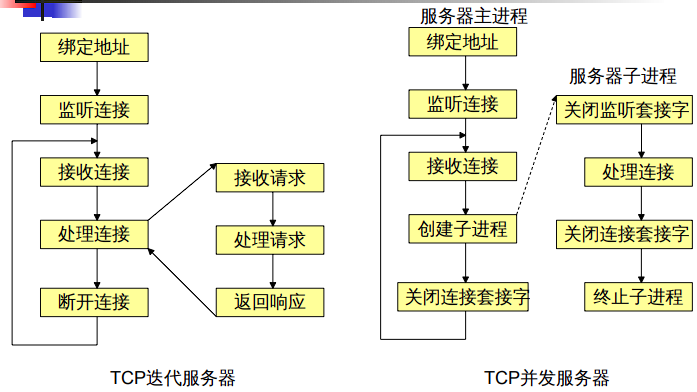

# 计算机网络基础

## 1.地址

### 物理地址

48位：24位OUI(组织唯一标志符)，24位
由厂商分配
平面地址，无结构
全球唯一
局部范围寻址
存在于数据链路层

### IP地址

IP地址标识着网络一个主机的位置。每个IP地址都是由32位
（或128位）组成，分成两部分：网络号、主机号。
 全球唯一，寻址容易
 两种表示形式：二进制（计算机内部）、点分十进制（便于
记忆）

### 端口地址

为了识别传输层之上不同的网络通信程序（进程），传输层引入了
端口的概念。

TCP和UDP使用16位的端口号（用无符号整型
表示）
 为防止端口使用的混乱，将端口分为以下三
类：

“众所周知”的端口：0~1023，由IANA(因特网分配
数值权威机构)统一控制
 注册的端口：1024~49151，这些端口虽不由
IANA控制，但IANA登记这些端口的使用
 动态或私有的端口：49152~65535

## 网络中通信双方(考点)

唯一标识网络通信的一方：（本地协议，本地IP，本地端口）
通信双方：（本地协议，本地IP，本地端口，远程协议，远程IP，远程端口）
1（本地TCP，本地IP，本地端口，远程TCP，远程IP，远程端口）
2（本地UDP，本地IP，本地端口，远程UDP，远程IP，远程端口）
~~3（本地TCP，本地IP，本地端口，远程UDP，远程IP，远程端口）~~

## TCP和UDP对比


TCP（Transmission Control Protocol）可靠的、面向连接的协议（eg:打电话）、传输效率低全双工通信（发送缓存&接收缓存）、面向字节流。使用TCP的应用：Web浏览器；文
件传输程序。
UDP（User Datagram Protocol）不可靠的、无连接的服务，传输效率高（发送前时延小），一对一、一对多、多对一、多对多、面
向报文(数据包)，尽最大努力服务，无拥塞控制。使用UDP的应用：域名系统 (DNS)；视频流；IP语音(VoIP)。

# 基本接口编程

## 套接字基础

为了区别不同的应用程序进程和连接，计算机操作系统为应用程序与TCP／IP协议交互提供了称为套接字(Socket)的接口。Socket是应用层与TCP/IP协议族通信的中间软件抽象层，它把复杂的TCP/IP协议族隐藏在Socket接口后面，对用户来说，一组简单的接口就是全部，让Socket去组织数据，以符合指定的协议收发数据。

1. 套接字是是网络编程的入口，是本地应用程序所创建
    的, 为操作系统所控制的接口 ，它提供了大量的系统调
    用，构成了网络程序的主体。
2. 进程通过调用套接字接口来实现相互之间的通信，而套
    接字接口又利用下层的网络通信协议功能和系统调用实现
    实际的通信工作

socket 在网络系统中的作用如下。
（1）socket 位于网络协议之上，屏蔽了不同网络协议之间的差异。
（2）socket 是网络编程的入口，它提供了大量的系统调用，构成了网络
程序的主体。
（3）在Linux 系统中，socket 属于文件系统的一部分，网络通信可以被
看作是对文件的读取，使得我们对网络的控制和对文件的控制一样方便。

## 套接字地址族

地址族表示了其寻址方式

`AF_LOCAL`：使用文件系统本地的 UNIX 域套接字
`AF_INET`：IP版本4
`AF_INET6`：IP版本6

## 套接字类型

建套接字的应用程序所希
望的通信服务类型。
`SOCK_STREAM`：双向可靠数据流，流式套接字，对应TCP
`SOCK_DGRAM`：双向不可靠数据报，数据包套接字，对应UDP
`SOCK_RAW`：是低于传输层的低级协议或物理网络直接访问，可以访问内部网络接口。原始套接字，例如接收和发送
ICMP报。

## 套接字地址结构

### ipv4

(固定长度16字节)

```c
struct sockaddr_in{
    unsigned short int sin_len; /* IPv4地址长度，实际不存在，*/
    short int sin_family; /* 地址类型，2字节 */
    unsigned short int sin_port; /* 存储端口号，2字节 */
    struct in_addr sin_addr; /*存储IP地址，4字节 */
    unsigned char sin_zero[8]; /* 空字节，使sockaddr_in字节数和sockaddr相同 */
}；
```

实际上，在 `sockaddr_in` 结构体中并没有 sin_len 字段。`sin_len` 字段是在 `BSD` 套接字 API 的实现中引入的一个额外字段，用于指定 `sockaddr_in`结构体的实际长度。

其中`in_addr`结构体定义如下：

```c
typedef uint32_t in_addr_t;
typedef uint16_t in_port_t;
typedef unsigned short sa_family_t;
struct in_addr{
	in_addr_t s_addr;//32位IP地址，网络字节序
};
```

`sockaddr`结构体是这样的

```c
struct sockaddr {
    unsigned short sa_family; // 地址族（Address Family），2字节
    char sa_data[14]; // 地址数据（Address Data），14字节
};
```

### ipv6

固定长度24字节

```c
struct sockaddr_in6{
    uint8_t sin6_len; //实际不存在
    sa_family_t sin6_family;//地址族，2字节
    in_port_t sin6_port; //端口，2字节
    uint32_t sin6_flowinfo;// 优先级和流量表示，网络字节序，4字节
    struct in6_addr sin6_addr;// 16字节
};
```

其中`in6_addr`结构体是这样的

```c
typedef uint16_t in_port_t;
typedef unsigned short sa_family_t;
struct in6_addr{
    uint8_t s6_addr[16];// 128位
};
```

### 字节排序函数

```c
#include “netinet/in.h”
// 主机转网络
unsigned short int htons(unsigned short int hostshort);
// 主机转网络
unsigned long int htonl(unsigned long int hostlong);
// 网络转主机
unsigned short int ntons(unsigned short int netshort);
// 网络转主机
unsigned long int ntonl(unsigned long int netlong);
```

`h`:主机

`n`:网络

`s`:短整数

`l`:长整数

### 字节函数

系统提供两组函数来处理多字节数据，一组函数是以b（byte）开头，和BSD系统兼容的函数；另一组是以mem开头，ANSI C所提供的函数

```c
#include <string.h>
void bzero(void *dest, size_t nbytes);// 置零
void bcopy(const void *src, void *dest, size_t nbytes);// 复制
int bcmp(const void *src, void *dest, size_t nbytes); /*返回0则相同，非0不相同*/
void *memset(void *dest, int c, size_t len);
void *memcpy(void *dest, const void *src, size_t nbytes);
```

### 地址转换函数

`inet_aton`,`inet_addr`和`inet_ntoa`函数

```c

#include <arpa/inet.h>
// 换成32位的网络字节序二进制值,储存到addrptr指针所指的内存，进行有效性验证
int inet_aton(const char *strptr,struct in_addr *addrptr);
// 转换结果作为返回值返回32位二进制网络字节序地址，若转换错，则返回INADDR_NONE，不进行有效性验证
in_addr_t inet_addr(const char *strptr);
// 返回：指向点分十进制数串的指针,参数是结构体，不是指针
char *inet_ntoa(struct in_addr inaddr);
```

```c
#include <arpa/inet.h>
// 返回：1-成功，0－输入无效，-1:出错
int inet_pton(int family, const char *strptr, void *addrptr);
/*
返回：指向结果的指针－－成功，NULL－出错
字母P和N分别代表presentation（地址的表达格式）和numeric（数值格式）
*/
const char *inet_ntop(int family, const void *addrptr, char *strptr,size_t len);
```

## TCP套接字编程



### TCP套接字实现过程

服务器端步骤

1. 创建套接字
2. 绑定套接字
3. 设置套接字为监听模式，进入被动接受连接请求状态
4. 接受请求，建立连接
5. 读/写数据
6. 终止连接

客户端步骤

1. 创建套接字
2. 与远程服务程序连接
3. 读/写数据
4. 终止连接

------

> 连接相关函数

### Socket函数

```c
#include <sys/socket.h>
/**
param familiy: 协议地址簇，AF_INET(IPv4协议)，AF_INET6(IPv6协议)
param type: SOCK_STREAM(字节流套接口)、SOCK_DGRAM(数据报套接口)和SOCK_RAW(原始套接口)
param protocol 不是原始套接口则为0
return 
    非负描述字－－－成功
    -1－－－失败
*/
int socket(int family,int type,int protocol);
```

### bind函数

```c
#include <sys/socket.h>
/**
param sockfd: 套接字描述字体
param addr: 套接字地址（网络序）
param len: 本地地址信息的长度，以字节为单位
return 0－成功；-1－出错
*/
int bind(int sockfd, const struct sockaddr *addr, socklen_len len)
```

### setsockopt函数

```c
#include <sys/socktet.h>
/**
param sockfd: 套接字描述字体,
param level: 协议层，SOL_SOCKET (通用套接字 )IPPROTO_TCP(传输层，TCP协议)IPPROTO_IP(网际层，IP协议)
param optname: 选项名称
param optval: 选项值指针
param optlen: 选项值的长度,字节
return 0－OK；-1－出错。
*/
int setsockopt(int sockfd, int level, int optname, const void
*optval, socklen_t optlen);
```

端口复用

SO_REUSEADDR:端口复用
端口复用最常用的用途应该是防止服务器重启时之前绑定的端口还未释放或者程序突然退出而系统没有释放端口。这种情况下如果设定了端口复用，则新启动的服务器进程可以直接绑定端口。如果没有设定端口复用，绑定会失败。

### listen函数

listen函数仅被TCP服务器调用，它的作用是将用sock创建的主动套接口转换成被动套接口，并等待来自客户端的连接请求

```c
#include <sys/socket.h>
/**
param sockfd: 套接字描述字体
param backlog: 最大连接数
return 返回：0－－－成功 -1－－－失败
*/
int listen(int sockfd,int backlog);
```

### connect函数

connect激发TCP的三路握手过程；仅在成功或出错返回；错误有以下几种情况

1. 如果客户没有收到SYN分节的响应（总共75秒，这之间需要可能需要重发若干次SYN），则返回ETIMEDOUT。
2. 如果对客户的SYN的响应是RST，则表明该服务器主机在指定的端口上没有进程在等待与之相连。函数返回错误ECONNREFUSED；
3. 如果客户发出的SYN在中间路由器上引发一个目的地不可达ICMP错误，客户上的内核保存此消息，并按第一种情况，连续发送SYN，直到规定时间，返回保存的消息（即ICMP错误）作为EHOSTUNREACH或ENETUNREACH错误返回给进程。

```c
int connect(int sockfd, const struct sockaddr *addr, socklen_t addrlen);
```

其中：

- `sockfd`：需要发起连接请求的套接字描述符。
- `addr`：指向服务器地址结构的指针。
- `addrlen`：服务器地址结构的长度，以字节为单位。

客户在调用connect前不必非得调用bind函数，此时，内核会选择一个合适的IP地址和临时端口号；
如果函数connect失败，则套接字不可再用，必须关闭。不能再对此套接字再调用函数connect

### accept函数

accept函数由TCP服务器调用；从已完成连接队列头返回下一个已完成连接；如果该队列空，则进程进入睡眠状态

```c
int accept(int sockfd, struct sockaddr *addr, socklen_t *addrlen);
```

其中：

- `sockfd`：用于监听连接请求的套接字描述符。
- `addr`：指向客户端地址结构的指针。在函数调用成功后，会将客户端的地址信息存储在该地址结构中。
- `addrlen`：客户端地址结构的长度指针。在函数调用成功后，会将客户端地址结构的长度存储在该指针中。

------

> 下面是关闭函数

### close 函数

close函数缺省功能是将套接字做上“已关闭”标记，并立即返回到进程。这个套接字不能再为该进程所用

正常情况下，close将引发向TCP的四分节终止序列，但在终止前将发送已排队的数据；

>  如果套接字描述符访问计数在调用close后大于0（在多个进程共享同一个套接字的情况下,有多少进程打开该文件,计数加一），则不会引发TCP终止序列（即不会发送FIN分节）；


```c
#include <unistd.h>
int close(int sockfd);
```

### shutdown函数

该函数立即发送FIN分节（无论其访问计数是否大于0）。shutdown根据参数howto关闭指定方向的数据

```c
#include <sys/socket.h>
int shutdown(int sockfd, int howto);
```

- `sockfd`：需要关闭的套接字描述符。

- ```
  how
  ```

  ：指定关闭套接字的方式，可以取以下值：

  - `SHUT_RD`：关闭套接字的读端。
  - `SHUT_WR`：关闭套接字的写端。
  - `SHUT_RDWR`：同时关闭套接字的读端和写端。


------

> 下面是数据读写传输函数

### read函数

UNIX 系统提供的标准函数

```c
int read(int sockfd, void *buf, size_t count);
```

其中：

- `sockfd`：已连接的套接字描述符。
- `buf`：用于存储读取数据的缓冲区。
- `count`：缓冲区的大小，即最大读取的字节数。

套接字接收缓冲区接收数据，返回接收到的字节
数；

- `tcp协议收到FIN数据，返回0`；
- tcp协议收到RST数据，返回－1，同时errno为ECONNRESET；
- 进程阻塞过程中接收到信号，返回－1，同时errno为EINTR。

### write函数

UNIX 系统提供的标准函数

```c
int write(int sockfd, const void *buf, size_t count);
```

其中：

- `sockfd`：已连接的套接字描述符。
- `buf`：需要写入数据的缓冲区。
- `count`：需要写入的字节数。

`write()` 函数调用成功时返回实际写入的字节数，如果返回值为 -1，则表示出现了错误。如果返回 -1，则需要使用 `perror()` 函数来输出错误信息。

### send函数

专门用于向套接字中写入数据的函数

```c
int send(int sockfd, const void *buf, size_t len, int flags);
```

其中：

- `sockfd`：已连接的套接字描述符。
- `buf`：需要写入数据的缓冲区。
- `len`：需要写入的字节数。
- `flags`：写入数据的标志位，常用的包括 `MSG_DONTWAIT`（非阻塞方式写入数据）、`MSG_OOB`（发送带外数据）等，详细可参考系统文档。

### recv函数

专门用于从套接字中读取数据的函数

```c
int recv(int sockfd, void *buf, size_t len, int flags);
```

其中：

- `sockfd`：已连接的套接字描述符。
- `buf`：接收数据的缓冲区。
- `len`：缓冲区大小，即最大可接收的字节数。
- `flags`：接收数据的标志位，常用的包括 `MSG_WAITALL`（等待接收到指定长度的数据后才返回）和 `MSG_OOB`（接收带外数据）等，详细可参考系统文档。

### read,recv,write,send区别

- `read()` 函数是 UNIX 系统提供的标准函数，可用于从各种文件描述符（包括套接字）中读取数据。而 `recv()` 函数是专门用于从套接字中读取数据的函数，它是由 POSIX 标准定义的。
- `read()` 函数没有专门针对套接字的选项参数，可以通过文件描述符的属性设置来控制套接字的行为。而 `recv()` 函数提供了一些针对套接字的选项参数，可以控制数据的接收方式，如是否等待所有数据接收完毕等。
- `write()` 和 `send()` 函数用于向套接字中写入数据，它们的区别在于：
- `write()` 函数是 UNIX 系统提供的标准函数，可用于向各种文件描述符（包括套接字）中写入数据。而 `send()` 函数是专门用于向套接字中写入数据的函数，它是由 POSIX 标准定义的。
- `write()` 函数没有专门针对套接字的选项参数，可以通过文件描述符的属性设置来控制套接字的行为。而 `send()` 函数提供了一些针对套接字的选项参数，可以控制数据的发送方式，如是否使用带外数据等。

------

> 其他函数来喽

`gethostbyname()` 函数是一个用于获取指定主机名（hostname）对应的 IP 地址信息的函数。该函数定义在 `<netdb.h>` 头文件中。

```c
struct hostent *gethostbyname(const char *name);
```

其中，`name` 参数是要查询的主机名（hostname），类型为 `const char*`，即字符串指针类型。函数返回值为 `struct hostent*` 类型的指针，它指向一个 `hostent` 结构体，该结构体包含了与指定主机名相关的 IP 地址信息。

`hostent`结构体:

```c
struct hostent {
  char  *h_name;            /* 主机名 */
  char  **h_aliases;        /* 主机别名 */
  int   h_addrtype;         /* IP 地址类型 */
  int   h_length;           /* IP 地址长度 */
  char  **h_addr_list;      /* IP 地址列表 */
};
```

## UDP套接字编程



### sendto函数

```c
int sendto(int sockfd, const void *buf, size_t len, int flags,const struct sockaddr *dest_addr, socklen_t addrlen);
```

各参数的含义如下：

- `sockfd`：表示数据报要通过哪个套接字发送，类型为 `int`。

- `buf`：表示待发送的数据缓冲区的首地址，类型为 `const void*`。

- `len`：表示待发送的数据缓冲区的长度，类型为 `size_t`。

- `flags`：发送标志，类型为 int

  可以取以下两个值之一：

  `0`：默认标志，表示普通发送操作。

  `MSG_DONTWAIT`：表示非阻塞发送操作。

- `dest_addr`：表示接收数据报的目的地址，类型为 `const struct sockaddr*`。该参数需要指向一个 `sockaddr` 结构体，具体的结构体类型（如 `sockaddr_in` 或 `sockaddr_in6`）由套接字地址族决定。

- `addrlen`：表示接收数据报的目的地址的长度，类型为 `socklen_t`。

### recvfrom函数

```c
int recvfrom(int sockfd, void *buf, size_t len, int flags,struct sockaddr *src_addr, socklen_t *addrlen);
```

各参数的含义如下：

- `sockfd`：表示数据报从哪个套接字接收，类型为 `int`。

- `buf`：表示接收数据的缓冲区的首地址，类型为 `void*`。

- `len`：表示接收数据的缓冲区的长度，类型为 `size_t`。

- `flag`：接收标志，类型为 int

  可以取以下两个值之一：

  `0`：默认标志，表示普通接收操作。

  `MSG_DONTWAIT`：表示非阻塞接收操作。

- `src_addr`：表示发送数据报的源地址，类型为 `struct sockaddr*`。该参数需要指向一个 `sockaddr` 结构体，用于保存发送方的地址信息。

- `addrlen`：表示发送数据报的源地址的长度，类型为 `socklen_t*`。该参数需要指向一个变量，用于保存发送方地址信息的长度。

## TCP示例代码

### 服务端

```c
// 头文件忽略
#define PORT    11111//端口
#define BACKLOG 1
#define MAXDATASIZE 100
int main(void)
{
    int listenfd, connectfd;
    struct sockaddr_in server;// 储存服务端的地址信息
    struct sockaddr_in client;// 客户端地址信息
    socklen_t addrlen;
    char buf[MAXDATASIZE];// 缓冲
    // 创建tcp/ipv4 面向tcp流的套接字
    if((listenfd = socket(AF_INET, SOCK_STREAM, 0)) == -1)
    {// 错误处理
    }
    //打开或关闭地址复用功能
    int opt = SO_REUSEADDR;
    setsockopt(listenfd, SOL_SOCKET, SO_REUSEADDR, &opt, sizeof(opt));
    
    bzero(&server, sizeof(server));//置0
    server.sin_family = AF_INET;// ipv4
    server.sin_port = htons(PORT); //设置端口,主机数转换为网络序
    server.sin_addr.s_addr = htonl(INADDR_ANY); // ip地址，此处是通配
    
    // 绑定到套接字体 params:套接字描述符,主机地址信息，本地地址信息的长度
    if (bind(listenfd, (struct sockaddr *)&server, sizeof(struct sockaddr)) == -1)
    {// 错误处理
    }
    
    // 监听套接字，监听队列长度1
    if (listen(listenfd, BACKLOG) == -1) 
    {// 错误处理
    }
    
    // 获取客户端地址结构的长度
    addrlen = sizeof(client);
    while(1) 
    {
        int n,m;
        // 接受连接
        if ((connectfd = accept(listenfd, (struct sockaddr *)&client, &addrlen)) == -1)
        {// 错误处理
        }
        // 网络地址转换为ascii码，网络序转换为主机序并输出，地址用的地址转换函数，端口用的字节排序函数
        printf("客户端ip: %s, 端口: %d\n", inet_ntoa(client.sin_addr), ntohs(client.sin_port));
        // 循环监听数据,其中n表示的长度包含了\0
        
        /***************************************/
        while((n = read(connectfd, buf, MAXDATASIZE)) > 0)
        {
            // 数据处理
            // ........
            // 写入数据
            write(connectfd, buf, n);
        }
        /***************************************/
        /*******************or********************/
        while((n = recv(connectfd, buf, MAXDATASIZE, 0)) > 0)
        {
            // 数据处理
            // ........
            // 写入数据
            send(connectfd, buf, n, 0);
        }
        /***************************************/
       close(connectfd);
    }
    close(listenfd);
}
```


### 客户端

```c
#define PORT            11111
#define MAXDATASIZE     100

int main(int argc, char *argv[])
{
    if(argc==1)argc++;
    int fd, numbytes, i;
    // 缓冲区
    char buf[MAXDATASIZE];
    char sendStr[MAXDATASIZE], recStr[MAXDATASIZE];
    struct hostent * he; //主机信息
    struct sockaddr_in server; // 套接字地址结构
    // 查询主机信息
    if ((he = gethostbyname("127.0.0.1")) == NULL) 
    {
    }

    // 创建tcp/ipv4套接字 tcp数据流 套接字
    if ((fd = socket(AF_INET, SOCK_STREAM, 0)) == -1)
    {
    }
    // 数据填充为0
    bzero(&server, sizeof(server));
    server.sin_family = AF_INET; // 设置族 ipv4
    server.sin_port = htons(PORT); // 端口
    server.sin_addr = *((struct in_addr *) he->h_addr); // 设置ip地址
    // 建立连接
    if (i = connect(fd, (struct sockaddr *)&server, sizeof(server)) == -1)
    {
        perror("connect() error\n.");
        exit(1);
    }
    while(i != -1)
    {
        write(fd, sendStr, strlen(sendStr)+1);  
        read(fd, recStr, MAXDATASIZE);
    }
    close(fd);
}
```


## UDP示例代码

### 服务端

```c
#define PORT    11111//
#define BACKLOG 1
#define MAXDATASIZE 100
int main(void)
{
    int listenfd;// 首字母d结尾
    struct sockaddr_in server; // 服务端地址信息
    struct sockaddr_in client; // 客户端地址信息
    socklen_t addrlen;
    char buf[MAXDATASIZE];// 缓冲
    // 创建tcp/ipv4 面向tcp流的套接字
    if((listenfd = socket(AF_INET, SOCK_DGRAM, 0)) == -1)
    {
    }

    int opt = SO_REUSEADDR;//打开或关闭地址复用功能
    setsockopt(listenfd, SOL_SOCKET, SO_REUSEADDR, &opt, sizeof(opt));
    
    bzero(&server, sizeof(server));//置0
    server.sin_family = AF_INET;// ipv4
    server.sin_port = htons(PORT); //设置端口,主机数转换为网络序
    server.sin_addr.s_addr = htonl(INADDR_ANY); // ip地址，此处是通配
    // 绑定到套接字体
    if (bind(listenfd, (struct sockaddr *)&server, sizeof(struct sockaddr)) == -1)
    {
    }
    addrlen = sizeof(client);// 目标主机地址长度
    while(1) 
    {
        int n;
        // 循环监听数据,其中n表示的长度包含了\0
        // 接受数据 params: 套接字描述符,数据储存地址，接受最大字节数,接受标志，用于保存目标地址信息，地址长度
        while((n = recvfrom(listenfd,buf, MAXDATASIZE,0,(struct sockaddr *)&client, &addrlen)) > 0)
        {
            sendto(listenfd, buf,n,0,(struct sockaddr*)&client,sizeof(client));
        }
    }
    close(listenfd);
}
```


### 客户端

```c
#define PORT            11111
#define MAXDATASIZE     100

int main(int argc, char *argv[])
{
    int fd, numbytes, i;
    // 缓冲区
    char buf[MAXDATASIZE];
    char sendStr[MAXDATASIZE], recStr[MAXDATASIZE];
    struct hostent * he; //主机信息
    struct sockaddr_in server,perr; // 套接字地址结构
    if (argc != 2)
    {
        printf("Usage: %s  <IP address>\n", argv[0]);
        exit(1);
    }
    // 查询主机信息
    if ((he = gethostbyname(argv[1])) == NULL) 
    {
    }

    // 创建tcp/ipv4套接字 tcp数据流 套接字
    if ((fd = socket(AF_INET, SOCK_DGRAM, 0)) == -1)
    {
    }
    // 数据填充为0
    bzero(&server, sizeof(server));
    server.sin_family = AF_INET; // 设置族 ipv4
    server.sin_port = htons(PORT); // 端口
    server.sin_addr = *((struct in_addr *) he->h_addr); // 设置ip地址
    
    i=1;
    while(i>0)
    {
        char* sendStr="";
        // 发送
        sendto(fd, sendStr, strlen(sendStr)+1,0,(struct sockaddr*)&server,sizeof(server));
        int l = recvfrom(fd,buf, MAXDATASIZE,0,(struct sockaddr *)&perr, &len);
    }
    close(fd);
}
```

# 并发服务器

## 服务器分类

按连接类型分类 

- 面向连接的服务器（如tcp）
- 面向无连接的服务器（如udp）

按处理方式分类

- 迭代服务器
- 并发服务器



## 创建进程

### 1.fork函数

```c
#include <sys/types.h>
#include <unistd.h>
pid_t fork(void)
```

该函数调用一次，但返回两次。两次返回的区别是子进程 返回值是0，而父进程的返回值则是子进程的进程ID

返回：父进程中返回子进程的进程ID, 子进程返回0， -1－出错

子进程的数据 段以及堆栈都和父进程一样，而且创建完成后 就会和父进程共享代码段，共同执行代码,

在fork之后是父进程先执行还是子进程先 执行是不确定的，这取决于内核所使用的调度 算法。

示例代码

```c
/*进程交替输出，无法预测*/
int main(void)
{
    pid_t pid;
    int status;
    if ((pid = fork()) == 0)
    {
        printf("child running.\n");
        printf("child sleeping.\n");
        printf("child dead.\n");
        exit(0);
    }else if ( pid > 0)
    {
        printf("parent running .\n");
        printf("parent exit\n");
        exit(0);
    } else {
        printf("fork error.\n");
        exit(1);
    }
}

```

### 2vfork函数

```c
#include <sys/types.h>
#include <unistd.h>
pid_t vfork(void);
```

是完全共享的创建，新老进程共享同样的资源，完全没有拷 贝

当使用vfork()创建新进程时，父进程将被暂时阻塞，而子进 程则可以借用父进程的地址空间。这个奇特状态将持续直到 子进程退出，至此父进程才继续执行。 因此，子进程需小心 处理共享变量

示例代码

```c
int main(void) {
    pid_t pid;
    int status;
    if ((pid =v fork()) == 0){
        sleep(2);
        printf("child running.\n");
        printf("child sleeping.\n");
        sleep(2);
        printf("child dead.\n");
        exit(0);
    }else if ( pid > 0)
    {
        printf("parent running .\n");
        wait(&status);
        printf("parent exit\n");
        exit(0);
    } else {
        printf("fork error.\n");
        exit(1);
    }
}

```

## 进程终止

进程的终止存在两个可能：

- 父进程先于子进程终止（init进程领养） 
- 子进程先于主进程终止 

对于后者，系统内核为子进程保留一定的状态 信息：进程ID、终止状态、CPU时间等；当父 进程调用wait或waitpid函数时，获取这些信 息，同时系统内核可以释放终止进程所使用的 存储空间等；

（什么叫“僵尸进程”？） 

当子进程正常或异常终止时，系统内核向其父 进程发送SIGCHLD信号；缺省情况下，父进 程忽略该信号，或者提供一个该信号发生时即 被调用的函数

### wait函数

获取终止信息

```c
#include <sys/types.h>
#include <sys/wait.h>
pid_t wait(int *stat_loc)
```

返回：终止子进程的ID－成功；-1－出错；stat_loc存储子 进程的终止状态（一个整数）；

① 阻塞等待子进程退出② 回收子进程残留资源③ 获取子 进程结束状态(退出原因)。

wait一旦被调用，就会一直阻塞在这里，直到有一个子进程 退出出现为止。

### waitpid函数

```c
pid_t waitpid(pid_t pid, int *stat_loc, int options);
```

当pid=-1,option=0时，该函数等同于wait，否则由 参数pid和option共同决定函数行为

其中pid参数 意义如下： 

-  -1： 回收任意子进程（相当于wait） ； 
- \>0：要求知道进程号为pid的子进程的状态； 
- <-1: 要求知道进程号为pid的绝对值的子进程的终止状 态 

Options最常用的选项是WNOHANG,它通知 内核在没有已终止进程时不要阻塞,如果子进 程正在运行，则返回0。

### exit函数

```c
#include <stdlib.h>
void exit(int status);
```

## 多进程tcp代码示例

```c
int main(){
    int listenfd_d, connectfd_d;
    struct sockaddr_in server_d;
    struct sockaddr_in client_d;
    socklen_t addrlen;
    /**
    * 省略创建套接字等步骤
    */
	// 监听套接字，监听队列长度1
    if (listen(listenfd_d, BACKLOG) == -1) 
    {
    }
    addrlen = sizeof(client_d);
    while(1) 
    {
        int n,m;
        // 接受连接
        if ((connectfd_d = accept(listenfd_d, (struct sockaddr *)&client_d, &addrlen)) == -1)
        {
        }
        int pid;
        if(pid=fork()>0){
            close(connectfd_d);// 由于父进程和子进程又相同的数据栈，父进程需要关闭连接。
            continue;
        }else if(pid==0){
            close(listenfd_d); // 子进程需要关闭自己的监听
            process(connectfd_d,client_d);
            exit(0);
        }
    }
    close(listenfd_d);
}
void process(int connfd,struct sockaddr_in client){
    int n,m;
    char buf[MAXDATASIZE];
    while((n = read(connfd, buf, MAXDATASIZE)) > 0)
    {
        // 数据处理
    }
    close(connfd);
}
```

## 创建线程

线程是进程内的独立执行实体和调度单元，又称为“轻量 级”进程（lightwight process）；创建线程比进程快 10~100倍。一个进程内的所有线程共享相同的内存空 间、全局变量等信息（这种机制又带来了同步问题）。而且 它们还共享以下信息


| 共享信息               | 私有信息                             |
| ---------------------- | ------------------------------------ |
| 进程指令               | 线程ID                               |
| 大多数数据             | 寄存器集合（包括程序计数器和栈指针） |
| 打开的文件描述字       | 栈（用于存放局部变量）               |
| 信号处理程序和信号处置 | error                                |
| 当前工作目录           | 信号掩码                             |
| 用户ID和组ID           | 优先级                               |

### pthread_create

```c
#include <pthread.h>
int pthread_create(pthread_t *tid, const pthread_attr_t *attr, void*(*func)(void *), void *arg);
```

1. `tid: 一个指向`pthread_t`类型的指针，用于存储新线程的标识符。
2. `attr`: 一个指向`pthread_attr_t`类型的指针，用于设置新线程的属性，可以传入`NULL`表示使用默认属性。
3. `func`: 一个指向函数的指针，这个函数将作为新线程的入口点，线程启动时会调用这个函数。
4. `arg`: 一个指向任意类型的指针，它传递给`start_routine`函数作为参数。

### pthread_join

```c
#inlcude <pthread.h>
int pthread_join(pthread_t tid, void **status);
```

`pthread_join`函数是一个线程同步函数，用于等待一个指定的线程结束并回收其资源。它的函数原型如下：

```
arduinoCopy code
int pthread_join(pthread_t thread, void **retval);
```

它的两个参数的含义分别如下：

1. `thread`: 要等待的线程标识符。
2. `retval`: 一个指向指针的指针，用于获取线程的返回值，如果不需要获取返回值，可以传入`NULL`。

### pthread_self

```c
pthread_t pthread_self(void); 
```

返回：调用线程的线程id;

### pthread_detach

```c
#include <pthread.h>
int pthread_detach(pthread_t tid)
```

返回：成功时为0；出错时为正Exxx值

调用`pthread_detach`函数将使线程标识符`tid`指定的线程变为“可分离的”状态，这意味着在线程结束时它的资源将被自动回收，而不需要显式地调用`pthread_join`函数

### pthread_exit

```c
#include <pthread.h> 
void pthread_exit(void *status);
```

它的参数`status`表示线程的返回状态值，可以是任意类型的指针，通常是一个整数或指针类型。

调用`pthread_exit`函数将使当前线程立即终止，并将`status`指向的内存作为线程的返回状态值。如果一个线程已经结束，调用`pthread_exit`函数将没有任何效果。

### pthread_once

```c
＃include <pthread.h>
int pthread_once(pthread_once_t *once_control, void (*init_routine)
(void))
```

它的两个参数的含义分别如下：

1. `once_control`：一个指向`pthread_once_t`类型的指针，用于指定初始化控制块。
2. `init_routine`：一个指向初始化函数的指针，该函数将在第一次调用`pthread_once`时被调用。

调用`pthread_once`函数将保证在多个线程中只执行一次`init_routine`函数。在第一次调用`pthread_once`时，`init_routine`函数将被调用，并且在调用完成之前，所有其他线程都将被阻塞。在之后的调用中，`pthread_once`函数将立即返回，不再调用`init_routine`函数。

### pthread_cancel

```c
int pthread_cancel(pthread_t tid);
```

它的参数`tid`表示要终止的线程标识符。

调用`pthread_cancel`函数将向线程标识符`tid`指定的线程发送一个取消请求，这将导致线程尽快终止执行。线程在何时以及如何响应取消请求取决于它的取消状态和取消类型。

### pthread_mutex_lock

```c
int pthread_mutex_lock(pthread_mutex_t *mptr);// 加锁
int pthread_mutex_unlock(pthread_mutex_t *mptr) //解锁
```

它的参数`mptr`表示要获取的互斥锁，它是一个指向`pthread_mutex_t`类型的指针。

调用`pthread_mutex_lock`函数将尝试获取指定的互斥锁。如果该互斥锁已经被其他线程占用，则调用线程将被阻塞，直到互斥锁被释放为止。如果该互斥锁当前没有被占用，则该线程将立即获取该锁。

如果互斥锁是静态分配的，就将mptr初始化为常值 `PTHREAD_MUTEX_INITIALIZER`。

示例：

```c
#include <pthread.h>
#include <stdlib.h>
#include <unistd.h>
#include <stdio.h>
int myglobal;
pthread_mutex_t mymutex=PTHREAD_MUTEX_INITIALIZER;
void *thread_function(void *arg) {
    int i,j;
    for ( i=0; i<5; i++) {
        pthread_mutex_lock(&mymutex);// 加锁
        j=myglobal;
        j=j+1;
        printf(".");
        fflush(stdout);
        sleep(1);
        myglobal=j;
        pthread_mutex_unlock(&mymutex);//解锁
    }
    return NULL;
}
```

### 多线程tcp示例

```c
void process(int connfd,struct sockaddr_in client);
void* function(void* arg);
struct ARG{
    int connfd;
    struct sockaddr_in client;
};
int main(void)
{
    pthread_t tid;
    int listenfd_d, connectfd_d;
    struct sockaddr_in server_d;
    struct sockaddr_in client_d;
    socklen_t addrlen;
    char buf[MAXDATASIZE];// 缓冲
    /**
    * 省略中间步骤
    */
    // 监听套接字，监听队列长度1
    if (listen(listenfd_d, BACKLOG) == -1) 
    {
    }
    addrlen = sizeof(client_d);
    while(1) 
    {
        int n,m;
        // 接受连接
        if ((connectfd_d = accept(listenfd_d, (struct sockaddr *)&client_d, &addrlen)) == -1)
        {
        }
        struct ARG* arg = (struct ARG*)malloc(sizeof(struct ARG));
        arg->connfd = connectfd_d;
        memcpy((void*)&(arg->client),&client_d,sizeof(client_d));
        if(pthread_create(&tid,NULL,function,(void*)arg)){
        }
        // 父线程不用关闭连接，因为父线程和子线程共享同一个变量
    }
    close(listenfd_d);
}
void* function(void* arg){
    struct ARG* info = (struct ARG*)arg;
    process(info->connfd,info->client);
    free(arg);
    pthread_exit(NULL);
}
void process(int connfd,struct sockaddr_in client){
   
    while((n = recv(connfd, buf, MAXDATASIZE,0)) > 0)
    {
        send(connfd, "hhh",3,0);
    }
    close(connfd);// 子线程关闭连接
}
```


> 未完待续

