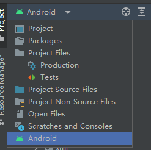

这是一个安卓复习记录，我觉得不考的东西都~~删除线~~伺候 🗑️

tips: `github`左上角↖或者右上角↗有目录

🍎:**很重要吧？**

其中第二章用户界面何第三章多界面最重要

内容仅供参考

[TOC]


# 第一章Andriod 系统及其开发过程

## Android发展历程

2003年10月，AndyRubin（安迪鲁宾）等人创建Android公司，并组建Android团队。

2005年8月17日，Google低调收购了成立仅22个月的高科技企业Android及其团队。安

  迪鲁宾成为Google公司工程部副总裁，继续负责Android项目。

2007年11月5日，谷歌公司正式向外界展示了这款名为Android的操作系统，并且在这天谷歌宣布建立一个全球性的联盟组织“开放手持设备联盟”（OpenHandsetAlliance）

2008年，在GoogleI/O大会上，谷歌提出了AndroidHAL架构图，在同年8月18号，Android获得了美国联邦通信委员会（FCC）的批准

2008年9月，谷歌正式发布了Android1.0系统，这也是Android系统最早的版本。

## Android系统的系统架构

### 应用程序框架层

应用程序框架可以说是一个应用程序的核心，是所有参与开发的程序员共同使用和遵守的约定。

该框架包含：`活动管理器`、`窗口管理器`、`内容提供者`、`视图系统`、`包管理器`、`电话管理器`、`资源管理器`、`位置管理器`、`通知管理器`、`XMPP服务`

活动管理器:管理各个应用程序的生命周期以及通常的导航回退功能。

窗口管理器：管理所有的窗口程序

内容提供器：使得不同应用程序之间存取或者分享数据。

视图系统:构建应用程序的基本组就是文本框、按钮等。 

通告管理器:使得应用程序可以在状态栏显示自定义的提示信息，通过NotificationManager 、 Notification这两个类可以完成在状态栏显示提示的信息。 

包管理器：安卓系统内的程序管理，Package Manger是一个实际上管理应用程序安装、卸载和升级的API。

电话管理器:管理所有的移动设备 用于管理手机通话状态、获取电话信息（设备、sim卡、网络信息），监听电话状态以及调用电话拨号器拨打电话。

资源管理器:提供应用程序使用的各种非代码资源。

位置管理器:提供位置服务

### 运行库层

通过一些c/c++库来为Android提供主要的特性支持，如SQLite提供了数据库的支持，OpenGL|ES库提供了3D绘图的支持，WebKit库提供了浏览器内核的支持等等。同时在这一层的还有Android运行时库提供了一些核心库，能够允许开发者使用JAVA语言来编写Android应用。还包含了虚拟机Dalvik但之后改为了ART运行环境，使每一个Android应用都有自己的进程，并且都有一个自己的Dalvik虚拟机实例，相较于JAVA的虚拟机，Dalvik是专门为移动设备定制的，针对内存和CPU性能都有了优化。

Android的系统运行库包含两部分，一个是系统库，另一个是运行时。

### Linux内核层

Android系统是基于Linux内核的，这一层为Android设备的各种硬件提供了底层的驱动（如显示，音频，照相机，蓝牙，WI-FI，电源管理等等）

关于内核的作用简单说就是提供了进程管理、文件网络管理、系统安全权限管理、以及系统与硬件设备通讯基础。而在无论Android还是iOS这类高度依赖框架的多层次操作系统上，内核对上层开发者来说是几乎不可见的，只能通过开放给你的框架接口进行相关操作。

## Android开发分类

原生APP开发

混合开发（Hybrid APP）

特点：与Html5混合，Html5和Android之间产生交互，当前的主流方式

## Android项目结构

在Android Studio中设置项目结构显示为Android



可以看到项目结构如下：


其主要目录如下：

- app
  - manifests(d)
    - AndroidManifest.xml - 项目的配置信息文件,应用程序名称，权限声明，组件声明等
  - java(d) - java源码,包括应用程序的Activity，Service和BroadcastReceiver等组件。
  - res(d)
    - anim(d) - xml 格式的动画资源
    - drawable(d) - 存放图形资源的目录
    - layout(d) - 布局文件目录
      - activity_main.xml
    - mipmap(d) - 存放应用程序图标资源的目录
      - drawable-xhdpi - 96 × 96
      - drawable-hdpi - 72 × 72
      - drawable-mdpi - 48 × 48
      - drawable-ldpi - 36 × 36
    - values(d) - 存放应用程序资源值的目录，用于存放各种字符串、颜色、尺寸等与应用程序UI相关的值
      - colors.xml
      - strings.xml
      - themes(d) - 自定义主题
    - xml(d) - 存放各种XML文件的目录，如布局文件、菜单文件、动画文件、样式文件
  - assets(d) - 可以存放任意资源，不会被编译

# 第二章 用户界面设计

## 组件包widget 和 View类

### 常见组件🍎

| **可视化组件**   | **说明**                                               |
| ---------------- | ------------------------------------------------------ |
| **Button**       | **按钮**                                               |
| **CalendarView** | **日历视图**                                           |
| **CheckBox**     | **复选框**                                             |
| **EditText**     | **可编辑的文本输入框**                                 |
| **ImageView**    | **显示图像或图标，并提供缩放、着色等各种图像处理方法** |
| **ListView**     | **列表框视图**                                         |
| **MapView**      | **地图视图****                                         |
| **RadioGroup**   | **单选按钮组件**                                       |
| **Spinner**      | **下拉列表**                                           |
| **TextView**     | **文本标签**                                           |
| **WebView**      | **网页浏览器视图**                                     |
| **Toast**        | **消息提示**                                           |

View是用户界面组件的共同父类，几乎所有的用户界面组件都是继承View类而实现的，如TextView、Button、EditText等。 

对View类及其子类的属性进行设置，可以在布局文件XML中设置，也可以通过成员方法在Java代码文件中动态设置。

组件大小单位：

- px（像素）：是屏幕上的最小单位，通常用于描述屏幕分辨率或图像大小。在 Android 开发中，通常使用 px 来指定视图的大小和位置。

- dpi（每英寸点数）：是显示器每英寸上的像素数量。通常用于描述设备的屏幕密度。在 Android 开发中，通常使用 dpi 来指定资源的尺寸，例如图标和图片。

- dp（密度无关像素）：是一种抽象的单位，用于描述在不同屏幕密度下的视图大小和位置。在 Android 开发中，通常使用 dp 来指定视图的大小和位置，以确保在不同屏幕密度下保持一致。

- sp（可缩放像素）：与 dp 类似，但它还考虑了用户的字体大小偏好。在 Android 开发中，通常使用 sp 来指定文本的大小，以确保在不同屏幕密度和用户字体大小偏好下保持一致。

### 常见组件的方法和属性

#### View类

属性

| 属 性              | 对 应 方 法                       | 说  明                                               |
| ---------------------- | ------------------------------------- | -------------------------------------------------------- |
| android:background | setBackgroundColor(int color) | 设置背景颜色                                         |
| android:id         | setId(int)                    | 为组件设置可通过findViewById方法获取的标识符 |
| android:alpha      | setAlpha(float)               | 设置透明度，取值[0，1]之间           |
|                        | findViewById(int id)          | 与id所对应的组件建立关联                     |
| android:visibility | setVisibility(int)            | 设置组件的可见性                                     |
| android:clickable  | setClickable(boolean) | 设置组件是否响应单击事件                             |

#### TextView🍎

方法

| **方   法**                     | **功   能**                |
| ------------------------------- | -------------------------- |
| **getText**();                  | **获取文本标签的文本内容** |
| **setText(CharSequence text);** | **设置文本标签的文本内容** |
| **setTextSize(float);**         | **设置文本标签的文本大小** |
| **setTextColor(int color);**    | **设置文本标签的文本颜色** |

属性

| **元 素 属 性**           | **说   明**                                                  |
| ------------------------- | ------------------------------------------------------------ |
| **android:id**            | **文本标签标识**                                             |
| **android:layout_width**  | **文本标签**TextView的宽度，通常取值"fill_parent"（屏幕宽度）或以像素为单位pt的固定值 |
| **android:layout_height** | **文本标签**TextView的高度，通常取值" **wrap_content** "（文本的高）或以像素p为单位的固定值 |
| **android:text**          | **文本标签**TextView的文本内容                               |
| **android:textSize**      | **文本标签**TextView的文本大小                               |

#### Button🍎

| 方法                 | 说明           |
| -------------------- | -------------- |
| setOnClickListener() | 设置点击监听器 |
| setClickable()       | 设置是否可点击 |
| setEnabled()         | 设置是否可用   |

setOnClickListener()示例

```java
Button button;
button.setOnClickListener((v)->{
	// v就是button对象自己
});
```

#### EditText🍎

方法

| **方法**                       | **功能**                         |
| ------------------------------ | -------------------------------- |
| **EditText**(Context context)  | **构造方法，创建文本编辑框对象** |
| **getText**()                  | **获取文本编辑框的文本内容**     |
| **setText(CharSequence text)** | **设置文本编辑框的文本内容**     |

属性

| **元素属性**            | **说明**                                            |
| ----------------------- | --------------------------------------------------- |
| **android:editable**    | 设置是否可编辑，其值为“true”或“false”               |
| **android:numeric**     | **设置**TextView只能输入数字，其参数默认值为假      |
| **android:password**    | 设置密码输入，字符显示为圆点，其值为“true”或“false” |
| **android:phoneNumber** | **设置只能输入电话号码，其值为“**true”或“false”     |

#### CheckBox

| **方   法**     | **功   能**                |
| --------------- | -------------------------- |
| **isChecked**() | **判断选项是否被选中**     |
| **getText**()   | **获取复选按钮的文本内容** |

#### ProgressBar

| **属   性**          | **方   法**                   | **功   能**                      |
| -------------------- | ----------------------------- | -------------------------------- |
| **android:max**      | setMax(int max)               | **设置进度条的变化范围为0～max   |
| **android:progress** | setProgress(int progress)     | **设置进度条的当前值（初始值）** |
|                      | incrementProgressBy(int diff) | **进度条的变化步长值**           |

#### ~~ImageView~~

| 元素属性          | 对应方法                                      | 说   明                                        |
| --------------------- | ------------------------------------------------- | -------------------------------------------------- |
| android:maxHeight | setMaxHeight(int)                         | 为显示图像提供最大高度的可选参数。             |
| android:maxWidth  | setMaxWidth(int)                          | 为显示图像提供最大宽度的可选参数。             |
| android:scaleType | setScaleType(ImageView.ScaleType) | 控制图像适合 ImageView大小的显示方式。 |
| android:src       | setImageResource(int)                     | 设置图像文件路径                               |

~~scaleType属性值常量~~

| scaleType属性值常量 | 值   | 说    明                                                     |
| ------------------- | ---- | ------------------------------------------------------------ |
| matrix              | 0    | 用矩阵来绘图。                                               |
| fitXY               | 1    | 拉伸图片（不按宽高比例）以填充View的宽高。                   |
| fitStart            | 2    | 按比例拉伸图片，拉伸后图片的高度为View的高度，且显示在View的左边。 |
| fitCenter           | 3    | 按比例拉伸图片，拉伸后图片的高度为View的高度，且显示在View的中间。 |
| fitEnd              | 4    | 按比例拉伸图片，拉伸后图片的高度为View的高度，且显示在View的右边。 |
| center              | 5    | 按原图大小显示图片，但图片宽高大于View的宽高时，截图图片中间部分显示。 |
| centerCrop          | 6    | 按比例放大原图直至等于某边View的宽高显示。                   |
| centerInside        | 7    | 当原图宽高或等于View的宽高时，按原图大小居中显示；反之将原图缩放至View的宽高居中显示。 |

#### Toast🍎

可以用Toast来显示帮助或提示消息。

~~方法~~

| **对应方法**                                               | **说   明**                                                  |
| ---------------------------------------------------------- | ------------------------------------------------------------ |
| Toast(Context context)                                     | Toast的构造方法，构造一个空的Toast对象。                     |
| makeText(Context context, CharSequence text, int duration) | 以特定时长显示文本内容，参数text为显示的文本，参数duration为显示时间，较长时间取值LENGTH_LONG，较短时间取值LENGTH_SHORT。 |
| getView( )                                                 | 返回视图。                                                   |
| setDuration(int duration)                                  | 设置存续时间。                                               |
| setView(View view)                                         | 设置要显示的视图。                                           |
| setGravity(int gravity, int xOffset, int yOffset)          | 设置提示信息在屏幕上的显示位置。                             |
| setText(int resId)                                         | 更新makeText（）方法的所设置的文本内容。                     |
| show( )                                                    | 显示提示信息。                                               |
| LENGTH_LONG                                                | 提示信息显示较长时间的常量。                                 |
| LENGTH_SHORT                                               | 提示信息显示较短时间的常量。                                 |

示例🍎

```java
Toast.makeText(this,"hello",Toast.LENGTH_LONG).show();
```

#### ListView 🍎

适配器要用到的组件，重要

| 对应方法                                                     | 说   明                                                      |
| ------------------------------------------------------------ | ------------------------------------------------------------ |
| ListView(Context context)                                    | 构造方法                                                     |
| setAdapter(ListAdapter adapter)                              | 设置提供数组选项的适配器                                     |
| addHeaderView(View v)                                        | 设置列表项目的头部                                           |
| addFooterView(View v)                                        | 设置列表项目的底部                                           |
| setOnItemClickListener(AdapterView.OnItemClickListener listener) | 注册单击选项时执行的方法，该方法继承于父类android.widget.AdapterView。 |


## 布局管理

布局有`LinearLayout`-线性布局、`FrameLayout`-框架布局、`TableLayout`-表格布局、`RelativeLayout`-相对布局、`GridLayout`-网格布局。 

### LinearLayout（线性布局）🍎

该布局按照水平或垂直方向排列子视图。

```xml
<LinearLayout
    android:layout_width="match_parent"
    android:layout_height="wrap_content"
    android:orientation="vertical">

    <!-- 子视图 -->
    <TextView
        android:layout_width="wrap_content"
        android:layout_height="wrap_content"
        android:text="Hello, LinearLayout!" />

</LinearLayout>
```

重要属性：

- `android:orientation`：指定布局的方向，可以是"**horizontal**"（水平）或"**vertical**"（垂直）。

- 在布局文件中，由 “android:gravity” 属性控制组件的对齐方式，其属性值有：

  上（top）、

  下（bottom）、

  左（letf）、

  右（right）、

  水平方向居中（center_horizontal）、

  垂直方向居中（center_vertical）

线性布局嵌套可以实现很多布局效果

### FrameLayout（帧布局）

该布局允许子视图重叠在同一个位置，通过控制它们的可见性来显示特定的视图。

```xml
xmlCopy code<FrameLayout
    android:layout_width="match_parent"
    android:layout_height="match_parent">

    <ImageView
        android:layout_width="match_parent"
        android:layout_height="match_parent"
        android:src="@drawable/image1" />

    <ImageView
        android:layout_width="match_parent"
        android:layout_height="match_parent"
        android:src="@drawable/image2"
        android:visibility="gone" />

</FrameLayout>
```

重要属性：

- `android:visibility`：指定视图的可见性，可以是"visible"（可见）、"invisible"（不可见，但仍占用空间）或"gone"（不可见且不占用空间）。

### TableLayout（表格布局）🍎

该布局以表格的形式排列子视图，具有行和列的结构。

```xml
<TableLayout
    android:layout_width="match_parent"
    android:layout_height="wrap_content"
    android:shrinkColumns="0,1">
    <TableRow>
        <TextView
            android:layout_width="wrap_content"
            android:layout_height="wrap_content"
            android:text="Cell 1" />

        <TextView
            android:layout_width="wrap_content"
            android:layout_height="wrap_content"
            android:text="Cell 2" />
    </TableRow>

    <TableRow>
        <TextView
            android:layout_width="wrap_content"
            android:layout_height="wrap_content"
            android:text="Cell 3" />

        <TextView
            android:layout_width="wrap_content"
            android:layout_height="wrap_content"
            android:text="Cell 4" />
    </TableRow>

</TableLayout>
```

重要属性：

- android:shrinkColumns: 指定列数
-  `</TableRow>` 指定行

### RelativeLayout（相对布局）

该布局允许子视图相对于其他视图或父视图进行定位。

```xml
<RelativeLayout
    android:layout_width="match_parent"
    android:layout_height="match_parent">


    <Button
    	android:id="@+id/button"
        android:layout_width="wrap_content"
        android:layout_height="wrap_content"
        android:layout_below="@id/text_view1"
        android:text="Button" 
        android:layout_alignParentLeft="true"/>
    <Button
        android:layout_width="wrap_content"
        android:layout_height="wrap_content"
        android:layout_below="@+id/button"
        android:text="Button" />
</RelativeLayout>
```

重要属性：

- `android:layout_alignParentLeft:` 相对于父元素的位置值为true或false，对应还有`layout_alignParentTop`,`layout_alignParentRight`,`layout_alignParentBottom`,`layout_centerInParent`
- `layout_below`: 相对于某个id的上方，对应还有`layout_below`，`layout_toRightOf`,`layout_toLeftOf`

### GridLayout（网格布局）

该布局以网格的形式排列子视图，具有行和列的结构。

```xml
xmlCopy code<GridLayout
    android:layout_width="match_parent"
    android:layout_height="wrap_content"
    android:rowCount="2"
    android:columnCount="2">

    <Button
        android:layout_width="wrap_content"
        android:layout_height="wrap_content"
        android:text="Button 1" 
        layout_columnSpan="2"
        layout_rowSpan="2"/>
    
</GridLayout>
```

#### 重要属性：

- `android:rowCount`：指定网格的行数。
- `android:columnCount`：指定网格的列数。
- `layout_columnSpan`:设置组件占据列数
- `layout_rowSpan`:设置组件占据行数

# 多界面

## 活动之间的数据传递🍎

`MainActivity`-->`MainActivity2`-->`MainActivity`的数据传递

`MainActivity`:

```java
package com.example.demo;
import androidx.annotation.Nullable;
import androidx.appcompat.app.AppCompatActivity;
import android.content.Intent;
import android.os.Bundle;
import android.widget.Button;
import android.widget.Toast;
public class MainActivity extends AppCompatActivity {

    @Override
    protected void onCreate(Bundle savedInstanceState) {
        super.onCreate(savedInstanceState);
        setContentView(R.layout.activity_main);// 将Activity和布局关联
        Button button = findViewById(R.id.main_buttom);
        button.setOnClickListener(view -> {
            Bundle bundle = new Bundle();// 创建Budle
            bundle.putString("key","String");// 放入数据
            Intent intent = new Intent();//创建Intent
            intent.setClass(this,MainActivity2.class);// 关联活动
            intent.putExtra("bundle",bundle);// 放入数据
            // 也可以直接放入数据
            intent.putExtra("key2","String2");
            startActivity(intent); //跳转,没有返回结果
            //startActivityForResult(intent,1);// 有返回结果
        });
    }
    @Override
    protected void onRestart() {
        super.onRestart();
        // 重新启动时的代码
    }

    @Override
    public void onBackPressed() {
        // 前面写代码
        super.onBackPressed();
    }

    @Override
    protected void onResume() {
        super.onResume();
        // 程序重新进入的代码
    }
    // 获取返回结果
    @Override
    protected void onActivityResult(int requestCode, int resultCode, @Nullable Intent data) {
        super.onActivityResult(requestCode, resultCode, data);
        switch (requestCode) {
            case 1:
                if (resultCode == RESULT_OK) {
                    String s = data.getStringExtra("return");
                    Toast.makeText(this, s, Toast.LENGTH_SHORT).show();
                }
                break;
            default:
                break;
        }
    }
}
```

`MainActivity2`

```java
package com.example.demo;
import androidx.appcompat.app.AppCompatActivity;
import android.content.Intent;
import android.os.Bundle;
import android.widget.Toast;
public class MainActivity2 extends AppCompatActivity {

    @Override
    protected void onCreate(Bundle savedInstanceState) {
        super.onCreate(savedInstanceState);
        setContentView(R.layout.activity_main2);
        Intent intent = getIntent();
        String s = intent.getBundleExtra("bundle").getString("key");// 获取bundle的数据
        String s2 = intent.getStringExtra("key2");// 直接获取intent的数据
        Toast.makeText(this,s,Toast.LENGTH_SHORT).show();
        Toast.makeText(this,s2,Toast.LENGTH_SHORT).show();
    }

    @Override
    public void onBackPressed() {
        Intent intent = new Intent();
        intent.putExtra("return","hello");
        setResult(RESULT_OK,intent);// 设置返回结果
        super.onBackPressed();// 返回
    }
}
```

## 菜单

Activity有这些方法可以别重写以操控菜单：

| **方   法**                           | **说   明**                              |
| ------------------------------------- | ---------------------------------------- |
| onCreateOptionMenu(Menu menu)         | 用于初始化菜单，menu为Menu对象实例。     |
| onPrepareOptionsMenu(Menu menu)       | 改变菜单状态，在菜单显示前调用。         |
| onOptionsMenuClosed(Menu menu)        | 菜单被关闭时调用。                       |
| onOptionsItemSelected(MenuItem  item) | 菜单项被点击时调用，即菜单项的监听方法。 |

示例：

```java
public class MainActivity extends AppCompatActivity {

    @Override
    protected void onCreate(Bundle savedInstanceState) {
        super.onCreate(savedInstanceState);
        setContentView(R.layout.activity_main);
    }

    @Override
    public boolean onCreateOptionsMenu(Menu menu) {
        menu.add(1,1,1,"hello1");// 添加菜单
        return super.onCreateOptionsMenu(menu);
    }
	// 菜单点击事件，在这里会输出hello1
    @Override
    public boolean onOptionsItemSelected(@NonNull MenuItem item) {
        Toast.makeText(this,item.getTitle(),Toast.LENGTH_SHORT).show();
        return super.onOptionsItemSelected(item);
    }
}
```

## 对话框

### 消息对话框🍎

| **方   法**                  | **说   明**                 |
| ---------------------------- | --------------------------- |
| AlertDialog.Builder(Context) | 对话框Builder对象的构造方法 |
| create();                    | 创建AlertDialog对象         |
| setTitle();                  | 设置对话框标题              |
| setIcon();                   | 设置对话框图标              |
| setMessage();                | 设置对话框的提示信息        |
| setItems();                  | 设置对话框要显示的一个list  |
| setPositiveButton();         | 在对话框中添加"yes"按钮     |
| setNegativeButton();         | 在对话框中添加"no"按钮      |
| show();                      | 显示对话框                  |
| dismiss();                   | 关闭对话框                  |

示例：

```java
public class MainActivity extends AppCompatActivity {
    private AlertDialog alert = null;
    private AlertDialog.Builder builder = null;
    @Override
    protected void onCreate(Bundle savedInstanceState) {
        super.onCreate(savedInstanceState);
        setContentView(R.layout.activity_main);// 将Activity和布局关联
        Button button = findViewById(R.id.main_buttom);

        button.setOnClickListener(view -> {
            alert = null;
            builder = new AlertDialog.Builder(this);// 构建器
            alert = builder
                    .setTitle("提示：")
                    .setMessage("你点击了按钮")
                    .setPositiveButton("确定", (dialog, which) -> {})
                    .create();// 创建对话框
            alert.show();
        });
    }
}
```

### 进度条对话框

| 方   法                                                      | 说   明                    |
| ------------------------------------------------------------ | -------------------------- |
| getMax()                                                     | 获取对话框进度的最大值     |
| getProgress()                                                | 获取对话框当前进度值       |
| onStart()                                                    | 开始调用对话框             |
| setMax(int max)                                              | 设置对话框进度的最大值     |
| setMessage(CharSequence message)                             | 设置对话框的文本内容       |
| setProgress(int value)                                       | 设置对话框当前进度         |
| show(Context context,  CharSequence title, CharSequence message) | 设置对话框的显示内容和方式 |
| ProgressDialog(Context context)                              | 对话框的构造方法           |

### 日期选择对话框

| **方   法**                                                  | **说   明**                        |
| ------------------------------------------------------------ | ---------------------------------- |
| updateDate(int year, int monthOfYear, int dayOfMonth)        | 设置DatePickerDialog对象的当前日期 |
| onDateChanged(DatePicker view, int year, int month, int  day) | 修改DatePickerDialog对象的日期     |
| updateTime(int hourOfDay, int minutOfHour)                   | 设置TimePickerDialog对象的时间     |
| onTimeChanged(TimePicker view, int hourOfDay, int minute)    | 修改TimePickerDialog对象的时间     |

示例见作业二`MyServiceStart`代码

# 后台服务和系统服务

见PPT

广播和服务示例代码见作业二代码

# 网络通信

## <del>Web视图</del>

略...

## TCP

TCP是`面向连接`的通信协议，TCP提供两台计算机之间的`可靠无差错`的数据传输。

UDP是`无连接`通信协议，UDP`不保证可靠数据`的传输。 

### IP

在Java.net包中，IP地址由一个称作InetAddress的特殊的类来描述

`getLocalHost( )`返回一个本地主机的IP地址。
`getByName(String host )`返回对应于指定主机的IP地址。
`getAllByName(String host )`对于某个主机有多个IP地址（多宿主机）可用于得到一个IP地址数组。
此外，对一个InetAddress的实例可以使用getAddress( )获得一个用字节数组形式表示的IP地址。 

### Socket

`getInputStream( )`：获得一个输入流，读取从网络线路上传送来的数据信息。
`getOutputStream( )`：获得一个输出流，用这个输出流将数据信息写入到网络“线路”上。

`ServerSocket(int port)`:创建Socket

`Socket.accept()`: accept

### HttpClient🍎

1. 创建HttpClient对象。

2. 创建请求方法的实例，并指定请求URL。如果需要发送GET请求，创建HttpGet对象；如果需要发送POST请求，创建HttpPost对象。

3. 如果需要发送请求参数，可调用HttpGet、HttpPost共同的setParams(HttpParams params)方法来添加请求参数；对于HttpPost对象而言，也可调用setEntity(HttpEntity entity)方法来设置请求参数。

4. 调用HttpClient对象的execute(HttpUriRequest request)发送请求，该方法返回一个*HttpResponse*。

5. 调用HttpResponse的getAllHeaders()、getHeaders(String name)等方法可获取服务器的响应头；调用HttpResponse的getEntity()方法可获取HttpEntity对象，该对象包装了服务器的响应内容。程序可通过该对象获取服务器的响应内容。

6. 释放连接。无论执行方法是否成功，都必须释放连接

由于HttpClient api版本不同方法不同，所以没有示例

### HttpUrlConnection

```java
void test(String urls){
    try {
        URL url = new URL(urls);
        HttpURLConnection con = (HttpURLConnection) url.openConnection();
        con.setReadTimeout(5000);
        con.setConnectTimeout(5000);
        con.setRequestProperty("Charset", "UTF-8");
        con.setRequestMethod("GET");
        InputStream is = con.getInputStream();//获取输入流
        FileOutputStream fileOutputStream = null;//文件输出流
        // 流操作.....
    } catch (Exception e) {
        e.printStackTrace();
    }
}
```

# 数据储存🍎

SQLite数据库是一个关系型数据库，因为它很小，引擎本身只有一个大小不到 300KB的文件，所以常作为嵌入式数据库内嵌在应用程序中。 
SQLite生成的数据库文件是一个普通的磁盘文件，可以放置在任何目录下。 
SQLite数据库的管理工具很多，比较常用的有SQLite Expert Professional。
在Android 系统的内部集成了 SQLite数据库，所以 Android 应用程序可以很方便地使用 SQLite 数据库来存储数据。 

`SQLiteDatabase`

| 方   法                                                      | 说   明          |
| ------------------------------------------------------------ | ---------------- |
| openOrCreateDatabase(String path, SQLiteDatabase.CursorFactory factory) | 打开或创建数据库 |
| openDatabase(String path, SQLiteDatabase.CursorFactory factory，int flags) | 打开指定的数据库 |
| insert(String table, String nullColumnHack, ContentValues values) | 新增一条记录     |
| delete(String table,String whereClause, String[] whereArgs)  | 删除一条记录     |
| query(String table,String[] columns,String selection, String[]selectionArgs,  String groupBy,String having, String orderBy) | 查询一条记录     |
| update(String table,ContentValues values,String whereClause,String[] whereArgs) | 修改记录         |
| execSQL(String sql)                                          | 执行一条SQL语句  |
| close()                                                      | 关闭数据库       |

`SQLiteOpenHelper`

| 方   法                               | 说   明                        |
| ------------------------------------- | ------------------------------ |
| onCreate（SQLiteDatabase）            | 首次生成数据库时候调用该方法。 |
| onOpen（SQLiteDatabase）              | 调用已经打开的数据库。         |
| onUpgrade（SQLiteDatabase，int，int） | 升级数据库时调用。             |
| getWritableDatabase()                 | 读写方式创建或打开数据库。     |
| getReadableDatabase()                 | 创建或打开数据库。             |

示例：

🍎:`Cursor` ,`ContentValues` ,`SQLiteDatabase.insert()` ,`SQLiteDatabase.update()` ,`SQLiteDatabase.query()`

```java
public class DBHelper extends SQLiteOpenHelper {
    public static final String DATABASE_NAME = "my_database.db";
    public static final int DATABASE_VERSION = 1;
    public static final String TABLE_NAME = "my_table";
    private static final String ID = "_id";
    private static final String USERNAME = "username";
    private static final String PHONE = "phone";
    private static final String EMAIL = "email";
    private static final String Address = "address";
    
    private static final String CREATE_TABLE_SQL = "CREATE TABLE " + TABLE_NAME + " (" +
            ID + " INTEGER PRIMARY KEY AUTOINCREMENT, " +
            USERNAME + " TEXT, "+
            PHONE + " TEXT, "+
            EMAIL + " TEXT, "+
            Address + " TEXT"+
            ")";
    public DBHelper(@Nullable Context context) {
        super(context,DATABASE_NAME,null,DATABASE_VERSION);
    }

    @Override
    public void onCreate(SQLiteDatabase sqLiteDatabase) {
        sqLiteDatabase.execSQL(CREATE_TABLE_SQL);// 创建数据库
    }

    @Override
    public void onUpgrade(SQLiteDatabase sqLiteDatabase, int i, int i1) {
        //......
    }
	// 插入数据
    public boolean insert(Info info){
        SQLiteDatabase db = this.getWritableDatabase();
        ContentValues contentValues = new ContentValues();
        contentValues.put(USERNAME, info.getUsername());
        contentValues.put(PHONE, info.getPhone());
        contentValues.put(EMAIL, info.getEmail());
        contentValues.put(Address, info.getAddress());
        long result = db.insert(TABLE_NAME, null, contentValues);
        db.close();
        return result > 0;
    }
	// 删除数据
    public int delete(int id){
        SQLiteDatabase db = this.getWritableDatabase();
        int result = db.delete(TABLE_NAME, ID + "=" + id, null);// 删除条件
        db.close();
        return result;
    }
	// 更新
    public int update(Info info){
        SQLiteDatabase db = this.getWritableDatabase();
        ContentValues contentValues = new ContentValues();
        contentValues.put(USERNAME, info.getUsername());// 设置字段值
        contentValues.put(PHONE, info.getPhone());
        contentValues.put(EMAIL, info.getEmail());
        contentValues.put(Address, info.getAddress());
        int result = db.update(TABLE_NAME, contentValues, ID + "=" + info.getId(), null);// 更新条件
        db.close();
        return result;
    }
	
    public Info select(int i){
        SQLiteDatabase db = this.getReadableDatabase();
        // 查询限制一条
        // query参数(表名,columns,selection,selectionArgs,groupBy,having,orderBy,limite)
        // 如 query("t_user","class","name=?,age>=?",new String[]{"dbin",0},"class","sex='男'","10,100");
        // select class from t_user where name='dbin',age>=0 group by class having sex='男' limit 10,100;
        Cursor cursor = db.query(TABLE_NAME, null, null, null, null, null, null,i-1+","+1);
        Info info = new Info();
        if(cursor.moveToFirst()){
            info.setId(cursor.getInt(0));
            info.setUsername(cursor.getString(1));
            info.setPhone(cursor.getString(2));
            info.setEmail(cursor.getString(3));
            info.setAddress(cursor.getString(4));
        }else{
            return null;
        }
        // 遍历查询结果集
        while(!cursor.isLast()){
            cursor.moveToNext();
            //......
        }
        cursor.close();
        db.close();
        return info;
    }
}
```

# 代码示例

## Activity(Intent,Bundle)

[示例见本页活动之间的数据传递](#活动之间的数据传递)

## Button,EditText,TextView

```xml
<?xml version="1.0" encoding="utf-8"?>
<!--线性布局-->
<LinearLayout
    xmlns:android="http://schemas.android.com/apk/res/android"
    android:orientation="vertical"
    android:layout_width="match_parent"
    android:layout_height="match_parent">
    <EditText
        android:id="@+id/main.text"
        android:layout_width="match_parent"
        android:layout_height="wrap_content"
        android:text="0"
        />
    <Button
        android:id="@+id/main.clear_text"
        android:layout_width="match_parent"
        android:layout_height="wrap_content"
        android:text="清除"/>
    <TextView
            android:id="@+id/main.text.view"
            android:layout_width="wrap_content"
            android:layout_height="wrap_content"/>
    <LinearLayout
        android:orientation="vertical"
        android:layout_width="match_parent"
        android:layout_height="wrap_content">
        <!-- 无限套娃-->
    </LinearLayout>

</LinearLayout>
```

```java
public class MainActivity extends AppCompatActivity {
    // 程序将会将用户输入全部转换为字符串，然后解析为计算式。
    String evalString = "";
    @Override
    protected void onCreate(Bundle savedInstanceState) {
        super.onCreate(savedInstanceState);
        setContentView(R.layout.activity_main);
        final EditText editText = findViewById(R.id.main_text);
        editText.setFocusableInTouchMode(false); // 不可以编辑
        editText.setKeyListener(null); //不可以粘贴
        editText.setClickable(false);// 不可以点击
        editText.setText("hello");// 直接修改内容
        
        final TextView tv = findViewById(R.id.main_text_view);
        tv.setText("hello");// 设置内容
        
        // 按钮监听
        Button button = findViewById(R.id.main_clear_text);
        button.setOnClickListener((v)-> {
            evalString = evalString+ finalI;
            editText.setText(evalString);
        });
    }
}
```

## 提示组件(Toast,AlertDialog)

Toast

```java
Toast.makeText(this,"",Toast.LENGTH_SHORT).show();// 短时间
Toast.makeText(this,"",Toast.LENGTH_LONG).show();// 长时间
```

[示例见本页消息对话框](#消息对话框)

## 适配器(ListView,SimpleAdapter)

布局文件

```xml
<?xml version="1.0" encoding="utf-8"?>
<androidx.constraintlayout.widget.ConstraintLayout xmlns:android="http://schemas.android.com/apk/res/android"
    android:layout_width="match_parent"
    android:layout_height="match_parent">
    <ListView

        android:id="@+id/main2.list"
        android:layout_width="match_parent"
        android:layout_height="match_parent"
        android:orientation="horizontal">
    </ListView>
</androidx.constraintlayout.widget.ConstraintLayout>
```

组件(用来放到ListView的组件)

再ImageView中可以直接设置`android:src="@drawable/...."`设置其图片

```xml
<?xml version="1.0" encoding="utf-8"?>
<LinearLayout xmlns:android="http://schemas.android.com/apk/res/android"
    android:layout_width="match_parent"
    android:layout_height="match_parent">
    <LinearLayout
        android:id="@+id/list_item"
        android:layout_width="wrap_content"
        android:layout_height="wrap_content"
        android:orientation="horizontal">
        <ImageView
            android:id="@+id/header"
            android:layout_width="match_parent"
            android:layout_height="wrap_content"
            android:adjustViewBounds="true"
            android:maxHeight="80dp"
            android:maxWidth="80dp"
            android:padding="10dp"/>
        <TextView
            android:id="@+id/name"
            android:layout_width="wrap_content"
            android:layout_height="wrap_content"
            android:textSize="20dp"
            android:padding="10dp"/>
    </LinearLayout>
</LinearLayout>
```

Java代码：

```java
public class MainActivity2 extends AppCompatActivity {
    // 图片的信息
    private String[] data = {
            "Apple","Banana","Orange","Watermelon","Pear"
    };
    // 图片的id,是放在drawable目录下的图片,文件名是immg0.jpg,则id就是R.drawable.img0
    private int[] header = {
            R.drawable.img0,R.drawable.img1,R.drawable.img2,R.drawable.img3,
            R.drawable.img4
    };
    @Override
    protected void onCreate(@Nullable Bundle savedInstanceState) {
        super.onCreate(savedInstanceState);
        this.setContentView(R.layout.activity_main2);
        ListView listView = findViewById(R.id.main2_list);
        // 添加元素点击的监听器
        listView.setOnItemClickListener((adapterView, view, i, l) -> {
            // 获取子元素的name,最终对应的就是前面定义的data变量的数据
            TextView textView = view.findViewById(R.id.name);
            Toast.makeText(this,textView.getText(),Toast.LENGTH_SHORT).show();
            
        });
        // 存放数据的list
        List<Map<String,Object>> list = new ArrayList<>();
        for(int i=0;i<data.length;i++){
            Map<String,Object> map = new HashMap<>();
            map.put("header",header[i]);// 表示header映射数据到对应的id,
            map.put("data",data[i]);// data映射为字符串
            list.add(map);
        }
        // 创建一个适配器，适配器的数据是list,布局是list_array.xml
        // 子元素中数据是header对应header,name对应data.
        SimpleAdapter simpleAdapter = new SimpleAdapter(
                MainActivity2.this,
                list,
                R.layout.list_array,
                new String[]{"header","data"},
                new int[]{R.id.header,R.id.name}// 此处将header映射到对应的图片的id上，将列表中ImageView的数据修改为对应的图片
                );
        listView.setAdapter(simpleAdapter);
    }
}
```

## 数据库操作

[示例见本页数据储存](#数据储存)

## SharedPreferences

```java
SharedPreferences sp = getSharedPreferences("info",MODE_PRIVATE);
SharedPreferences.Editor editor = sp.edit();
String t = sp.getString("t",null);// get and set
editor.clear();// 清空
editor.commit();// 提交任务
```


## 服务和广播

### 编写服务

音乐播放

```java
public class MusicPlayerService extends Service implements MediaPlayer.OnPreparedListener, MediaPlayer.OnCompletionListener {
    private static final String TAG = "MusicPlayerService";
    private MediaPlayer mediaPlayer;
    private boolean isPrepared = false;// 好像没啥用
    private boolean isStart = false;
    @Override
    public void onCreate() {
        super.onCreate();
        mediaPlayer = MediaPlayer.create(this, R.raw.wojide);// 这里注意和自己的文件对应
        mediaPlayer.setOnPreparedListener(this); // 注册回调函数，当准备好的时候会回调onPrepared方法
        mediaPlayer.setOnCompletionListener(this); // 注册回调函数，当播放完成的时候会回调onCompletion方法
    }

    @Override
    public int onStartCommand(Intent intent, int flags, int startId) {
        if (intent != null) 
            String action = intent.getAction();
            if ("PLAY_MUSIC".equals(action)) {
                if(mediaPlayer==null){
                    mediaPlayer = MediaPlayer.create(this, R.raw.wojide);
                    mediaPlayer.setOnPreparedListener(this); // 注册回调函数，当准备好的时候会回调onPrepared方法
                    mediaPlayer.setOnCompletionListener(this); // 注册回调函数，当播放完成的时候会回调onCompletion方法
                }
               isStart = true;
            }
            // 停止播放
            if("STOP_MUSIC".equals(action)){
                if(mediaPlayer!=null){
                    mediaPlayer.stop();
                    mediaPlayer.release();
                    mediaPlayer = null;
                    isPrepared = false;
                }
            }
        }
        return START_STICKY;
    }

    @Override
    public void onDestroy() {
        super.onDestroy();
    }

    @Override
    public IBinder onBind(Intent intent) {
        return null;
    }

    @Override
    public void onPrepared(MediaPlayer mp) {
        
    }

    @Override
    public void onCompletion(MediaPlayer mp) {
        stopSelf();
    }
}
```

### 注册服务

```xml
<service
            android:name=".music.MusicPlayerService"
            android:exported="false"/>
```


### 调用服务

```java
Intent playIntent = new Intent(this, MusicPlayerService.class);
playIntent.putExtra("time",time);
playIntent.setAction("PLAY_MUSIC");
startService(playIntent);
stopService(playIntent);
```

### 注册广播

``` java
public class MyServiceStart extends AppCompatActivity {
    protected void onCreate(Bundle savedInstanceState){
		localBroadcastManager = LocalBroadcastManager.getInstance(this); // 获取实例
        intentFilter = new IntentFilter();
        intentFilter.addAction(BROADCAST_ACTION);// BROADCAST_ACTION就是一个字符串
        localReceiver = new LocalReceiver();
        localBroadcastManager.registerReceiver(localReceiver, intentFilter);
    }
    // 一个内部内，用来处理广播
    class LocalReceiver extends BroadcastReceiver {
        @Override
        public void onReceive(Context context, Intent intent) {
            // 处理
        }
    }
}
```

### 发送广播

``` java
Intent intent = new Intent(MyServiceStart.BROADCAST_ACTION);//BROADCAST_ACTION 是一个字符串
localBroadcastManager.sendBroadcast(intent);
```

## AndroidMainfest注册

```xml
<?xml version="1.0" encoding="utf-8"?>
<manifest xmlns:android="http://schemas.android.com/apk/res/android"
    xmlns:tools="http://schemas.android.com/tools">
	<!--这个是获取网络权限-->
    <uses-permission android:name="android.permission.INTERNET" />

    <application
        android:allowBackup="true"
        android:dataExtractionRules="@xml/data_extraction_rules"
        android:fullBackupContent="@xml/backup_rules"
        android:icon="@mipmap/ic_launcher"
        android:label="@string/app_name"
        android:supportsRtl="true"
        android:theme="@style/Theme.Application1"
        tools:targetApi="31">
        <!--这个是注册服务-->
        <service
            android:name=".music.MusicPlayerService"
            android:exported="false"/>
        <!--普通的活动-->
        <activity
            android:name=".MainActivity"
            android:exported="false" />
        <!--下面这个是启动类(活动)-->
        <activity
            android:name=".StartActivity"
            android:exported="true">
            <intent-filter>
                <action android:name="android.intent.action.MAIN" />

                <category android:name="android.intent.category.LAUNCHER" />
            </intent-filter>
        </activity>
    </application>

</manifest>
```

