# 前言：

我将实验全都写在一个工程内，所以启动类的名字有所区别，请注意到`AndroidManifest.xm`中修改正确的启动类。

我使用的是`API25`的老机器，运行没啥大问题

# 实验一

## 要求

1. 利用线性布局，实现以下效果

   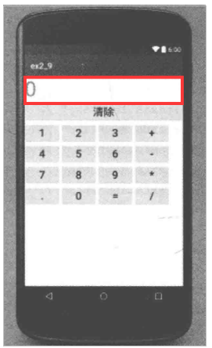

   2. 在MainActivity中实现该计算器程序的功能，能够进行简单的4则运算，如2*8=16,4.6-8=-3.4等。

   3. “清除”按钮点击后清除整个算式。

   4. 对于不正确的输入，通过Toast对象进行错误提示，如零不能为除数、操作数位数太长等。

## 实验代码

### 1.`activity_main.xml`

```xml
<?xml version="1.0" encoding="utf-8"?>
<!--线性布局-->
<LinearLayout
    xmlns:android="http://schemas.android.com/apk/res/android"
    android:orientation="vertical"
    android:layout_width="match_parent"
    android:layout_height="match_parent">
    <EditText
        android:id="@+id/main.text"
        android:layout_width="match_parent"
        android:layout_height="wrap_content"
        android:text="0"
        />
    <Button
        android:id="@+id/main.clear_text"
        android:layout_width="match_parent"
        android:layout_height="wrap_content"
        android:text="清除"/>
    <LinearLayout
        android:orientation="vertical"
        android:layout_width="match_parent"
        android:layout_height="wrap_content">
        <LinearLayout
            android:orientation="horizontal"
            android:layout_width="match_parent"
            android:layout_height="wrap_content">
        <Button
            android:id="@+id/main.num.1"
            android:layout_weight="1"
            android:text="1"
            android:layout_margin="5dp"
            android:layout_width="wrap_content"
            android:layout_height="wrap_content" />
        <Button
            android:id="@+id/main.num.2"
            android:layout_weight="1"
            android:text="2"
            android:layout_margin="5dp"
            android:layout_width="wrap_content"
            android:layout_height="wrap_content" />
        <Button
            android:id="@+id/main.num.3"
            android:text="3"
            android:layout_weight="1"
            android:layout_margin="5dp"
            android:layout_width="wrap_content"
            android:layout_height="wrap_content" />
        <Button
            android:id="@+id/main.jia"
            android:text="+"
            android:layout_weight="1"
            android:layout_margin="5dp"
            android:layout_width="wrap_content"
            android:layout_height="wrap_content" />
        </LinearLayout>
        <LinearLayout
            android:orientation="horizontal"
            android:layout_width="match_parent"
            android:layout_height="wrap_content">
            <Button
                android:id="@+id/main.num.4"
                android:text="4"
                android:layout_weight="1"
                android:layout_margin="5dp"
                android:layout_width="wrap_content"
                android:layout_height="wrap_content" />
            <Button
                android:id="@+id/main.num.5"
                android:text="5"
                android:layout_weight="1"
                android:layout_margin="5dp"
                android:layout_width="wrap_content"
                android:layout_height="wrap_content" />
            <Button
                android:id="@+id/main.num.6"
                android:text="6"
                android:layout_weight="1"
                android:layout_margin="5dp"
                android:layout_width="wrap_content"
                android:layout_height="wrap_content" />
            <Button
                android:id="@+id/main.jian"
                android:text="-"
                android:layout_weight="1"
                android:layout_margin="5dp"
                android:layout_width="wrap_content"
                android:layout_height="wrap_content" />
        </LinearLayout>
        <LinearLayout
            android:orientation="horizontal"
            android:layout_width="match_parent"
            android:layout_height="wrap_content">
            <Button
                android:id="@+id/main.num.7"
                android:text="7"
                android:layout_weight="1"
                android:layout_margin="5dp"
                android:layout_width="wrap_content"
                android:layout_height="wrap_content" />
            <Button
                android:id="@+id/main.num.8"
                android:text="8"
                android:layout_weight="1"
                android:layout_margin="5dp"
                android:layout_width="wrap_content"
                android:layout_height="wrap_content" />
            <Button
                android:id="@+id/main.num.9"
                android:text="9"
                android:layout_weight="1"
                android:layout_margin="5dp"
                android:layout_width="wrap_content"
                android:layout_height="wrap_content" />
            <Button
                android:id="@+id/main.cheng"
                android:text="*"
                android:layout_weight="1"
                android:layout_margin="5dp"
                android:layout_width="wrap_content"
                android:layout_height="wrap_content" />
        </LinearLayout>
        <LinearLayout
            android:orientation="horizontal"
            android:layout_width="match_parent"
            android:layout_height="wrap_content">
            <Button
                android:id="@+id/main.dian"
                android:text="."
                android:layout_weight="1"
                android:layout_margin="5dp"
                android:layout_width="wrap_content"
                android:layout_height="wrap_content" />
            <Button
                android:id="@+id/main.num.0"
                android:text="0"
                android:layout_weight="1"
                android:layout_margin="5dp"
                android:layout_width="wrap_content"
                android:layout_height="wrap_content" />
            <Button
                android:id="@+id/main.deng"
                android:text="="
                android:layout_weight="1"
                android:layout_margin="5dp"
                android:layout_width="wrap_content"
                android:layout_height="wrap_content" />
            <Button
                android:id="@+id/main.chu"
                android:text="/"
                android:layout_weight="1"
                android:layout_margin="5dp"
                android:layout_width="wrap_content"
                android:layout_height="wrap_content" />
        </LinearLayout>


    </LinearLayout>

</LinearLayout>
```

### 2.`MainActivity.java`

```java
package site.dbin.application1;

import androidx.appcompat.app.AppCompatActivity;

import android.os.Bundle;
import android.widget.Button;
import android.widget.EditText;
import android.widget.Toast;

import java.util.Objects;

public class MainActivity extends AppCompatActivity {
    // 程序将会将用户输入全部转换为字符串，然后解析为计算式。
    String evalString = "";
    // 定义所有的数字按钮
    static final int ids[] = {
            R.id.main_num_0,
            R.id.main_num_1, R.id.main_num_2,R.id.main_num_3,
            R.id.main_num_4,R.id.main_num_5,R.id.main_num_6,
            R.id.main_num_7,R.id.main_num_8,R.id.main_num_9};
    static final int fuhao[] = {
            R.id.main_jia,R.id.main_jian,R.id.main_cheng,R.id.main_chu,R.id.main_dian
    };
    // 定义所有的符号
    static final char fuhaoc[] = {'+','-','*','/','.'};
    @Override
    protected void onCreate(Bundle savedInstanceState) {
        super.onCreate(savedInstanceState);
        setContentView(R.layout.activity_main);
        final EditText editText = findViewById(R.id.main_text);
        editText.setFocusableInTouchMode(false); // 不可以编辑
        editText.setKeyListener(null); //不可以粘贴
        editText.setClickable(false);// 不可以点击
        // 添加数字监听
        for(int i=0;i<=9;i++){
            Button button = findViewById(ids[i]);
            int finalI = i;
            button.setOnClickListener((v)-> {
                evalString = evalString+ finalI;
                editText.setText(evalString);
            });
        }
        // 添加符号监听
        for(int i=0;i<fuhao.length;i++){
            Button button = findViewById(fuhao[i]);
            int finalI = i;
            button.setOnClickListener((v)->{
                evalString = evalString+ fuhaoc[finalI];
                editText.setText(evalString);
            });
        }
        // 添加等于监听
        Button clean = findViewById(R.id.main_clear_text);// 清空按钮
        Button dengyu = findViewById(R.id.main_deng);//等于按钮
        dengyu.setOnClickListener((v)-> {
            Double ans = getResult(evalString);
            if(ans==null){
                Toast.makeText(MainActivity.this,"输入非法",Toast.LENGTH_LONG).show();
            }else{
                // 先显示，后清空算式，不用清空就可以直接输入下一个算式了。
                editText.setText(String.format("%s=%f",this.evalString,ans));
                this.evalString = "";
            }
        });
        // 清空

        clean.setOnClickListener((v)-> {
            this.evalString = "";
            editText.setText(evalString);
        });
    }

    public static Double getResult(String str) {
        boolean isNumber = true;
        try {
            Double.valueOf(str);
        }catch (Exception e){
            isNumber = false;
        }
        try {
            // 递归头
            if (str.isEmpty() || isNumber) {
                return str.isEmpty() ? 0 : Double.parseDouble(str);
            }
            if (str.contains("+")) {
                int index = str.lastIndexOf("+");
                return getResult(str.substring(0, index)) + getResult(str.substring(index + 1));
            }
            if (str.contains("-")) {
                int index = str.lastIndexOf("-");
                return getResult(str.substring(0, index)) - getResult(str.substring(index + 1));
            }
            if (str.contains("*")) {
                int index = str.lastIndexOf("*");
                return getResult(str.substring(0, index)) * getResult(str.substring(index + 1));
            }
            if (str.contains("/")) {
                int index = str.lastIndexOf("/");
                Double d = getResult(str.substring(index + 1));
                if(Objects.equals(d,0.0)){
                    return null;
                }
                return getResult(str.substring(0, index)) / d;
            }
        }catch (Exception e) {
            return null;
        }
        // 出错
        return null;
    }
}
```

### 3.运行结果

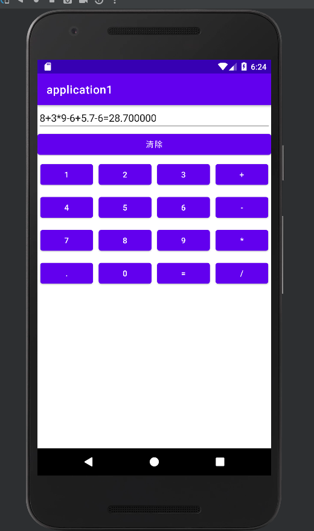

# 实验二

<font color='blue'>提示：我是直接在实验一的基础上做的，运行时将`AndroidMainfest.xml`中的如下代码替换，就可以改变启动时运行的Activity了</font>

```xml
<activity
            android:name=".MainActivity"
            android:exported="true">
            <intent-filter>
                <action android:name="android.intent.action.MAIN" />

                <category android:name="android.intent.category.LAUNCHER" />
            </intent-filter>
        </activity>
```

替换为

```xml
<!--MainActivity2是我之后新建的类-->
<activity android:name=".MainActivity2"
            android:exported="true">
            <intent-filter>
                <action android:name="android.intent.action.MAIN"/>
                <category android:name="android.intent.category.LAUNCHER"/>
            </intent-filter>
        </activity>
```

## 实验要求

见实验指导书

## 实验代码和过程

### 1.准备

准备了6张图片，放在了`drawable`目录下

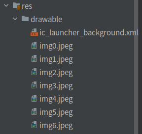

### 2.布局文件

layout目录下新建布局文件`activity_main2.xml`

```xml
<?xml version="1.0" encoding="utf-8"?>
<androidx.constraintlayout.widget.ConstraintLayout xmlns:android="http://schemas.android.com/apk/res/android"
    android:layout_width="match_parent"
    android:layout_height="match_parent">
    <ListView

        android:id="@+id/main2.list"
        android:layout_width="match_parent"
        android:layout_height="match_parent"
        android:orientation="horizontal">

    </ListView>
</androidx.constraintlayout.widget.ConstraintLayout>
```

### 3.“组件”

在layout目录下新建`list_array.xml`

```xml
<?xml version="1.0" encoding="utf-8"?>
<LinearLayout xmlns:android="http://schemas.android.com/apk/res/android"
    android:layout_width="match_parent"
    android:layout_height="match_parent">
    <LinearLayout
        android:id="@+id/list_item"
        android:layout_width="wrap_content"
        android:layout_height="wrap_content"
        android:orientation="horizontal">
        <ImageView
            android:id="@+id/header"
            android:layout_width="match_parent"
            android:layout_height="wrap_content"
            android:adjustViewBounds="true"
            android:maxHeight="80dp"
            android:maxWidth="80dp"
            android:padding="10dp"/>
        <TextView
            android:id="@+id/name"
            android:layout_width="wrap_content"
            android:layout_height="wrap_content"
            android:textSize="20dp"
            android:padding="10dp"/>
    </LinearLayout>
</LinearLayout>
```

### 4.`MainActivity2.java`

```java
package site.dbin.application1;

import android.os.Bundle;
import android.widget.ArrayAdapter;
import android.widget.ListView;
import android.widget.SimpleAdapter;
import android.widget.TextView;

import androidx.annotation.Nullable;
import androidx.appcompat.app.AlertDialog;
import androidx.appcompat.app.AppCompatActivity;

import java.util.ArrayList;
import java.util.HashMap;
import java.util.List;
import java.util.Map;

public class MainActivity2 extends AppCompatActivity {
    // 图片的信息
    private String[] data = {
            "Apple","Banana","Orange","Watermelon","Pear"
    };
    // 图片的id
    private int[] header = {
            R.drawable.img0,R.drawable.img1,R.drawable.img2,R.drawable.img3,
            R.drawable.img4,//R.drawable.img5,R.drawable.img6
    };
    // AlerDialog
    private AlertDialog alert = null;
    private AlertDialog.Builder builder = null;
    @Override
    protected void onCreate(@Nullable Bundle savedInstanceState) {
        super.onCreate(savedInstanceState);
        this.setContentView(R.layout.activity_main2);
//      实验指导书让写的，没什么用
//        ArrayAdapter<String> adapter = new ArrayAdapter<>(
//                MainActivity2.this,R.layout.list_array,data);
        ListView listView = findViewById(R.id.main2_list);
        // 添加元素点击的监听器
        listView.setOnItemClickListener((adapterView, view, i, l) -> {
            // 获取子元素的name,最终对应的就是前面定义的data变量的数据
            TextView textView = view.findViewById(R.id.name);
            alert = null;
            builder = new AlertDialog.Builder(MainActivity2.this);
            alert = builder
                    .setTitle("提示：")
                    .setMessage("你点击了"+textView.getText())
                    .setPositiveButton("确定", (dialog, which) -> {})
                    .create();
            alert.show();
        });
        //listView.setAdapter(adapter);
        // 存放数据的list
        List<Map<String,Object>> list = new ArrayList<>();
        for(int i=0;i<data.length;i++){
            Map<String,Object> map = new HashMap<>();
            map.put("header",header[i]);
            map.put("data",data[i]);
            list.add(map);
        }
        // 创建一个适配器，适配器的数据是list,布局是list_array.xml
        // 子元素中数据是header对应header,name对应data.
        SimpleAdapter simpleAdapter = new SimpleAdapter(
                MainActivity2.this,
                list,
                R.layout.list_array,
                new String[]{"header","data"},
                new int[]{R.id.header,R.id.name}
                );
        listView.setAdapter(simpleAdapter);
    }
}
```

### 5.运行效果

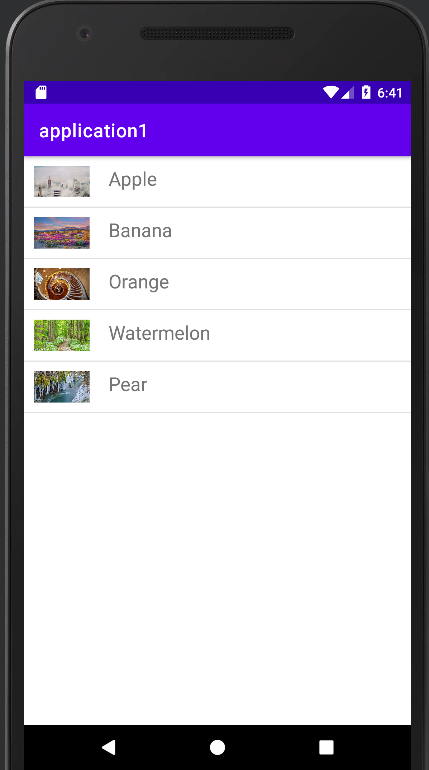


# 作业一

> 吐槽:为什么有这这这这么奇怪的作业????????

## 要求

写几个页面跳来跳去？

## 实验设计

伟大的GouPi大神创造了三个世界`冰雪世界`,`大草原`,`火焰山`,而渺小的人类(DBin)只能在其中挑来跳去，唯一能做的就是发泄自己的不满。(GouPi大神一定是DBin的死对头)

## 实验代码和过程

### 实验提示

创建activity时这样创建，会自动创建布局文件哦。

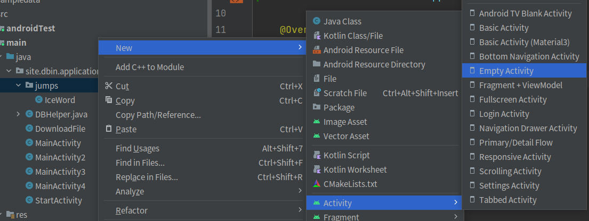

创建是选择LauncherActivity会自动注册活动，否则你就只能手动注册了，像实验二开头那样。

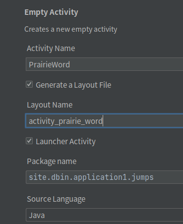

### 实验代码

#### `IceWord.java`

```java
package site.dbin.application1.jumps;//我的在默认的jumps包下

import androidx.annotation.Nullable;
import androidx.appcompat.app.AppCompatActivity;

import android.content.Intent;
import android.os.Bundle;
import android.widget.Button;
import android.widget.EditText;
import android.widget.TextView;

import site.dbin.application1.R;// 我的有导包，你的可能不需要

public class IceWord extends AppCompatActivity {
    final String s = "冰雪世界";
    @Override
    protected void onCreate(Bundle savedInstanceState) {
        super.onCreate(savedInstanceState);
        setContentView(R.layout.activity_ice_word);
        Intent i = getIntent();
        String data = i.getStringExtra("word");
        // 当有上一个activity传递的值
        if(data!=null){
            TextView v = findViewById(R.id.ice_info);
            v.setText("欢迎你从"+data+"来到冰雪世界");
        }
        Button jump = findViewById(R.id.ice_button1);
        // 跳转
        jump.setOnClickListener((v)->{
            Intent intent = new Intent(this,PrairieWord.class);
            intent.putExtra("word",s);
            // 接受返回值的跳转
            // 虽然不建议使用startActivityForResult，但是这里为了演示，就这样写了
            startActivityForResult(intent,666);
        });
        Button jump2 = findViewById(R.id.ice_button2);
        jump2.setOnClickListener((v)->{
            Intent intent = new Intent(this,VolcanoWord.class);
            intent.putExtra("word",s);
            startActivityForResult(intent,666);
        });
    }
    //当有返回值
    @Override
    protected void onActivityResult(int requestCode, int resultCode, @Nullable Intent data) {
        super.onActivityResult(requestCode, resultCode, data);
        String message = "";
        String word = data.getStringExtra("word");
        if(word!=null&&word.length()>0)message+=("欢迎你从"+word+"回到"+s);
        String mood = data.getStringExtra("mood");
        if(mood!=null&&mood.length()>0)message+="，听说你在"+word+"的心情"+mood;
        TextView v = findViewById(R.id.ice_info);
        v.setText(message);
    }
    //返回按钮按下后，结束当前activity,并且返回值
    @Override
    public void onBackPressed() {
        Intent intent = new Intent();
        EditText editText = findViewById(R.id.ice_edit);
        if(editText!=null&&editText.getText().toString().length()>0){
            intent.putExtra("mood",editText.getText().toString());
        }
        intent.putExtra("word",s);
        setResult(666,intent);
        finish();
    }
}
```

#### `PrairieWord.java`

```java
package site.dbin.application1.jumps;

import androidx.annotation.Nullable;
import androidx.appcompat.app.AppCompatActivity;

import android.content.Intent;
import android.os.Bundle;
import android.widget.Button;
import android.widget.EditText;
import android.widget.TextView;

import site.dbin.application1.R;

public class PrairieWord extends AppCompatActivity {
    final String s = "大草原";
    @Override
    protected void onCreate(Bundle savedInstanceState) {
        super.onCreate(savedInstanceState);
        setContentView(R.layout.activity_prairie_word);
        Intent i = getIntent();
        String data = i.getStringExtra("word");
        if(data!=null){
            TextView v = findViewById(R.id.pra_info);
            v.setText("欢迎你从"+data+"来到大草原");
        }
        Button jump = findViewById(R.id.pra_button1);
        jump.setOnClickListener((v)->{
            Intent intent = new Intent(this,IceWord.class);
            intent.putExtra("word",s);
            startActivityForResult(intent,666);
        });
        Button jump2 = findViewById(R.id.pra_button2);
        jump2.setOnClickListener((v)->{
            Intent intent = new Intent(this,VolcanoWord.class);
            intent.putExtra("word",s);
            startActivityForResult(intent,666);
        });
    }

    @Override
    protected void onActivityResult(int requestCode, int resultCode, @Nullable Intent data) {
        super.onActivityResult(requestCode, resultCode, data);
        String message = "";
        String word = data.getStringExtra("word");
        if(word!=null&&word.length()>0)message+=("欢迎你从"+word+"回到"+s);
        String mood = data.getStringExtra("mood");
        if(mood!=null&&mood.length()>0)message+="，听说你在"+word+"的心情"+mood;
        TextView v = findViewById(R.id.pra_info);
        v.setText(message);
    }

    @Override
    public void onBackPressed() {
        Intent intent = new Intent();
        EditText editText = findViewById(R.id.pra_edit);
        if(editText!=null&&editText.getText().toString().length()>0){
            intent.putExtra("mood",editText.getText().toString());
        }
        intent.putExtra("word",s);
        setResult(666,intent);
        finish();
    }
}
```

#### `VolcanoWord.java`

```java
package site.dbin.application1.jumps;

import androidx.annotation.Nullable;
import androidx.appcompat.app.AppCompatActivity;

import android.content.Intent;
import android.os.Bundle;
import android.widget.Button;
import android.widget.EditText;
import android.widget.TextView;

import site.dbin.application1.R;

public class VolcanoWord extends AppCompatActivity {
    final String s = "火焰山";
    @Override
    protected void onCreate(Bundle savedInstanceState) {
        super.onCreate(savedInstanceState);
        setContentView(R.layout.activity_volcano_word);
        Intent i = getIntent();
        String data = i.getStringExtra("word");
        if(data!=null){
            TextView v = findViewById(R.id.vol_info);
            v.setText("欢迎你从"+data+"来到大草原");
        }
        Button jump = findViewById(R.id.vol_button1);
        jump.setOnClickListener((v)->{
            Intent intent = new Intent(this,IceWord.class);
            intent.putExtra("word",s);
            startActivityForResult(intent,666);
        });
        Button jump2 = findViewById(R.id.vol_button2);
        jump2.setOnClickListener((v)->{
            Intent intent = new Intent(this,PrairieWord.class);
            intent.putExtra("word",s);
            startActivityForResult(intent,666);
        });
    }

    @Override
    protected void onActivityResult(int requestCode, int resultCode, @Nullable Intent data) {
        super.onActivityResult(requestCode, resultCode, data);
        if (resultCode == 666) {
            String message = "";
            String word = data.getStringExtra("word");
            if(word!=null&&word.length()>0)message+=("欢迎你从"+word+"回到"+s);
            String mood = data.getStringExtra("mood");
            if(mood!=null&&mood.length()>0)message+="，听说你在"+word+"的心情"+mood;
            TextView v = findViewById(R.id.vol_info);
            v.setText(message);
        }
    }

    @Override
    public void onBackPressed() {
        Intent intent = new Intent();
        EditText editText = findViewById(R.id.vol_edit);
        if(editText!=null&&editText.getText().toString().length()>0){
            intent.putExtra("mood",editText.getText().toString());
        }
        intent.putExtra("word",s);
        setResult(666,intent);
        finish();
    }
}
```

#### `activity_ice_word.xml`

```xml
<?xml version="1.0" encoding="utf-8"?>
<androidx.constraintlayout.widget.ConstraintLayout xmlns:android="http://schemas.android.com/apk/res/android"
    xmlns:app="http://schemas.android.com/apk/res-auto"
    xmlns:tools="http://schemas.android.com/tools"
    android:layout_width="match_parent"
    android:layout_height="match_parent"
    tools:context=".jumps.IceWord"><!--此处注意我的是jumps包,如果是默认的包可能没有.jumps只有.IceWord-->
    <LinearLayout
        android:layout_width="match_parent"
        android:layout_height="match_parent"
        android:orientation="vertical">
        <TextView
            android:id="@+id/ice_text"
            android:layout_width="match_parent"
            android:layout_height="wrap_content"
            android:layout_marginTop="20dp"
            android:gravity="center"
            android:text="冰雪世界"
            android:background="@color/purple_200"
            android:textSize="20sp" />
        <TextView
            android:id="@+id/ice_info"
            android:layout_width="match_parent"
            android:layout_height="wrap_content"
            android:layout_marginTop="20dp"
            android:gravity="center"
            android:text="这里好像什么都没有"
            android:textSize="20sp" />
        <EditText
            android:id="@+id/ice_edit"
            android:layout_width="match_parent"
            android:layout_height="wrap_content"
            android:hint="你可以在这里输入心情"/>
        <Button
            android:id="@+id/ice_button1"
            android:layout_width="match_parent"
            android:layout_height="wrap_content"
            android:layout_marginTop="20dp"
            android:gravity="center"
            android:text="去大草原看看,go"
            android:textSize="20sp" />
        <Button
            android:id="@+id/ice_button2"
            android:layout_width="match_parent"
            android:layout_height="wrap_content"
            android:layout_marginTop="20dp"
            android:gravity="center"
            android:text="去火焰山看看,go"
            android:textSize="20sp" />
    </LinearLayout>
</androidx.constraintlayout.widget.ConstraintLayout>
```

#### `activity_prairie_word.xml`

```xml
<?xml version="1.0" encoding="utf-8"?>
<androidx.constraintlayout.widget.ConstraintLayout xmlns:android="http://schemas.android.com/apk/res/android"
    xmlns:app="http://schemas.android.com/apk/res-auto"
    xmlns:tools="http://schemas.android.com/tools"
    android:layout_width="match_parent"
    android:layout_height="match_parent"
    tools:context=".jumps.PrairieWord">
    <LinearLayout
        android:layout_width="match_parent"
        android:layout_height="match_parent"
        android:orientation="vertical">
        <TextView
            android:id="@+id/pra_text"
            android:layout_width="match_parent"
            android:layout_height="wrap_content"
            android:layout_marginTop="20dp"
            android:gravity="center"
            android:text="大草原"
            android:background="#4CAF50"
            android:textSize="20sp" />
        <TextView
            android:id="@+id/pra_info"
            android:layout_width="match_parent"
            android:layout_height="wrap_content"
            android:layout_marginTop="20dp"
            android:gravity="center"
            android:text="这里好像什么都没有"
            android:textSize="20sp" />
        <EditText
            android:id="@+id/pra_edit"
            android:layout_width="match_parent"
            android:layout_height="wrap_content"
            android:hint="你可以在这里输入心情"/>
        <Button
            android:id="@+id/pra_button1"
            android:layout_width="match_parent"
            android:layout_height="wrap_content"
            android:layout_marginTop="20dp"
            android:gravity="center"
            android:text="去冰雪世界看看,go"
            android:textSize="20sp" />
        <Button
            android:id="@+id/pra_button2"
            android:layout_width="match_parent"
            android:layout_height="wrap_content"
            android:layout_marginTop="20dp"
            android:gravity="center"
            android:text="去火焰山看看,go"
            android:textSize="20sp" />
    </LinearLayout>
</androidx.constraintlayout.widget.ConstraintLayout>
```

#### `activity_volcano_word.xml`

```xml
<?xml version="1.0" encoding="utf-8"?>
<androidx.constraintlayout.widget.ConstraintLayout xmlns:android="http://schemas.android.com/apk/res/android"
    xmlns:app="http://schemas.android.com/apk/res-auto"
    xmlns:tools="http://schemas.android.com/tools"
    android:layout_width="match_parent"
    android:layout_height="match_parent"
    tools:context=".jumps.VolcanoWord">
    <LinearLayout
        android:layout_width="match_parent"
        android:layout_height="match_parent"
        android:orientation="vertical">
        <TextView
            android:id="@+id/vol_text"
            android:layout_width="match_parent"
            android:layout_height="wrap_content"
            android:layout_marginTop="20dp"
            android:gravity="center"
            android:text="火焰山"
            android:background="#E91E63"
            android:textSize="20sp" />
        <TextView
            android:id="@+id/vol_info"
            android:layout_width="match_parent"
            android:layout_height="wrap_content"
            android:layout_marginTop="20dp"
            android:gravity="center"
            android:text="这里好像什么都没有"
            android:textSize="20sp" />
        <EditText
            android:id="@+id/vol_edit"
            android:layout_width="match_parent"
            android:layout_height="wrap_content"
            android:hint="你可以在这里输入心情"/>
        <Button
            android:id="@+id/vol_button1"
            android:layout_width="match_parent"
            android:layout_height="wrap_content"
            android:layout_marginTop="20dp"
            android:gravity="center"
            android:text="去冰雪世界看看,go"
            android:textSize="20sp" />
        <Button
            android:id="@+id/vol_button2"
            android:layout_width="match_parent"
            android:layout_height="wrap_content"
            android:layout_marginTop="20dp"
            android:gravity="center"
            android:text="去大草原看看,go"
            android:textSize="20sp" />
    </LinearLayout>
</androidx.constraintlayout.widget.ConstraintLayout>
```

到这里，三大世界就被GouPi大神创建完毕了

不过，GouPi大神还需要去AndroidManifest大神哪里去注册(在android宇宙，GouPi大神太渺小了)

#### 注册活动

`到AndroidManifest.xml`的`application`节点中添加以下类容

```xml
<!--注意包名,我的IceWord.java在jumps包下，请和你的包对应-->
<activity
    android:name=".jumps.IceWord"
    android:exported="false" />
<activity
    android:name=".jumps.VolcanoWord"
    android:exported="false" />
<activity
    android:name=".jumps.PrairieWord"
    android:exported="false"/>
```

注意，我是通过其他activity进入‘冰雪世界的’，如果你想启动app就进入冰雪世界你需要这样

```xml
<activity
    android:name=".jumps.IceWord"
    android:exported="true">
    <intent-filter>
        <action android:name="android.intent.action.MAIN" />

        <category android:name="android.intent.category.LAUNCHER" />
    </intent-filter>
</activity>
<activity
    android:name=".jumps.VolcanoWord"
    android:exported="false" />
<activity
    android:name=".jumps.PrairieWord"
    android:exported="false"/>
```

### 运行结果

渺小的DBin进入了冰雪世界


DBin依然决然选择去大草原看看，我去，大草原热情的欢迎DBin的到来。

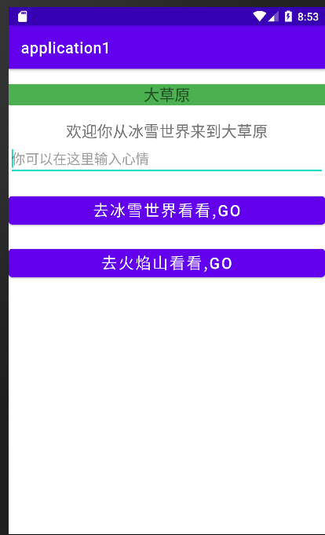

火焰山也热热热热热热情的欢迎了DBin,不过太热了，DBin心情`bad`的离开了(点击返回按键)

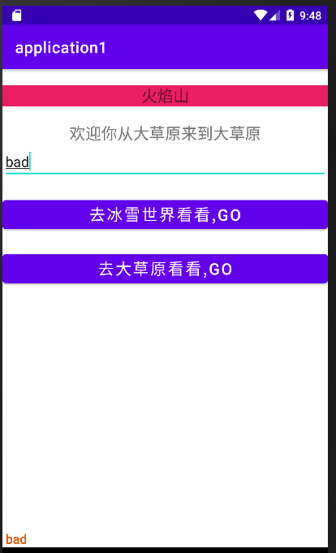

Dbin跟随传送阵回到了大草原，哇，大草原居然知道我在火焰山过得很bad? Dbin表示有人关心自己很开心！

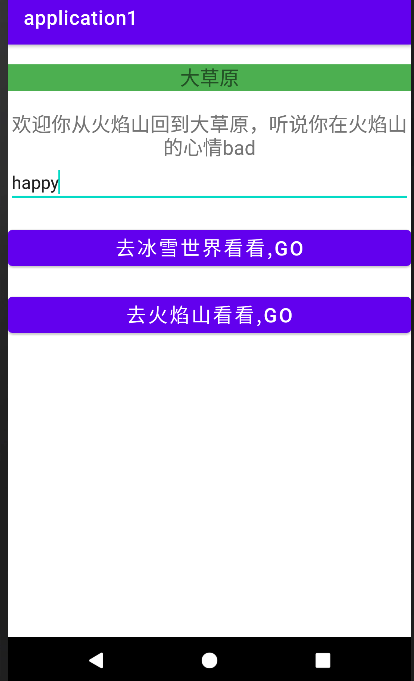

最后Dbin回到了冰雪世界，唉，Dbin终究还是逃不过GouPi神的魔爪。他这辈子只能去火焰山和大草原玩耍了

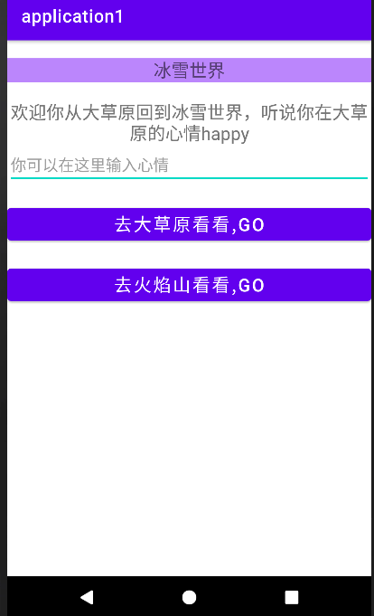

## 实验结论

通过Intent 各个Activity之间可以传输数据，？？？？？那Dbin是数据吗????

# 实验三

## 实验要求：

设计如下布局


在MainActivity中通过SharedPreferences保存验证通过的用户名和密码。

当用户在“记住用户名和密码”处打钩，则在下一次进入该界面时，自动读取SharedPreferences中的内容，并填充到指定的文本框中。

在Module中新建一个Activity，取名为“DownloadFile”。

设计DownloadFile的布局文件，主要包括两个文本框（et1和et2）和一个按钮（btn1）。

在DownloadFile中编写相关的逻辑代码，点击按钮btn1后，通过HttpURLConnection实现将et1中指定网络地址的文件进行下载，并保存到本地，保存的文件名来自et2中的输入。

下载完成后，使用Toast给出提示。

通过Device File Explorer检查文件是否生成，能否正确打开。

## 实验代码(第一部分)

### `activity_main3.xml`

```xml
<?xml version="1.0" encoding="utf-8"?>
<androidx.constraintlayout.widget.ConstraintLayout xmlns:android="http://schemas.android.com/apk/res/android"
    xmlns:tools="http://schemas.android.com/tools"
    android:layout_width="match_parent"
    android:layout_height="match_parent"
    tools:context=".MainActivity3">
<LinearLayout
    android:orientation="vertical"
    android:layout_width="match_parent"
    android:layout_height="match_parent">
    <LinearLayout
        android:orientation="horizontal"
        android:layout_width="match_parent"
        android:layout_height="wrap_content">
        <TextView
            android:layout_width="wrap_content"
            android:layout_height="wrap_content"
            android:text="用户名:"
            android:textSize="30dp"
            android:width="50pt"/>
        <EditText
            android:id="@+id/main3.username"
            android:layout_width="match_parent"
            android:layout_height="wrap_content"
            android:text=""
            android:textSize="30dp"/>
    </LinearLayout>
    <LinearLayout
        android:orientation="horizontal"
        android:layout_width="match_parent"
        android:layout_height="wrap_content">
        <TextView
            android:layout_width="wrap_content"
            android:layout_height="wrap_content"
            android:text="密码:"
            android:textSize="30dp"
            android:width="50pt"/>
        <EditText
            android:id="@+id/main3.password"
            android:layout_width="wrap_content"
            android:layout_height="wrap_content"
            android:text=""
            android:inputType="textPassword"
            android:textSize="30dp"
            android:width="100pt"/>
        <ToggleButton
            android:id="@+id/main3.show"
            android:layout_width="match_parent"
            android:layout_height="wrap_content"
            android:width="50pt"
            android:textAllCaps="false"
            android:textOn="hide"
            android:textOff="show"
            />
    </LinearLayout>
    <LinearLayout
        android:orientation="vertical"
        android:layout_width="match_parent"
        android:layout_height="wrap_content">
        <RadioButton
            android:id="@+id/main3.remember"
            android:layout_width="match_parent"
            android:layout_height="wrap_content"
            android:text="记住用户名和密码"
            android:textSize="20dp"/>
        <LinearLayout
            android:layout_width="match_parent"
            android:layout_height="match_parent">
            <Button
                android:id="@+id/main3.submit"
                android:layout_width="wrap_content"
                android:layout_height="wrap_content"
                android:text="登录"
                android:layout_margin="10px"
                android:textSize="30dp" />
            <Button
                android:id="@+id/main3.clear"
                android:layout_width="wrap_content"
                android:layout_height="wrap_content"
                android:text="清空数据"
                android:layout_margin="10px"
                android:textSize="30dp" />
        </LinearLayout>
    </LinearLayout>
</LinearLayout>
</androidx.constraintlayout.widget.ConstraintLayout>
```

### `MainActivity3.java`

```java
package site.dbin.application1;

import androidx.appcompat.app.AppCompatActivity;

import android.content.SharedPreferences;
import android.os.Bundle;
import android.text.InputType;
import android.widget.Button;
import android.widget.EditText;
import android.widget.RadioButton;
import android.widget.Toast;
import android.widget.ToggleButton;

public class MainActivity3 extends AppCompatActivity {

    @Override
    protected void onCreate(Bundle savedInstanceState) {
        super.onCreate(savedInstanceState);
        setContentView(R.layout.activity_main3);
        SharedPreferences sp = getSharedPreferences("info",MODE_PRIVATE);
        SharedPreferences.Editor editor = sp.edit();
        EditText usernameT = findViewById(R.id.main3_username);
        EditText passwordT = findViewById(R.id.main3_password);
        ToggleButton show = findViewById(R.id.main3_show);// 显示密码的控件
        show.setOnCheckedChangeListener((v,is)->{
            if(is){
                passwordT.setInputType(InputType.TYPE_CLASS_TEXT | InputType.TYPE_TEXT_VARIATION_VISIBLE_PASSWORD);
            } else {
                passwordT.setInputType(InputType.TYPE_CLASS_TEXT | InputType.TYPE_TEXT_VARIATION_PASSWORD);
            }
        });
        Button clear = findViewById(R.id.main3_clear);
        clear.setOnClickListener(v -> {
            editor.clear();
            editor.commit();
            usernameT.setText("");
            passwordT.setText("");
        });
        String username = sp.getString("username",null);
        String password = sp.getString("password",null);
        if(username!=null){
            usernameT.setText(username);
        }
        if(password!=null){
            passwordT.setText(password);
        }
        Button submit = findViewById(R.id.main3_submit);
        RadioButton remember = findViewById(R.id.main3_remember);
        submit.setOnClickListener(v -> {
            String u = usernameT.getText().toString();
            String p = passwordT.getText().toString();
            if(isBlank(u)||isBlank(p)){
                Toast.makeText(MainActivity3.this,"用户名和密码不能为空", Toast.LENGTH_SHORT).show();
                return;
            }
            if(remember.isChecked()) {
                editor.putString("username", u);
                editor.putString("password", p);
                editor.commit();// 提交数据
            }
            Toast.makeText(MainActivity3.this,"成功", Toast.LENGTH_SHORT).show();
        });
    }

    private static boolean isBlank(String s){
        if(s==null)return true;
        boolean is = true;
        for(int i=0;i<s.length();i++){
            if(s.charAt(i)!=' '){
                is = false;
                break;
            }
        }
        return is;
    }
}
```

## 运行效果(第一部分)


## 实验代码(第二部分)

### 修改AndroidManifest.xml

在二级标签中添加下面类容，申请网络权限

```xml
<uses-permission android:name="android.permission.INTERNET" />
```

### `activity_download_file.xml`

```xml
<?xml version="1.0" encoding="utf-8"?>
<androidx.constraintlayout.widget.ConstraintLayout xmlns:android="http://schemas.android.com/apk/res/android"
    xmlns:tools="http://schemas.android.com/tools"
    android:layout_width="match_parent"
    android:layout_height="match_parent"
    tools:context=".DownloadFile">
    <LinearLayout
        android:orientation="vertical"
        android:layout_width="match_parent"
        android:layout_height="match_parent">
        <EditText
            android:id="@+id/et1"
            android:layout_width="match_parent"
            android:layout_height="wrap_content"
            android:hint="请输入下载地址"/>
        <EditText
            android:id="@+id/et2"
            android:layout_width="match_parent"
            android:layout_height="wrap_content"
            android:hint="请输入文件名"/>
        <Button
            android:id="@+id/btn1"
            android:layout_width="wrap_content"
            android:layout_height="wrap_content"
            android:text="下载"/>
    </LinearLayout>
</androidx.constraintlayout.widget.ConstraintLayout>
```

### `DownloadFile.java`

```java
package site.dbin.application1;

import static androidx.constraintlayout.helper.widget.MotionEffect.TAG;

import androidx.appcompat.app.AppCompatActivity;

import android.os.Bundle;
import android.os.FileUtils;
import android.util.Log;
import android.widget.Button;
import android.widget.EditText;
import android.widget.Toast;

import java.io.File;
import java.io.FileOutputStream;
import java.io.InputStream;
import java.net.HttpURLConnection;
import java.net.URL;

public class DownloadFile extends AppCompatActivity {
    private EditText et1, et2;
    @Override
    protected void onCreate(Bundle savedInstanceState) {
        super.onCreate(savedInstanceState);
        setContentView(R.layout.activity_download_file);
        et1 = findViewById(R.id.et1);
        et2 = findViewById(R.id.et2);
        Button btn1 = findViewById(R.id.btn1);
        btn1.setOnClickListener((v)->{
            String url = et1.getText().toString();
            // 测试连接
            if(isBlank(url))url = "https://raw.githubusercontent.com/dbinfun/My-college-assignments/main/README.md";
            String fileName = et2.getText().toString();
            if(isBlank(url)||isBlank(fileName)){
                Toast.makeText(this,"连接和文件名不能为空",Toast.LENGTH_SHORT).show();
                return;
            }
            String pd = this.getFilesDir().getAbsolutePath();
            Log.d(TAG,pd);// 输出路径，方便查找
            downLoad(url,pd+"/"+fileName);
        });
    }
    public static void downLoad(final String path, final String FileName) {
        //开启新的线程进行文件下载
        new Thread(() -> {
            try {
                URL url = new URL(path);
                HttpURLConnection con = (HttpURLConnection) url.openConnection();
                con.setReadTimeout(5000);
                con.setConnectTimeout(5000);
                con.setRequestProperty("Charset", "UTF-8");
                con.setRequestMethod("GET");
                InputStream is = con.getInputStream();//获取输入流
                FileOutputStream fileOutputStream = null;//文件输出流
                if (is != null) {
                    File file = new File(FileName);
                    boolean isCreate = file.createNewFile();
                    if(!isCreate){
                        is.close();
                        Log.e(TAG, "downLoad: 文件访问错误");
                        return;
                    }

                    fileOutputStream = new FileOutputStream(file);//指定文件保存路径，
                    byte[] buf = new byte[1024];
                    int ch;
                    while ((ch = is.read(buf)) != -1) {
                        fileOutputStream.write(buf, 0, ch);//将获取到的流写入文件中
                    }
                }
                if (fileOutputStream != null) {
                    fileOutputStream.flush();
                    fileOutputStream.close();
                    is.close();
                }

            } catch (Exception e) {
                e.printStackTrace();
            }
        }).start();//新线程的启动
    }
    private static boolean isBlank(String s){
        if(s==null)return true;
        boolean is = true;
        for(int i=0;i<s.length();i++){
            if(s.charAt(i)!=' '){
                is = false;
                break;
            }
        }
        return is;
    }
}
```

## 运行效果(第二部分)

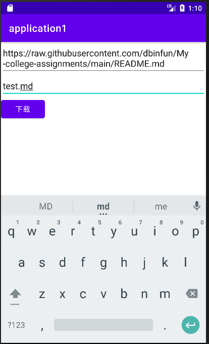

通过 Device Manager 的虚拟的的 Open this device in.... 进入虚拟机的文件管理器


到`/data/data/你的程序包名+的工程名/file/`寻找下载的文件(有时需要点击Synchronize刷新)

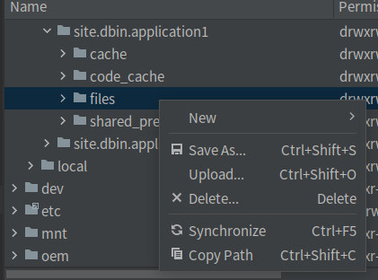

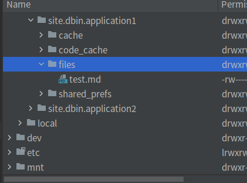

# 作业二

tips: 本次作业中有以下注释包裹的代码可以忽略(因为里面涉及适配器和广播)

```java
/***plus***/
```

```xml
<!--plus-->
```

准备：

准备一个mp3格式的文件放在res/raw下,命名最好是英文，中文好像会报错。

我这里是赵雷的我记得。


## 要求

实现(定时)服务

## 实验代码

### `activity_my_service_start.xml`

这是布局文件

```xml
<?xml version="1.0" encoding="utf-8"?>
<androidx.constraintlayout.widget.ConstraintLayout xmlns:android="http://schemas.android.com/apk/res/android"
    xmlns:app="http://schemas.android.com/apk/res-auto"
    xmlns:tools="http://schemas.android.com/tools"
    android:layout_width="match_parent"
    android:layout_height="match_parent"
    tools:context=".MyServiceStart">
    <LinearLayout
        android:orientation="vertical"
        android:layout_width="match_parent"
        android:layout_height="match_parent">
        <Button
            android:id="@+id/start_service"
            android:layout_width="match_parent"
            android:layout_height="wrap_content"
            android:text="定时" />
        <Button
            android:id="@+id/service.stop"
            android:layout_width="match_parent"
            android:layout_height="wrap_content"
            android:text="关闭" />
        <!--plus-->
        <TextView
            android:layout_width="match_parent"
            android:layout_height="wrap_content"
            android:text="当前运行的闹钟"/>
        <ListView
            android:id="@+id/service.list"
            android:layout_width="match_parent"
            android:layout_height="wrap_content">

        </ListView>
        <!--plus-->
    </LinearLayout>
</androidx.constraintlayout.widget.ConstraintLayout>
```

### `MusicPlayerService`

这是服务类

```java
package site.dbin.application1.music;

import android.app.Service;
import android.content.Intent;
import android.media.MediaPlayer;
import android.os.IBinder;
import android.util.Log;

import androidx.localbroadcastmanager.content.LocalBroadcastManager;

import java.io.IOException;

import site.dbin.application1.MyServiceStart;
import site.dbin.application1.R;

public class MusicPlayerService extends Service implements MediaPlayer.OnPreparedListener, MediaPlayer.OnCompletionListener {
    // 官方文档：https://developer.android.com/reference/android/media/MediaPlayer#setOnPreparedListener(android.media.MediaPlayer.OnPreparedListener)
    // 方法介绍：https://blog.csdn.net/Jason_Julie/article/details/115549602
    private static final String TAG = "MusicPlayerService";
    private MediaPlayer mediaPlayer;
    private boolean isPrepared = false;// 好像没啥用
    private boolean isStart = false;
    /***plus***/
    private LocalBroadcastManager localBroadcastManager;
    private String time;
    /***plus***/
    @Override
    public void onCreate() {
        super.onCreate();
        mediaPlayer = MediaPlayer.create(this, R.raw.wojide);// 这里注意和自己的文件对应
        mediaPlayer.setOnPreparedListener(this); // 注册回调函数，当准备好的时候会回调onPrepared方法
        mediaPlayer.setOnCompletionListener(this); // 注册回调函数，当播放完成的时候会回调onCompletion方法
        /***plus***/
        localBroadcastManager = LocalBroadcastManager.getInstance(this);
        /***plus***/
    }

    @Override
    public int onStartCommand(Intent intent, int flags, int startId) {
        if (intent != null) {
            /***plus***/
            time = intent.getStringExtra("time");
            /***plus***/
            String action = intent.getAction();
            if ("PLAY_MUSIC".equals(action)) {
                if(mediaPlayer==null){
                    mediaPlayer = MediaPlayer.create(this, R.raw.wojide);
                    mediaPlayer.setOnPreparedListener(this); // 注册回调函数，当准备好的时候会回调onPrepared方法
                    mediaPlayer.setOnCompletionListener(this); // 注册回调函数，当播放完成的时候会回调onCompletion方法
                }
               isStart = true;
            }
            // 停止播放
            if("STOP_MUSIC".equals(action)){
                if(mediaPlayer!=null){
                    mediaPlayer.stop();
                    mediaPlayer.release();
                    mediaPlayer = null;
                    isPrepared = false;
                }
            }
        }
        return START_STICKY;
    }

    @Override
    public void onDestroy() {
        super.onDestroy();
        if (mediaPlayer != null) {
            mediaPlayer.release(); // 释放相关资源，官方文档说一旦不使用了就一定要调用。
            mediaPlayer = null;
        }
    }

    @Override
    public IBinder onBind(Intent intent) {
        return null;
    }

    @Override
    public void onPrepared(MediaPlayer mp) {
        isPrepared = true;
        if(isStart){
            mediaPlayer.start();
            /***plus***/
            // 发送广播
            Intent intent = new Intent(MyServiceStart.BROADCAST_ACTION);
            if(time!=null){
                intent.putExtra("time",time);
            }
            localBroadcastManager.sendBroadcast(intent);
            /***plus***/
        }
    }

    @Override
    public void onCompletion(MediaPlayer mp) {
        stopSelf();
    }
}
```

### `MyServiceStart`

这是java代码

```java
package site.dbin.application1;

import android.app.AlarmManager;
import android.app.DatePickerDialog;
import android.app.PendingIntent;
import android.app.TimePickerDialog;
import android.content.BroadcastReceiver;
import android.content.Context;
import android.content.Intent;
import android.content.IntentFilter;
import android.icu.util.Calendar;
import android.os.Bundle;
import android.view.View;
import android.widget.ArrayAdapter;
import android.widget.Button;
import android.widget.ListView;
import android.widget.TextView;
import android.widget.Toast;

import androidx.appcompat.app.AppCompatActivity;
import androidx.localbroadcastmanager.content.LocalBroadcastManager;

import java.util.ArrayList;
import java.util.Collections;
import java.util.HashMap;
import java.util.List;
import java.util.Map;

import site.dbin.application1.music.MusicPlayerService;

public class MyServiceStart extends AppCompatActivity {
    /***plus***/
    private Map<String,PendingIntent> map  = Collections.synchronizedMap(new HashMap<>());
    private ArrayAdapter<String> adapter = null;
    private List<String> list = new ArrayList();

    private IntentFilter intentFilter;
    private LocalReceiver localReceiver;
    private LocalBroadcastManager localBroadcastManager;

    public static final String BROADCAST_ACTION = "site.dbin.application1.MyServiceStart";
    /***plus***/
    Button button =null;
    ListView listView = null;
    AlarmManager alarmManager =null;
    private Integer alarmId = 0; // 用于区分不同的闹钟
    @Override
    protected void onCreate(Bundle savedInstanceState) {
        super.onCreate(savedInstanceState);
        setContentView(R.layout.activity_my_service_start);
        alarmManager= (AlarmManager) getSystemService(Context.ALARM_SERVICE);
        button = findViewById(R.id.start_service);
        /***plus***/
        listView = findViewById(R.id.service_list);
        adapter = new ArrayAdapter<>(this, android.R.layout.simple_list_item_1, list);
        listView.setAdapter(adapter);
        adapter.notifyDataSetChanged();
        listView.setOnItemClickListener((adapterView, view, i, l) -> {
            String key = ((TextView) view).getText().toString();
            PendingIntent intent = map.get(key);
            map.remove(key);
            alarmManager.cancel(intent);
            adapter.remove(key);
        });
        /***plus***/
        // 选择时间
        button.setOnClickListener((v)->{
            //v.setEnabled(false);
            Calendar t = Calendar.getInstance();
            new DatePickerDialog(this,(view,year,month,dayOfMonth)->{
                new TimePickerDialog(this,(view2,hourOfDay,minute)->{
                    Intent playIntent = new Intent(this, MusicPlayerService.class);
                    String time = year+"年,"+month+"月,"+dayOfMonth+"日,"+hourOfDay+"时,"+minute+"分";
                    playIntent.putExtra("time",time);
                    playIntent.setAction("PLAY_MUSIC");
                    PendingIntent pendingIntent = PendingIntent.getService(this,alarmId++,playIntent,PendingIntent.FLAG_UPDATE_CURRENT);
                    Calendar calendar = Calendar.getInstance();
                    calendar.set(year,month,dayOfMonth,hourOfDay,minute,0);
                    // 因为省点等原因，直接用set会有延迟，所以用这个方法，参见官方文档https://developer.android.com/reference/android/app/AlarmManager#setAndAllowWhileIdle(int,%20long,%20android.app.PendingIntent)
                    // RTC_WAKEUP 是绝对时间。
                    alarmManager.setAndAllowWhileIdle(AlarmManager.RTC_WAKEUP,calendar.getTimeInMillis(),pendingIntent);
                    /***plus***/
                    this.addView(time);
                    map.put(time,pendingIntent);
                    /***plus***/
                    Toast.makeText(this,"设置成功："+ time,Toast.LENGTH_SHORT).show();
                },t.get(Calendar.HOUR_OF_DAY),t.get(Calendar.MINUTE)+1,true).show();// 默认设置当前时间+1分钟
            },t.get(Calendar.YEAR),t.get(Calendar.MONTH),t.get(Calendar.DAY_OF_MONTH)).show();// 默认设置问当前日期
        });
        Button button1 = findViewById(R.id.service_stop);
        button1.setOnClickListener((v)->{
            Intent playIntent = new Intent(this, MusicPlayerService.class);
            playIntent.setAction("STOP_MUSIC");
            startService(playIntent);
        });
        /***plus***/
        // 注册广播
        localBroadcastManager = LocalBroadcastManager.getInstance(this); // 获取实例
        intentFilter = new IntentFilter();
        intentFilter.addAction(BROADCAST_ACTION);
        localReceiver = new LocalReceiver();
        localBroadcastManager.registerReceiver(localReceiver, intentFilter);
        /***plus***/
    }

    @Override
    public void onBackPressed() {
        finish();
    }

    @Override
    public void finish() {
        stopService(new Intent(this, MusicPlayerService.class));
        localBroadcastManager.unregisterReceiver(localReceiver);
        super.finish();
    }

    /***plus***/
    private void addView(String time){
        adapter.add(time);
        adapter.notifyDataSetChanged();
    }
    // 移除列表
    private void removeView(String time){
        adapter.remove(time);
        adapter.notifyDataSetChanged();
    }

    class LocalReceiver extends BroadcastReceiver {
        @Override
        public void onReceive(Context context, Intent intent) {
            // 接受广播后的处理，播放的闹钟从列表中移除
            String time = intent.getStringExtra("time");
            removeView(time);
            PendingIntent i = map.get(time);
            map.remove(time);
        }}
    /***plus***/
}
```

### 注册服务

tips: 同事也要注册MyServiceStart这个Activity,可以参考前面的注册方法，到AndroidManfest.xml注册

注册服务有一点不一样，如下：

```xml
<service
            android:name=".music.MusicPlayerService"
            android:exported="false"/>
```

## 运行效果

选择时间，然后到时间就会播放音乐


# 实验四

## 实验要求

1）在项目中新建1个APP Module，Module中包含1个空的Activity，名称为MainActivity。

2）把MainActivity的布局文件设计如下：


3）创建SQLiteOpenHelper的派生类DBHelper，并重写onCreate方法，使得程序第一次创建数据库后就可以创建表

Users（_id（不是id）,username,usertel,useraddress,useremail）。

4）按钮“打开数据库”点击处理的逻辑为：创建DBHelper的对象，并通过对象的getWritableDatabase()方法得到SQLiteDatabase对象。

5）在ADB Shell环境中访问SQLite数据库（使用的命令：SQLite3），查看表Users是否已经创建。（程序执行了DBHelper的onCreate方法）

6）按钮“下一记录”点击处理的逻辑为： 调用SQLiteDatabase对象的query方法生成Cursor对象，通过向后移动记录指针，将记录指针指向的记录数据在文本编辑框中显示。

7）按钮“上一记录”点击处理的逻辑为： 调用SQLiteDatabase对象的query方法生成Cursor对象，通过向前移动记录指针，将记录指针指向的记录数据在文本编辑框中显示。

8）按钮“添加”点击处理的逻辑为：将文本编辑框中用户输入的内容保存到SQLite数据库中,主要使用SQLiteDatabase对象的insert()方法。

9）按钮“更新”点击处理的逻辑为：将文本编辑框中用户输入的内容更新到SQLite数据库中,主要使用SQLiteDatabase对象的update()方法，通过用户姓名进行更新（或通过主键_id）。

10）按钮“删除”点击处理的逻辑为：使用SQLiteDatabase对象的delete()方法，通过用户姓名进行记录删除（或通过主键_id）。

11）在ADB Shell环境中访问SQLite数据库，查看表Users中记录的变化。

## 实验代码或步骤

### `activity_main4.xml`

```xml
<?xml version="1.0" encoding="utf-8"?>
<androidx.constraintlayout.widget.ConstraintLayout xmlns:android="http://schemas.android.com/apk/res/android"
    xmlns:app="http://schemas.android.com/apk/res-auto"
    xmlns:tools="http://schemas.android.com/tools"
    android:layout_width="match_parent"
    android:layout_height="match_parent"
    tools:context=".MainActivity4">

    <LinearLayout
        android:layout_width="match_parent"
        android:layout_height="match_parent"
        android:orientation="vertical"
        tools:layout_editor_absoluteX="151dp"
        tools:layout_editor_absoluteY="48dp">

        <TextView
            android:layout_width="match_parent"
            android:layout_height="wrap_content"
            android:gravity="center"
            android:text="我的通讯录"
            android:textSize="20pt" />

        <LinearLayout
            android:layout_width="match_parent"
            android:layout_height="wrap_content"
            android:gravity="center"
            android:orientation="horizontal">

            <Button
                android:id="@+id/main4.open.database"
                android:layout_width="wrap_content"
                android:layout_height="wrap_content"
                android:layout_margin="2pt"
                android:text="打开数据库"
                android:textSize="10pt" />

            <Button
                android:id="@+id/main4.close.database"
                android:layout_width="wrap_content"
                android:layout_height="wrap_content"
                android:layout_margin="2pt"
                android:text="关闭数据库"
                android:textSize="10pt" />
        </LinearLayout>

        <LinearLayout
            android:layout_width="match_parent"
            android:layout_height="wrap_content"
            android:gravity="center_vertical"
            android:orientation="horizontal"><!--垂直居中-->
            <TextView
                android:layout_width="0px"
                android:layout_height="wrap_content"
                android:layout_weight="2"
                android:text=" 浏览记录:"
                android:textSize="10pt" />

            <LinearLayout
                android:layout_width="0px"
                android:layout_height="wrap_content"
                android:layout_weight="5">

                <Button
                    android:id="@+id/main4.front"
                    android:layout_width="0px"
                    android:layout_height="match_parent"
                    android:layout_margin="10px"
                    android:layout_weight="1"
                    android:text="上一记录" />

                <Button
                    android:id="@+id/main4.next"
                    android:layout_width="0px"
                    android:layout_height="match_parent"
                    android:layout_margin="10px"
                    android:layout_weight="1"
                    android:text="下一记录" />
            </LinearLayout>
        </LinearLayout>

        <LinearLayout
            android:layout_width="match_parent"
            android:layout_height="wrap_content">
            <TextView
                android:layout_width="0px"
                android:layout_height="wrap_content"
                android:layout_weight="2"
                android:text=" 用户姓名:"
                android:textSize="8pt" />
            <EditText
                android:id="@+id/main4.username"
                android:layout_width="0px"
                android:layout_height="wrap_content"
                android:layout_weight="7" />
        </LinearLayout>
        <LinearLayout
            android:layout_width="match_parent"
            android:layout_height="wrap_content">
            <TextView
                android:layout_width="0px"
                android:layout_height="wrap_content"
                android:layout_weight="2"
                android:text=" 联系电话:"
                android:textSize="8pt" />
            <EditText
                android:id="@+id/main4.phone"
                android:layout_width="0px"
                android:layout_height="wrap_content"
                android:layout_weight="7"
                android:inputType="phone"/>
        </LinearLayout>
        <LinearLayout
            android:layout_width="match_parent"
            android:layout_height="wrap_content">

            <TextView
                android:layout_width="0px"
                android:layout_height="wrap_content"
                android:layout_weight="2"
                android:text=" 家庭住址:"
                android:textSize="8pt" />

            <EditText
                android:id="@+id/main4.address"
                android:layout_width="0px"
                android:layout_height="wrap_content"
                android:layout_weight="7"/>
        </LinearLayout>
        <LinearLayout
            android:layout_width="match_parent"
            android:layout_height="wrap_content">

            <TextView
                android:layout_width="0px"
                android:layout_height="wrap_content"
                android:layout_weight="2"
                android:text=" 电子邮箱:"
                android:textSize="8pt" />
            <EditText
                android:id="@+id/main4.email"
                android:layout_width="0px"
                android:layout_height="wrap_content"
                android:layout_weight="7"
                android:inputType="textEmailAddress"/>
        </LinearLayout>
        <LinearLayout
            android:layout_width="match_parent"
            android:layout_height="wrap_content"
            android:gravity="center">
            <Button
                android:id="@+id/main4.add"
                android:layout_width="wrap_content"
                android:layout_height="wrap_content"
                android:layout_margin="5px"
                android:layout_weight="1"
                android:text="添加"/>
            <Button
                android:id="@+id/main4.edit"
                android:layout_width="wrap_content"
                android:layout_height="wrap_content"
                android:layout_margin="5px"
                android:layout_weight="1"
                android:text="修改"/>
            <Button
                android:id="@+id/main4.delete"
                android:layout_width="wrap_content"
                android:layout_height="wrap_content"
                android:layout_margin="5px"
                android:layout_weight="1"
                android:text="删除"/>
        </LinearLayout>
    </LinearLayout>
</androidx.constraintlayout.widget.ConstraintLayout>
```

### `DBHelper.java`

```java
package site.dbin.application1;

import android.content.ContentValues;
import android.content.Context;
import android.database.Cursor;
import android.database.sqlite.SQLiteDatabase;
import android.database.sqlite.SQLiteOpenHelper;

import androidx.annotation.Nullable;

class Info {
    private Integer id;
    private String username;

    private String phone;
    private String email;
    private String address;

    public Info(){}

    public Info(Cursor cursor){
        this.id = cursor.getInt(0);
        this.username = cursor.getString(1);
        this.phone = cursor.getString(2);
        this.email = cursor.getString(3);
        this.address = cursor.getString(4);
    }

    public Integer getId() {
        return id;
    }

    public void setId(Integer id) {
        this.id = id;
    }

    public String getUsername() {
        return username;
    }

    public void setUsername(String username) {
        this.username = username;
    }

    public String getPhone() {
        return phone;
    }

    public void setPhone(String phone) {
        this.phone = phone;
    }

    public String getEmail() {
        return email;
    }

    public void setEmail(String email) {
        this.email = email;
    }

    public String getAddress() {
        return address;
    }

    public void setAddress(String address) {
        this.address = address;
    }
}
public class DBHelper extends SQLiteOpenHelper {
    public static final String DATABASE_NAME = "my_database.db";
    public static final int DATABASE_VERSION = 1;
    public static final String TABLE_NAME = "my_table";
    private static final String ID = "_id";
    private static final String USERNAME = "username";
    private static final String PHONE = "phone";
    private static final String EMAIL = "email";
    private static final String Address = "address";
    private static final String CREATE_TABLE_SQL = "CREATE TABLE " + TABLE_NAME + " (" +
            ID + " INTEGER PRIMARY KEY AUTOINCREMENT, " +
            USERNAME + " TEXT, "+
            PHONE + " TEXT, "+
            EMAIL + " TEXT, "+
            Address + " TEXT"+
            ")";
    public DBHelper(@Nullable Context context) {
        super(context,DATABASE_NAME,null,DATABASE_VERSION);
    }

    @Override
    public void onCreate(SQLiteDatabase sqLiteDatabase) {
        sqLiteDatabase.execSQL(CREATE_TABLE_SQL);
    }

    @Override
    public void onUpgrade(SQLiteDatabase sqLiteDatabase, int i, int i1) {
    }

    public boolean insert(Info info){
        SQLiteDatabase db = this.getWritableDatabase();
        ContentValues contentValues = new ContentValues();
        contentValues.put(USERNAME, info.getUsername());
        contentValues.put(PHONE, info.getPhone());
        contentValues.put(EMAIL, info.getEmail());
        contentValues.put(Address, info.getAddress());
        long result = db.insert(TABLE_NAME, null, contentValues);
        db.close();
        return result > 0;
    }

    public int delete(int id){
        SQLiteDatabase db = this.getWritableDatabase();
        int result = db.delete(TABLE_NAME, ID + "=" + id, null);
        db.close();
        return result;
    }

    public int update(Info info){
        SQLiteDatabase db = this.getWritableDatabase();
        ContentValues contentValues = new ContentValues();
        contentValues.put(USERNAME, info.getUsername());
        contentValues.put(PHONE, info.getPhone());
        contentValues.put(EMAIL, info.getEmail());
        contentValues.put(Address, info.getAddress());
        int result = db.update(TABLE_NAME, contentValues, ID + "=" + info.getId(), null);
        db.close();
        return result;
    }

    public Info select(int i){
        SQLiteDatabase db = this.getReadableDatabase();
        // 查询限制一条
        Cursor cursor = db.query(TABLE_NAME, null, null, null, null, null, null,i-1+","+1);
        Info info = new Info();
        if(cursor.moveToFirst()){
            info.setId(cursor.getInt(0));
            info.setUsername(cursor.getString(1));
            info.setPhone(cursor.getString(2));
            info.setEmail(cursor.getString(3));
            info.setAddress(cursor.getString(4));
        }else{
            return null;
        }
        cursor.close();
        db.close();
        return info;
    }
}
```

### `MainActivity4.java`

```java
package site.dbin.application1;

import android.database.sqlite.SQLiteDatabase;
import android.os.Bundle;
import android.widget.Button;
import android.widget.EditText;
import android.widget.Toast;

import androidx.appcompat.app.AppCompatActivity;

public class MainActivity4 extends AppCompatActivity {
    private DBHelper dbHelper;
    private int which=0;// 记录当前用户是第几行
    private Info info=null;// 用户信息
    EditText username=null;
    EditText phone=null;
    EditText email=null;
    EditText address=null;
    @Override
    protected void onCreate(Bundle savedInstanceState) {
        super.onCreate(savedInstanceState);
        setContentView(R.layout.activity_main4);
        username = findViewById(R.id.main4_username);
        phone = findViewById(R.id.main4_phone);
        email = findViewById(R.id.main4_email);
        address = findViewById(R.id.main4_address);
        // 这里可以采用遍历数组的方式获取队像
        Button add = findViewById(R.id.main4_add);
        Button del = findViewById(R.id.main4_delete);
        Button edit = findViewById(R.id.main4_edit);
        Button front = findViewById(R.id.main4_front);
        Button next =findViewById(R.id.main4_next);
        Button open = findViewById(R.id.main4_open_database);
        Button close = findViewById(R.id.main4_close_database);
        // 禁用按钮
        disallowClick(add,del,edit,front,next,close);
        open.setOnClickListener((v)->{
            if(dbHelper==null){
                dbHelper = new DBHelper(this);
                SQLiteDatabase db = dbHelper.getWritableDatabase();
                // 启用和禁用按钮
                allowdClick(add,del,edit,front,next,close);
                disallowClick(open);
            }else{
                toast("数据库已经打开了");
            }
        });
        close.setOnClickListener((v)->{
            if(dbHelper!=null){
                dbHelper.close();
                dbHelper = null;
                // 启用和禁用按钮
                allowdClick(open);
                disallowClick(add,del,edit,front,next,close);
                // which=1;//可以切换到第一个
                // 这里可以将数据清空,略......
            }else{
                toast("数据库已经关闭了");
            }
        });
        // 下一个
        next.setOnClickListener((v)->{
            if(!isOpen())return;
            which++;
            Info t = dbHelper.select(which);
            if(t==null){
                which=1;
                t=dbHelper.select(which);
                toast("已经是最后一个了，尝试切换到第一个");
            }
            bindData(t);
        });
        // 前一个
        front.setOnClickListener((v)->{
            if(!isOpen())return;
            which--;
            if(which==0){
                toast("已经是第一个了，尝试切换到第一个");
                which=1;
            }
            Info t=dbHelper.select(which);
            bindData(t);
        });
        // 添加
        add.setOnClickListener((v)->{
            if(!isOpen())return;
            // 获取编辑器中的数据
            Info t = bindData(null,username.getText().toString(),phone.getText().toString(),email.getText().toString(),address.getText().toString());
            if(t==null){
                toast("数据填写不完整或者不可见");
                return;
            }
            boolean is = dbHelper.insert(t);
            if(is)toast("添加成功");
            else toast("添加失败");
        });
        // 删除
        del.setOnClickListener((v)->{
            if(!isOpen())return;
            dbHelper.delete(info.getId());// 删除
            Info t = dbHelper.select(which);// which不变重新查询
            // 没有
            if(t==null){
                which=1;
                t=dbHelper.select(which);
                toast("删除了最后一个，尝试切换到第一个");
            }
            bindData(t);
            toast("删除成功");
        });
        // 编辑
        edit.setOnClickListener(view -> {
            if(!isOpen())return;
            // 修改时witch不变
            info = bindData(info.getId(),username.getText().toString(),phone.getText().toString(),email.getText().toString(),address.getText().toString());
            if(info==null){
                toast("数据填写不完整或者不可见");
                return;
            }
            int result = dbHelper.update(info);
            if(result==1)toast("修改成功");
            else toast("修改失败");
        });

    }

    /**
     * 统一的Toast
     * @param message 信息
     */
    private void toast(String message){
        Toast.makeText(this,message,Toast.LENGTH_SHORT).show();
    }

    /**
     * 绑定数据到视图
     * @param info 数据
     */
    public void bindData(Info info){
        if(info==null){
            toast("没有数据");
            return;
        }else{
            toast("查询到数据");
        }
        this.info = info;
        username.setText(info.getUsername());
        phone.setText(info.getPhone());
        email.setText(info.getEmail());
        address.setText(info.getAddress());
    }

    /**
     * 字符串判空
     * @param s s
     * @return
     */
    private boolean isBlank(String s){
        if(s==null) return true;
        for(int i=0;i<s.length();i++){
            if(!Character.isWhitespace(s.charAt(i))){
                return false;
            }
        }return true;
    }
    /**
     * 构建可以存入数据库的对象
     */
    public Info bindData(Integer id,String username,String phone,String email,String address){
        if(isBlank(username)||isBlank(phone)||isBlank(email)||isBlank(address)){
            return null;
        }
        Info t = new Info();
        t.setId(id);
        t.setUsername(username);
        t.setPhone(phone);
        t.setEmail(email);
        t.setAddress(address);
        return t;
    }

    /**
     * 允许点击
     * @param buttons 按钮列表
     */
    private void allowdClick(Button ...buttons){
        for(Button b : buttons){
            b.setEnabled(true);
        }
    }

    /**
     * 禁止点击
     * @param buttons 按钮列表
     */
    private void disallowClick(Button...buttons){
        for(Button b : buttons){
            b.setEnabled(false);
        }
    }

    /**
     * 数据库是否开启
     * @return true/no
     */
    public boolean isOpen(){
        if(this.dbHelper!=null){
            return true;
        }
        toast("数据库未开启");
        return false;
    }
}
```

## 运行效果


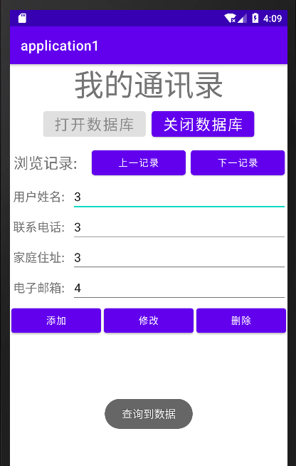

## ADB命令查看数据库

1. 找到SDK的安装位置，其platform-tools下有adb的可执行文件,打开终端，进入platform-tools.

2. 打开AS的虚拟机

3. 使用adb基本命令连接到虚拟机

   有这样一些命令：

   ```shell
   adb devices #连接到虚拟机
   adb shell #进入设备shell环境
   run-as <package_name> #快速进入应用私有目录，比如我的包名是site.dbin 项目名是app，就运行run-as site.dbin.app
   cd databases
   ls #到这步就可以看到数据库文件了
   sqlite3 my_database.db # 注意my_database.db是对应的数据库文件
   # 之后将进入sql命令行
   .tables #查看表
   select * from my_table; #查询my_table表的数据
   .exit #退出sql命令行
   exit #退出应用程序私有目录
   exit #退出adb
   ```

效果如下

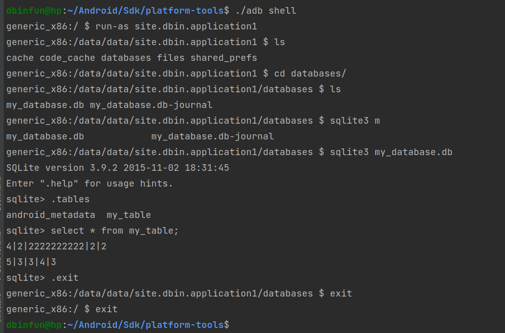
