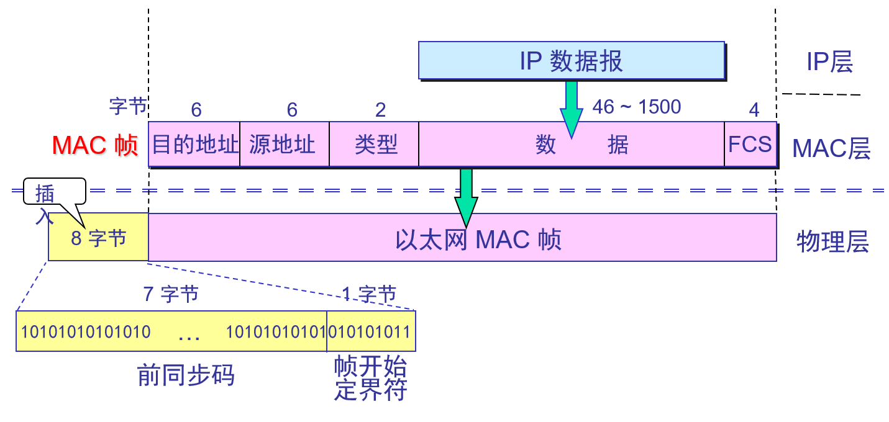
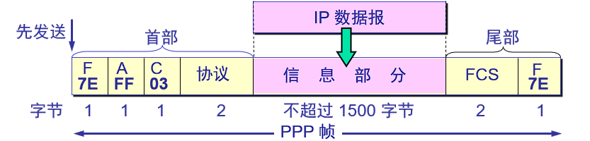
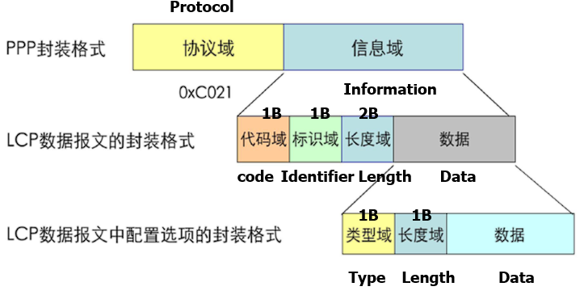
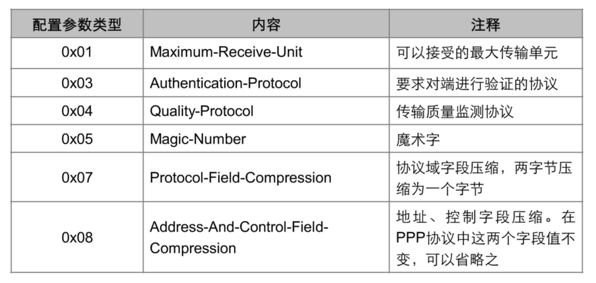
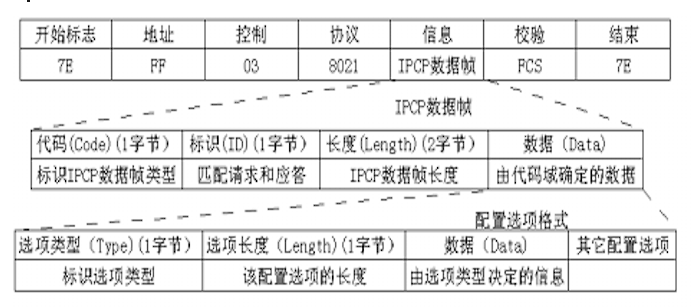
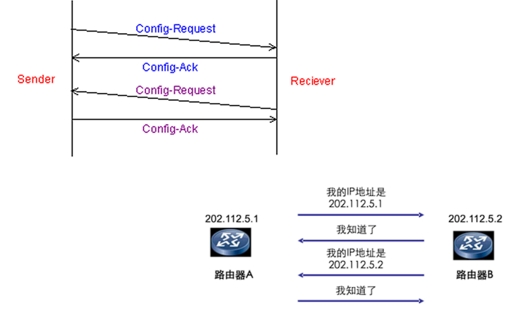
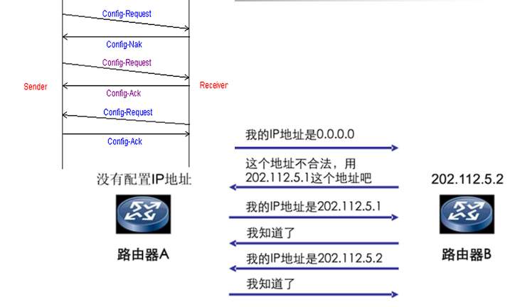
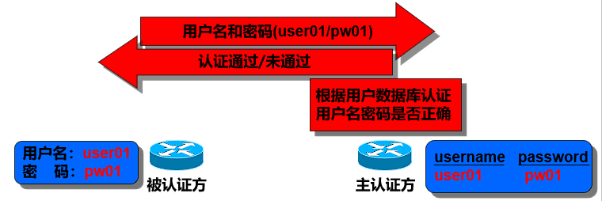
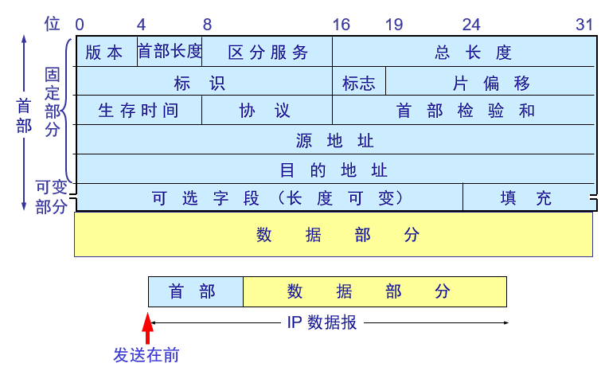
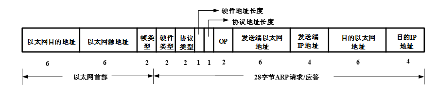

# 第一章

## Wireshark

略...

## Winpcap

### 函数

#### pcap_findalldevs_ex()

获得已连接的网络适配器列表

```c
// return 0:ok -1:error
int pcap_findalldevs_ex  ( 
            char*  source,
            struct pcap_rmtauth* auth,
            pcap_if_t** alldevs, 
            char* errbuf
 ) 
```

参数说明：

- `source`：一个字符串，用于指定要捕获的网络接口。如果传递NULL，则函数将返回所有可用的网络接口。
- `auth`：一个指向`pcap_rmtauth`结构的指针，用于在远程捕获时进行身份验证。如果不需要远程捕获，可以传递NULL。
- `alldevs`：一个指向`pcap_if_t`指针的指针，用于存储获取到的网络接口列表。该列表是通过动态分配内存而生成的，需要在使用完毕后进行释放。
- `errbuf`：一个指向字符数组的指针，用于存储错误消息（如果有）。该数组应该至少具有PCAP_ERRBUF_SIZE（256）个字符的大小。

返回值：

- 如果函数执行成功，返回0。
- 如果发生错误，返回-1，并将错误消息存储在`errbuf`中。

使用完`alldevs`列表后，应调用`pcap_freealldevs`函数来释放为列表动态分配的内存。

`pcap_if`结构体：

```c
typedef struct pcap_if {
    struct pcap_if*           next;      // 指向下一个接口设备的指针
    char*                     name;      // 接口的名称
    char*                     description; // 接口的描述
    struct pcap_addr*         addresses; // 接口的地址链表
    uint32_t                  flags;     // 接口的标志
} pcap_if_t;
```

`pcap_addr`结构体

```c
struct pcap_addr {
    struct pcap_addr*   next;        // 指向下一个地址的指针
    struct sockaddr*    addr;        // 地址结构的指针
    struct sockaddr*    netmask;     // 子网掩码的指针
    struct sockaddr*    broadaddr;   // 广播地址的指针
    struct sockaddr*    dstaddr;     // 目标地址的指针
};
```

#### pcap_open()

用于打开设备

```c
pcap_t* pcap_open(
    const char*              source,
    int                      snaplen,
    int                      flags,
    int                      read_timeout,
    struct pcap_rmtauth*     auth,
    char*                    errbuf
);
```

参数说明：

- `source`：一个字符串，指定要打开的网络接口或保存的捕获文件的路径。
- `snaplen`：一个整数，指定捕获数据包时的最大长度。超过该长度的数据包将被截断。
- `flags`：一个整数，用于指定打开设备时的一些标志选项。
- `read_timeout`：一个整数，指定读取数据包时的超时时间（以毫秒为单位）。
- `auth`：一个指向`pcap_rmtauth`结构的指针，用于在远程捕获时进行身份验证。如果不需要远程捕获，可以传递NULL。
- `errbuf`：一个指向字符数组的指针，用于存储错误消息（如果有）。该数组应该至少具有PCAP_ERRBUF_SIZE（256）个字符的大小。

返回值：

- 如果函数执行成功，返回一个指向`pcap_t`结构体的指针，表示打开的接口或文件。
- 如果发生错误，返回NULL，并将错误消息存储在`errbuf`中。

使用完打开的接口或文件后，应调用`pcap_close()`函数来关闭接口或文件，并释放相关资源。

#### pcap_dispatch() 

打开的网络接口或保存的捕获文件中异步捕获数据包。它会不断地从接口或文件中读取数据包，直到达到指定的捕获数量或满足停止条件。每当捕获到数据包时，指定的回调函数将被调用，可以在回调函数中对捕获到的数据包进行处理。

```c
int pcap_dispatch(
    pcap_t*              p,
    int                  cnt,
    pcap_handler         callback,
    u_char*              user
);
```

参数说明：

- `p`：指向已打开的网络接口或保存的捕获文件的`pcap_t`指针。
- `cnt`：指定要捕获的数据包数量。设置为负数（例如-1）表示持续捕获数据包，直到达到某个停止条件。
- `callback`：一个回调函数指针，用于在每次捕获到数据包时被调用。
- `user`：一个指向用户数据的指针，可以在回调函数中使用。

返回值：

- 如果函数执行成功，返回捕获并处理的数据包数量。
- 如果发生错误，返回-1。

#### pcap_loop()

与`pcap_dispatch()`类似，它也允许你指定一个回调函数，在每次捕获到数据包时被调用

```c
int pcap_loop(
    pcap_t*              p,
    int                  cnt,
    pcap_handler         callback,
    u_char*              user
);
```

参数说明：

- `p`：指向已打开的网络接口或保存的捕获文件的`pcap_t`指针。
- `cnt`：指定要捕获的数据包数量。设置为负数（例如-1）表示持续捕获数据包，直到达到某个停止条件。
- `callback`：一个回调函数指针，用于在每次捕获到数据包时被调用。
- `user`：一个指向用户数据的指针，可以在回调函数中使用。

返回值：

- 如果函数执行成功，返回捕获并处理的数据包数量。
- 如果发生错误，返回-1。

`pcap_handler`

```c
typedef void (*pcap_handler)(u_char* user, const struct pcap_pkthdr* header, const u_char* packet);
```

回调函数的参数说明如下：

- `user`：一个指向用户数据的指针，可以在回调函数中使用。该指针在调用`pcap_dispatch()`或`pcap_loop()`函数时通过`user`参数传递。
- `header`：一个指向`pcap_pkthdr`结构体的指针，包含了捕获到的数据包的相关信息，如时间戳和数据包长度。
- `packet`：一个指向捕获到的数据包的原始数据的指针。

#### pcap_next_ex()

用于从打开的网络接口或保存的捕获文件中获取下一个数据包。它是一个阻塞函数，即在没有捕获到数据包时会一直等待，直到有数据包到达或发生错误。

```c
int pcap_next_ex(
    pcap_t*              p,
    struct pcap_pkthdr** header,
    const u_char**       packet
);
```

参数说明：

- `p`：指向已打开的网络接口或保存的捕获文件的`pcap_t`指针。
- `header`：一个指向`pcap_pkthdr`结构体指针的指针，用于存储捕获到的数据包的头部信息。
- `packet`：一个指向指向数据包原始数据的指针的指针。

返回值：

- 如果函数执行成功并捕获到数据包，返回1，并将数据包的头部信息存储在`header`指向的指针中，数据包的原始数据存储在`packet`指向的指针中。
- 如果函数执行成功但没有捕获到数据包（如超时等待），返回0，并将`header`和`packet`的值设置为NULL。
- 如果发生错误，返回-1。

#### pcap_compile( )

`pcap_compile()`是WinPcap库中的一个函数，用于编译并设置捕获过滤器。过滤器允许你指定条件，以仅捕获符合条件的特定数据包。`pcap_compile()`函数将过滤器表达式编译为一个内部表示，并将其与指定的`pcap_t`设备或文件关联起来。

函数原型：

```c
cCopy codeint pcap_compile(
    pcap_t*              p,
    struct bpf_program*  fp,
    const char*          str,
    int                  optimize,
    bpf_u_int32          netmask
);
```

参数说明：

- `p`：指向已打开的网络接口或保存的捕获文件的`pcap_t`指针。
- `fp`：指向`bpf_program`结构体的指针，用于存储编译后的过滤器程序。
- `str`：一个字符串，表示要编译的过滤器表达式。
- `optimize`：一个整数，用于指定是否对过滤器进行优化。设置为非零值（例如1）表示启用优化，设置为零值表示禁用优化。
- `netmask`：一个32位的网络掩码，用于在过滤器表达式中指定网络地址和子网掩码的匹配规则。

返回值：

- 如果函数执行成功，返回0。
- 如果发生错误，返回-1。

#### pcap_setfilter( )

用于将已编译的过滤器程序应用于打开的网络接口或保存的捕获文件，以实际进行数据包的过滤。通过设置过滤器，你可以指定捕获仅包含特定条件的数据包

```c
int pcap_setfilter(
    pcap_t*              p,
    struct bpf_program*  fp
);
```

参数说明：

- `p`：指向已打开的网络接口或保存的捕获文件的`pcap_t`指针。
- `fp`：指向`bpf_program`结构体的指针，其中存储了已编译的过滤器程序。

返回值：

- 如果函数执行成功，返回0。
- 如果发生错误，返回-1。

#### pcap_sendpacket()

发送原始数据包到网络接口

```c
int pcap_sendpacket(
    pcap_t*       p,
    const u_char* packet,
    int           size
);
```

参数说明：

- `p`：指向已打开的网络接口的`pcap_t`指针。
- `packet`：一个指向包含待发送数据包的原始数据的指针。
- `size`：数据包的大小（以字节为单位）。

返回值：

- 如果函数执行成功，返回0。
- 如果发生错误，返回-1。

### 多个数据包发送

- 可以调用pcap_sendqueue_alloc()来创建一个队列
- 然后调用pcap_sendqueue_queue() 来向队列中加入一个包
- 最后调用pcap_sendqueue_transmit()来将队列发送出去.
- 调用 pcap_sendqueue_destroy()来删除一个队列

# 二层协议分析

## MAC帧格式



类型字段用来标志上一层使用的是什么协议，以便把收到的 MAC 帧的数据上交给上一层的这个协议。 

数据字段的正式名称是 MAC 客户数据字段最小长度 64 字节  18 字节的首部和尾部 = 数据字段的最小长度  

当传输媒体的误码率为 1×10<sup>-8</sup> 时，MAC 子层可使未检测到的差错小于 1×10<sup>-14</sup>.

在帧的前面插入的 8 字节中的第一个字段共 7 个字节，是前同步码，用来迅速实现 MAC 帧的比特同步。第二个字段是帧开始定界符，表示后面的信息就是MAC 帧。 

### 无效的 MAC 帧 

- 帧的长度不是整数个字节；

- 用收到的帧检验序列 FCS 查出有差错；
- 数据字段的长度不在 46 ~ 1500 字节之间。
- 有效的 MAC 帧长度为 64 ~ 1518 字节之间。

对于检查出的无效 MAC 帧就简单地丢弃。以太网不负责重传丢弃的帧。 

## PPPOE

- PPPoE协议提供了在广播式的网络（如以太网）中多台主机连接到远端的访问集中器（Access Concentrator, AC, 也称为宽带接入服务器、接入集中器）上的一种标准.
- 所有用户的主机都需要能独立的初始化自已的PPP协议栈，而且通过PPP协议本身所具有的一些特点，能实现在广播式网络上对用户进行计费和管理。
- 需要每个主机与访问集中器之间能建立唯一的点到点的会话。

PPPOE有两个阶段：

- PPPoE的发现阶段（PPPoE Discovery Stage）（类型为`0x8863`）
- PPPoE的会话阶段（PPPoE Session Stage）(类型为`0x8864`)

所有的PPPoE的数据报文均是被封装在以太网的数据域（净载荷区）中传送的

### 发现阶段

1. 第一步，由用户侧首先发送一个`PADI`(PPPoE Active Discovery Initiation)报文。报文的目标MAC地址为广播地址，源地址为主机的以太网地址。
2. 第二步，由访问集中器发送一个`PADO` (PPPoE Active Discovery Offer)报文以回应各用户主机发送的PADI报文，此时该PADO报文的以太网帧的源地址被填充为访问集中器的MAC地址，而目的地址则填充为从PADI中所获取的用户主机的MAC地址。报文的目标MAC地址为该主机的以太网地址。源地址为接入集中器的以太网地址
3. 第三步，是由用户主机向访问服务器发送单播的请求`PADR`（PPPOE Active Discovery Request）报文。报文的目标MAC地址为接入集中器的以太网地址，源地址为主机的以太网地址
4. 第四步，当访问集中器收到PADR报文时，就准备开始一个PPP的会话了。而此时访问集中器会为这个会话分配一个唯一的会话ID，并在发送给主机的`PADS`（PPPOE Active Discovery Session-confirmation）报文中携带上这个会话ID。报文的目标MAC地址为该主机的以太网地址，源地址为接入集中器的以太网地址

| 类型                        | 类型代码 |
| --------------------------- | -------- |
| PADI(PPPoE发现初始报文)     | `0x09`   |
| PADO(PPPoE发现提供报文)     | `0x07`   |
| PADR(PPPOE发现请求报文)     | `0x19`   |
| PADS(PPPoE发现会话确认报文) | `0x65`   |
| PADT(PPPoE发现终止报文)     | `0xa7`   |

PADT报文可以在会话建立之后的任何时间由主机或接入集中器发出。ETHER_TYPE值为`0x8863`，会携带终止会话的`SESSION-ID`

### 会话阶段

一旦PPPoE进入到会话阶段，则PPP的数据报文就会被填充在PPPoE的净载荷中被传送，这时两者所发送的所有以太网包均是单播地址。

此时ETHER_TYPE值为`0x8864`,代码为`0x00`, SESSION-ID在整个会话过程中保持不变. PPPoE净载荷里包含一个无标志、地址、控制域的PPP数据报文.

## PPP

现在全世界使用得最多的数据链路层协议是`点对点协议` PPP (Point-to-Point Protocol)。

用户使用拨号电话线接入因特网时，一般都是使用 PPP 协议。  (路由器之间也可以使用这个协议)

PPP 协议有三个组成部分 

1. 一个将 IP 数据报封装到串行链路的方法。
2. 链路控制协议 LCP (Link Control Protocol)。
3. 网络控制协议 NCP (Network Control Protocol)。

PPP 协议**不使用序号和确认机制**是出于以下的考虑：

- 在数据链路层出现差错的概率不大时，使用比较简单的 PPP 协议较为合理。
- 在因特网环境下，PPP 的信息字段放入的数据是 IP 数据报。数据链路层的可靠传输并不能够保证网络层的传输也是可靠的。
- 帧检验序列 FCS 字段可保证无差错接受。   

### 帧格式



**标志字段**： F = **0x7E** （ **01111110**）。用来标示PPP帧的开始和结束

**地址字段**： A 只置为 **0xFF**。地址字段实际上并不起作用。对方的数据链路层地址。因为PPP协议是点对点的链路层协议，所以此字节无意义，用0xFF填充

**控制字段**： C 通常置为 **0x03**。

**信息字段**：信息域：根据协议域的内容而定

- 当协议域为LCP协议时，信息域内为LCP协商参数
- 当协议域为NCP协议时，信息域内为NCP协商参数
- 当协议域为IP协议时，信息域内为用户数据

**协议字段**：

- 0xc021  信息字段是链路控制数据LCP 
- 0xc023  信息字段是安全性认证PAP 
- 0xc223  信息字段是安全性认证CHAP 
- 0x8021  信息字段是网络控制数据NCP 
- 0x0021  信息字段是IP数据报 

PPP 是面向字节的，所有的 PPP 帧的长度都是整数字节。     

### 字符填充

当 PPP 用在**异步传输**时，就使用一种特殊的字符填充法

将信息字段中出现的每一个 **0x7E** 字节转变成为 2 字节序列(**0x7D, 0x5E**)。 

若信息字段中出现一个 **0x7D** 的字节, 则将其转变成为 2 字节序列(**0x7D, 0x5D**)。

若信息字段中出现 ASCII 码的控制字符（即**数值小于 0x20** 的字符），则在该字符**前面要加入一个 0x7D** 字节，同时将该字符的编码加以改变。  

### 零比特填充

PPP 协议用在 SONET/SDH 链路时，是使用**同步传输**（一连串的比特连续传送）。这时 PPP 协议采用零比特填充方法来实现透明传输。

在发送端，只要发现**有 5 个连续 1，则立即填入一个 0**。接收端对帧中的比特流进行扫描。每当发现 5 个连续1时，就把这 5 个连续 1 后的一个 0 删除，

### PPP链路建立的过程

#### 创建阶段

1. LCP负责创建链路。对基本的通讯方式进行选择。
2. 链路两端设备通过LCP向对方发送配置信息报文（Configure Packets）。
3. 配置成功信息包（Configure-Ack packet）被发送且被接收，进入了LCP开启状态。

#### 用户验证

1. 客户端会将自己的身份发送给远端的接入服务器。
2.  使用安全验证方式避免第三方窃取数据或冒充远程客户接管与客户端的连接。
3.  在认证完成之前，禁止从认证阶段前进到网络层协议阶段。
4.  如果认证失败，认证者应该跃迁到链路终止阶段。

最常用的认证协议有**PAP（口令验证协议）**和**CHAP（挑战握手验证协议）**

#### 调用网络层协议

认证阶段完成之后，PPP将调用在链路创建阶段（阶段1）选定的网络控制协议（NCP）。

## LCP协议

用来建立、配置、维护、终止一条点对点链路
LCP协议协商选项

1. MRU，最大接收单元
2. 认证协议
3. 链路压缩
4. 多链路捆绑

#### 报文格式



代码域：

链路配置报文

1       Configure-Request

2       Configure-Ack

3       Configure-Nak

4       Configure-Reject

链路终止报文

5       Terminate-Request

6       Terminate-Ack

链路维护报文

7       Code-Reject

8       Protocol-Reject

9       Echo-Request

10      Echo-Reply

11      Discard-Request

类型域：



## NCP协议

用来建立、配置不同的网络层协议
包括IPCP、IPXCP等协议
IPCP协议协商选项

1. IP地址协商
2. TCP/IP头压缩

### 数据帧格式



使用的代码域IPCP使用的数据帧格式与LCP相同，只是它的代码只有1到7的这7种取值，即它**只有7种数据帧类型**，主要用来发送配置请求、接收应答以及拒绝应答等:

### 协商过程

静态协商

静态协商，也即是不协商。点对点的通信设备两端在PPP协商之前已配置好了IP地址，所以就无须在网络层协议阶段协商IP地址，而双方唯一要做的就是告诉对方自身的IP地址。

在IPCP控制协议完成整个配置的过程时，最理想的情况将会看到如图所示的四种报文，而无其它报文再被发送。



动态协商，也即是一端配置为动态获取IP地址，另一端通过手动方式配置IP地址，且允许给对端分配IP地址

这个过程实际上可与窄带拨号上网的过程相一致，如果我们想用计算机上网，均会安装一个拨号适配器，而且计算机中的拨号网络适配器是采用动态获取IP地址的方式。



### PAP认证

PAP是一种简单的明文验证方式。

AC/NAS（访问集中器，Access Concentrator/Network Access Server）要求用户提供用户名和口令，PAP以明文方式返回用户信息。

PAP是两次握手认证协议，口令以明文传送，被认证方首先发起认证请求。



# 三层相关协议

## IP数据报



版本：版本号为4

首部长度：4位，可表示的最大数值 是 15 个单位(一个单位为 4 字节)因此 IP 的首部长度的最大值是 60 字节。

总长度：占 16 位，指首部和数据之和的长度，单位为字节，因此数据报的最大长度为 65535 字节。
总长度必须不超过最大传送单元 MTU。 

标识：   占 16 位，它是一个计数器，用来产生数据报的标识

标志：   占 3 位，目前只有两位有意义。标志字段的最低位是 MF (More Fragment)。MF = 1 表示后面“还有分片”。MF = 0 表示最后一个分片。标志字段中间的一位是 DF (Don't Fragment) 。只有当 DF = 0 时才允许分片。 

片偏移：占13 位   较长的分组在分片以后，某片在原分组中的相对位置。片偏移以 8 个字节为偏移单位

生存时间：8 位  记为 TTL (Time To Live)数据报在网络中可通过的路由器数的最大值。

协议：8 位  字段指出此数据报携带的数据使用何种协议以便目的主机的 IP 层将数据部分上交给哪个处理过程

首部检验和：16 位 字段只检验数据报的首部不检验数据部分。这里不采用 CRC 检验码而采用简单的计算方法。 

## ARP协议(二层协议)

当主机 A 欲向本局域网上的某个主机 B 发送 IP 数据报时，就先在其 ARP 高速缓存中查看有无主机 B 的 IP 地址。如有，就可查出其对应的硬件地址，再将此硬件地址写入 MAC 帧，然后通过局域网将该 MAC 帧发往此硬件地址

为了减少网络上的通信量，主机 A 在发送其 ARP 请求分组时，就将自己的 IP 地址到硬件地址的映射写入 ARP 请求分组。

当主机 B 收到 A 的 ARP 请求分组时，就将主机 A 的这一地址映射写入主机 B 自己的 ARP 高速缓存中。这对主机 B 以后向 A 发送数据报时就更方便了

ARP 是**解决同一个局域网上的主机或路由器的 IP 地址和硬件地址的映射**问题。

如果所要找的主机和源主机不在同一个局域网上，那么就要通过 ARP 找到一个位于本局域网上的某个路由器的硬件地址，然后把分组发送给这个路由器，让这个路由器把分组转发给下一个网络。

### 报文格式



- 硬件类型：以太网接口类型为1 
- 协议类型：IP协议类型为0x0800 
- 硬件地址长度：MAC地址长度为6(Bytes) 
- 协议地址长度：IP地址长度为4(Bytes)
- 操作：ARP请求为1，ARP应答为2 

- 源MAC地址： (请求或应答报文)发送方的 MAC地址 
- 源IP地址： (请求或应答报文)发送方的IP地址 
- 目的 MAC 地址：ARP 请求中该字段没有意义；ARP应答中为(应答报文)接收方的MAC地址 
- 目的 IP 地址：ARP请求中为请求解析的 IP 地址；ARP应答中为(应答报文)接收方的IP地址

# TCP UDP

略...
