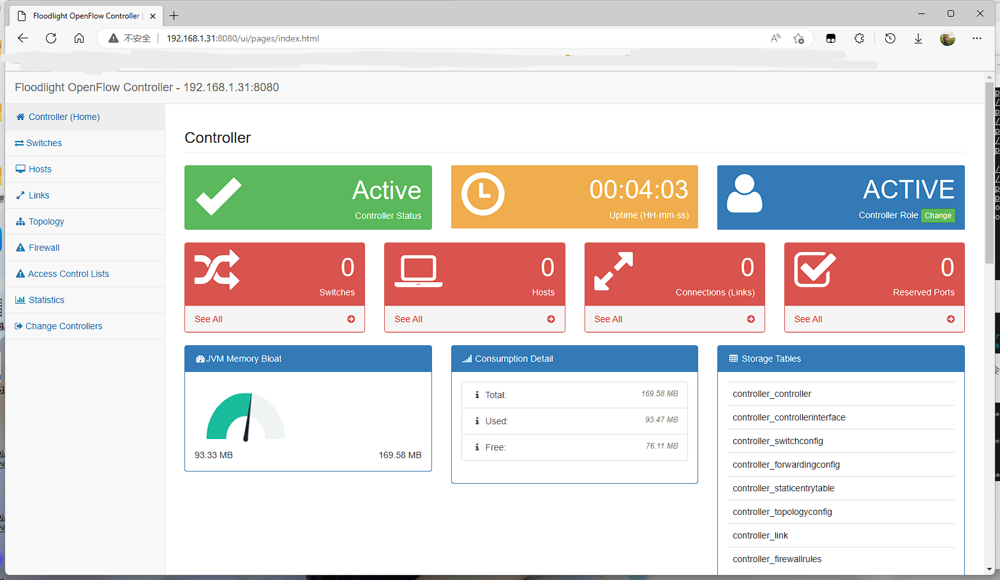
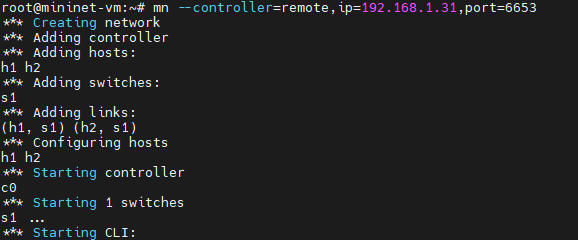
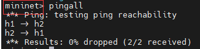

# 准备工作

1. 下载 Mininet ubuntu VMware 系统包，从 [github](https://github.com/mininet/mininet/releases) 获取
2. java8 可以到 [Oracle官网](https://www.oracle.com/java/technologies/javase/javase-jdk8-downloads.html )下载
3. ant 可以从 [apache官网](http://ant.apache.org/bindownload.c)下载
4. manve [apache官网](https://maven.apache.org/download.cgi)
5. floodlight.git.tar.gz 也可以用git clone `git clone git://github.com/floodlight/floodlight.git`

以上内容均可在教学平台下载

# 安装

## 虚拟机

直接用VMware打开Mininet解压得到的后缀为`ovf`的文件即可

设置虚拟机网络连接方式如下图


然后登录系统，为方便操作，使用`sudo su`进入root.

找个路径放java,ant,mave的包，我选择/usr/local/src

使用`chmod 777 -R /usr/local/src`赋权，要不然上传文件可能遇到问题，生产环境慎用。

切换工作目录为`/usr/local/src`

## JAVA

解压

```shell
tar xvf jdk-8u261-linux-x64.tar.gz
```

配置环境变量，编辑`/etc/profile` 在后面追加下面的内容，JAVA_HOME为解压后的路径

```shell
export JAVA_HOME=/usr/local/src/jdk1.8.0_261/
export JRE_HOME=${JAVA_HOME}/jre
export CLASSPATH=.:$JAVA_HOME/lib:$JRE_HOME/lib:$CLASSPATH
export PATH=$JAVA_HOME/bin:$JRE_HOME/bin:$PATH
```

重载配置文件

```shell
source /etc/profile
```

检验,输入`java`有一对输出则安装成功。

## maven

解压

```sh
unzip apache-maven-3.6.3-bin.zip
```

没有unzip就运行`apt-get install unzip` 装一个,下载慢就整个机场吧。


```
export MAVEN_HOME=/usr/local/src/apache-maven-3.6.3/
export PATH=$PATH:$MAVEN_HOME/bin
```

重载配置文件

```shell，
source /etc/profile
```

检验，输入 `mvn -version`,

## ant

同上

```shell
export ANT_HOME=/user/local/src/apache-ant-1.9.15
export PATH=$ANT_HOME/bin:$PATH
export CLASSPATH=.:$JAVA_HOME/lib/dt.jar:$JAVA_HOME/lib/tools.jar
```

配置好后就是这样的输出


最后下载Floodlighta所需的其他依赖环境

```shell
apt-get install build-essential python-de
```

## Fllodlight

tips:不要随便更管maven的镜像，我更换了后有些依赖没有。

```shell
tar xvf floodlight.git.tar.gz #解压
mkdir /var/lib/floodlight #创建目录
chmod -R 777 /var/lib/* #赋权
cd /usr/local/src/floodlight #移动到floodlight的目录
git submodule init
git submodule update
mvn install # 使用maven安装，
```

之后会下载依赖，然后build成功。


到target目录下可以看到打包好的jar包


到/usr/local/src/floodlight目录下运行 `java -jar target/floodlight.jar`,在target目录下运行会失败，运行前先查看本机ip，也可以使用`nohup java -jar target/floodlight.jar >> /dev/null &`后台运行


浏览器访问ip:8080/ui/index.html就可以查看到页面了，



如果你是前台运行的jar包，请切换另一个shell,后台运行jar包请继续。

然后运行`mn --controller=remote,ip=192.168.1.31,port=6653`注意ip,




回到控制台，输入pingall




点击右边的topology可以查看拓扑图


可以在此基础上直接进行[实验二](../实验二/index.md) 
