接[实验二](../实验二/index.md) 

## 1查看信息

运行`lsb_release -a`查看OVS安装情况。


检查OVS运行情况`sudo ps -ea|grep ovs`


查看OVS版本`ovs-appctl --versio`

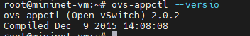

查看OVS支持的Openflow协议版本`ovs-ofctl --vers`


## 2OpenFlow命令操作

### 1

运行下面这三条命令

```shell
#创建一个 OVS 交换机
ovs-vsctl add-br ovs-switch
#创建一个端口 p0，设置端口 p0 的 OpenFlow 端
ovs-vsctl add-port ovs-switch p0 -- set Interface p0 ofport_request=100
#设置网络接口设备类型为internal
ovs-vsctl set Interface p0 type=internal
#查看设置结果
ethtool -i p0
```


创建一个 name space：ns0，把 p0 端口接入到 ns0 里，并且配置 ip 地址 192.168.2.100/24

```shell
ip netns add ns0
ip link set p0 netns ns0
ip netns exec ns0 ip addr add 192.168.2.100/24 dev p0
ip netns exec ns0 ifconfig p0 promisc up
```


查看结果`ovs-vsctl show`：

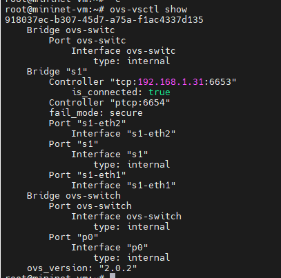

创建p1

```shell
ovs-vsctl add-port ovs-switch p1 -- set Interface p1 ofport_request=101
ovs-vsctl set Interface p1 type=internal
ip netns add ns1
ip link set p1 netns ns1
ip netns exec ns1 ip addr add 192.168.2.101/24 dev p1
ip netns exec ns1 ifconfig p1 promisc up
ovs-vsctl show
```


创建p2

```shell
ovs-vsctl add-port ovs-switch p2 -- set Interface p2 ofport_request=102
ovs-vsctl set Interface p2 type=internal
ip netns add ns2
ip link set p2 netns ns2
ip netns exec ns2 ip addr add 192.168.2.102/24 dev p2
ip netns exec ns2 ifconfig p2 promisc up
ovs-vsctl show
```

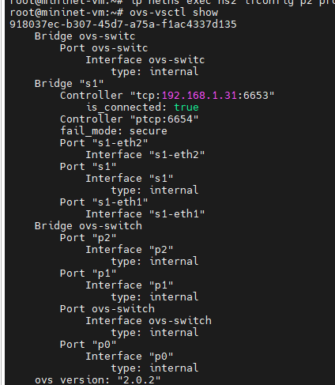

### 2

查看创建的交换机信息，获得dpid,端口，openflow端口编号

```shell
ovs-ofctl show ovs-switch
```


获取Openflow端口编号

```shell
ovs-vsctl get Interface p0 ofport
ovs-vsctl get Interface p1 ofport
ovs-vsctl get Interface p2 ofport
```


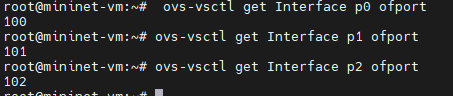

查看 datapath 的信息`ovs-dpctl show`


查看 mac 地址

依次运行以下命令，是ping不通的，ctrl+C取消继续就是，最后一条命令执行后得到如图信息,建议保存，之后要用。

```shell
ip netns exec ns0 ping 192.168.2.100
ip netns exec ns0 ping 192.168.2.101
ip netns exec ns0 ping 192.168.2.102
ovs-appctl fdb/show ovs-switch
```

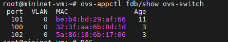

查看交换机所有table,会有一大堆输出

```shell
ovs-ofctl dump-tables ovs-switch
```

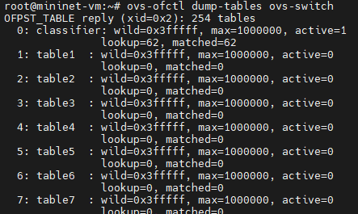

查看交换机中的所有流表项

```shell
ovs-ofctl dump-flows ovs-switch
```


删除编号为100端口上的所有流表项`ovs-ofctl del-flows ovs-switch "in_port=100"`

查看交换机端口信息`vs-ofctl show ovs-switch`

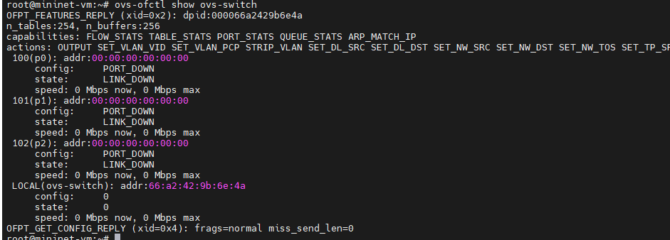

### 3

屏蔽所有进入OVS的以太网广播数据包

```shell
ovs-ofctl add-flow ovs-switch "table=0, dl_src=01:00:00:00:00:00/01:00:00:00:00:00,actions=drop"
```

屏蔽 STP 协议的广播数

```shell
ovs-ofctl add-flow ovs-switch "table=0, dl_dst=01:80:c2:00:00:00/ff:ff:ff:ff:ff:f0,actions=drop"
```

修改数据包，添加新的 OpenFlow 条目，修改从端口 p0 收到的数据包的源地址为 9.181.137.1

```shell
ovs-ofctl add-flow ovs-switch "priority=1 idle_timeout=0,in_port=100,actions=mod_nw_src:9.181.137.1,normal"
```

从端口 p0（192.168.2.100）发送测试数据到端口 p1（192.168.2.101），没啥响应

```shell
ip netns exec ns0 ping 192.168.2.101
```


重新运行上一个命令，再打开一个 ssh 终端，登录进去，运行 tcpdump，需要等待几分钟，才能看到类似如下的响应


回到原来的终端，添加新的 OpenFlow 条目，重定向所有的 ICMP 数据包到端口P2

```shell
ovs-ofctl add-flow ovs-switch idle_timeout=0,dl_type=0x0800,nw_proto=1,actions=output:102
```

从端口 p0 （192.168.2.100）发送数据到端口 p1（192.168.2.101）

```shell
ip netns exec ns0 ping 192.168.2.101
```

到新终端运行下面的命令，继续等待

```shell
ip netns exec ns2 tcpdump -i p2 icmp
```


### 4

修改vlan tag

修改端口 p1 的 VLAN tag 为 101，使端口 p1 成为一个隶属于 VLAN 101的端口

```shell
ovs-vsctl set Port p1 tag=101
```

们使用 ovs-appctl ofproto/trace 生成一个从端口 p0 发送到端口 p1 的数据包，这个数据包不包含任何 VLAN tag，并 观察 OVS 的处理过程,注意，mac地址要替换，第一个是p0的mac地址，第二个是p1的。

```shell
 ovs-appctl ofproto/trace ovs-switch in_port=100,dl_src=32:3f:aa:6b:8d:1d,dl_dst=be:b4:bd:29:af:66 -generate
```


```shell
ovs-appctl ofproto/trace ovs-switch in_port=100,dl_src=32:3f:aa:6b:8d:1d,dl_dst=be:b4:bd:29:af:66 -generate
```

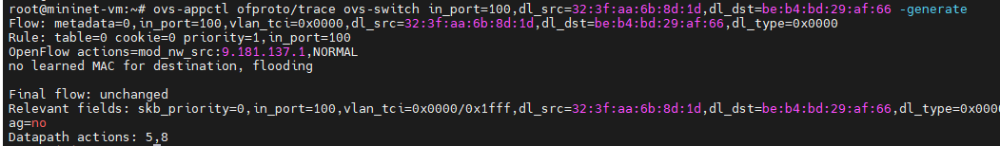

创建一条新的Flow

```shell
ovs-ofctl add-flow ovs-switch "priority=3,in_port=100,dl_vlan=0xffff,actions=mod_vlan_vid:101,normal"
```

再次尝试从端口 p0 发送一个不包含任何 VLAN tag 的数据包，发现数据包进入端口 p0 之后, 会被加上 VLAN tag101, 同时转发到端口 p1 上

```shell
ovs-appctl ofproto/trace ovs-switch in_port=100,dl_src=32:3f:aa:6b:8d:1d,dl_dst=be:b4:bd:29:af:66 -generate
```

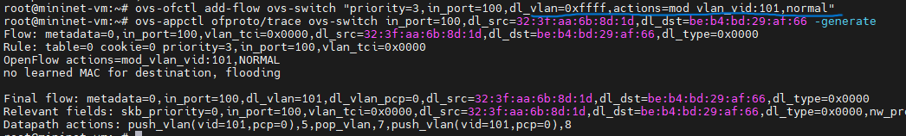

```shell
ovs-ofctl add-flow ovs-switch "priority=3,in_port=100,dl_vlan=0xffff,actions=mod_vlan_vid:101,normal"
ovs-appctl ofproto/trace ovs-switch in_port=100,dl_src=d6:0f:7e:ed:11:e4,dl_dst=f2:0d:06:ff:79:d7 -generat
```


反过来从端口 p1 发送数据包，由于 p1 现在是带有 VLAN tag 101 的 Access 类型的端口，所以数据包 进入端口 p1 之后，会被 OVS 添加 VLAN tag 101 并发送到p0

```shell
ovs-appctl ofproto/trace ovs-switch in_port=101,dl_src=f2:0d:06:ff:79:d7,dl_dst=d6:0f:7e:ed:11:e4 -generate
```


### 5

设置 ovs 的控制器为 floodlight，192.168.1.7，就是 floodlight 虚拟机的ip,然后设置 OVS 的连接模式为 secure模式

```shell
ovs-vsctl set-controller ovs-switch tcp:192.168.1.31:6653
ovs-vsctl set Bridge ovs-switch fail-mode=secure
```

运行`ovs-vsctl show`查看


到web端看到这样的界面

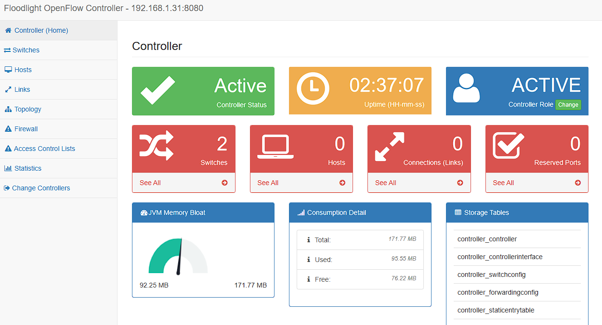

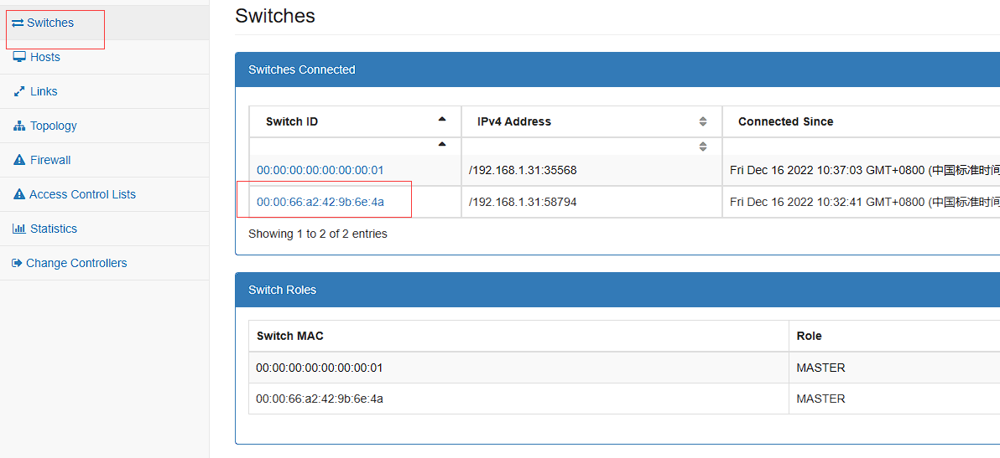

通过 Floodlight 的 RESTAPI，添加两条新的规则让端口 p0 和 p1 可以相互通讯。注意：替换命令行 中的 switch 的 ID 为上一张图片标注的id,另外注意ip，我的是192.168.1.31

```shell
curl -d '{"switch": "00:00:66:a2:42:9b:6e:4a", "name":"my-flow1","cookie":"0","priority":"32768","in_port":"100","active":"true","actions":"output=flood"}' http://192.168.1.31:8080/wm/staticflowentrypusher/json
```


```shell
curl -d '{"switch": "00:00:66:a2:42:9b:6e:4a", "name":"my-flow2","cookie":"0","priority":"32768","in_port":"101","active":"true","actions":"output=flood"}' http://192.168.1.31:8080/wm/staticflowentrypusher/json
```

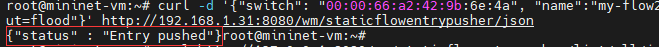

```shell
curl http://127.0.0.1:8080/wm/staticflowentrypusher/list/all/json | python -mjson.tool
```

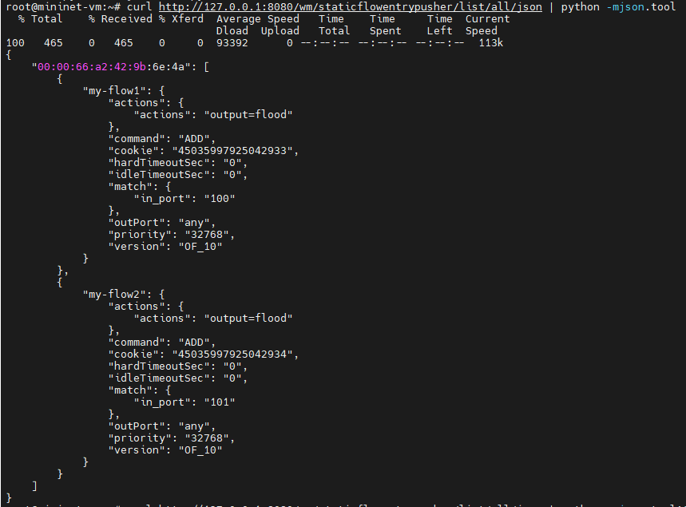

清楚所有流表操作和结果是:<font color='red'>(这条命令不要运行)</font>:

```shell
curl http://192.168.1.7:8080/wm/staticentrypusher/clear/all/json
```


验证是否能从端口 p0 发送数据包到 p1<font color='red'>(注意替换ip)</font>

```shell
 ip netns exec ns0 ping -c4 192.168.2.101
```


在 OVS 端也可以看到，流表规则已经被 OVS 同步到本地

```shell
ovs-ofctl dump-flows ovs-switch
```


通过 Floodlight 的 RestAPI，查看交换机上的流<font color='red'>(注意替换ip和switch id)</font>

```shell
curl http://192.168.1.31:8080/wm/staticflowentrypusher/list/00:00:00:00:66:a2:42:9b:6e:4a/json |python -mjson.tool
```

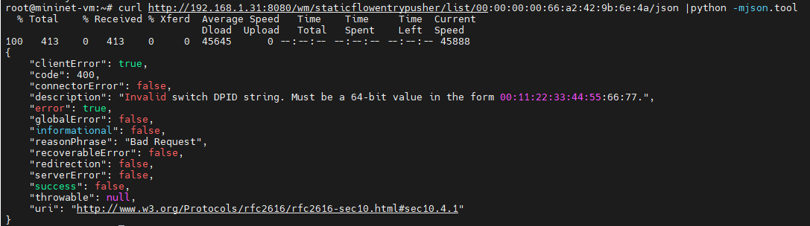

通过 Floodlight 的 RestAPI，删除交换机上的流表规则<font color='red'>(注意替换ip和switch id)</font>

```shell
curlhttp://192.168.1.31:8080/wm/staticflowentrypusher/clear/00:00:00:00:66:a2:42:9b:6e:4a/json
```

