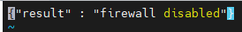
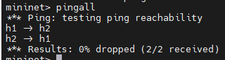
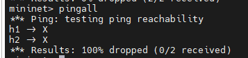
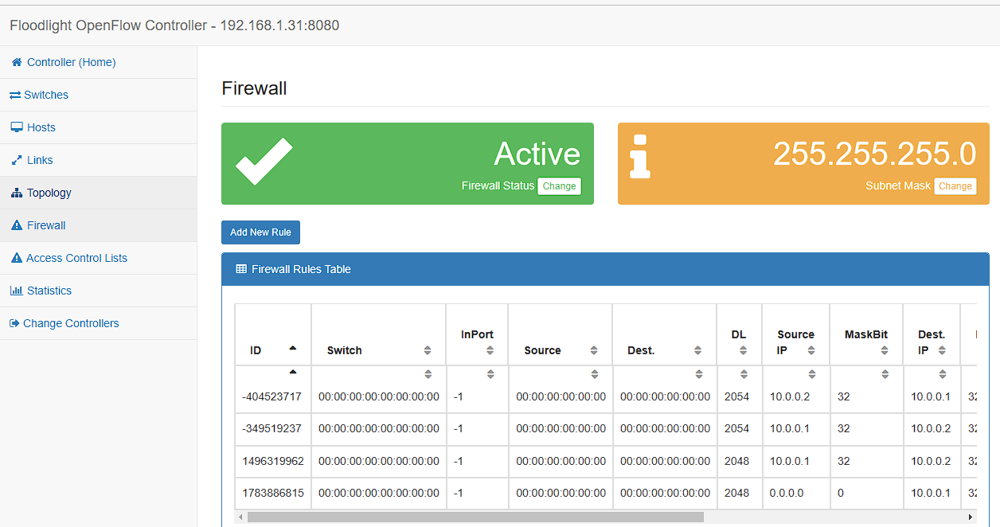
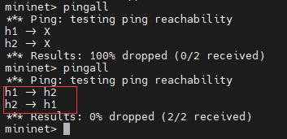

接[实验一](../实验一/index.md)继续做。

## 实验验证

1. 

使用`curl http://localhost:8080/wm/firewall/module/status/json` 查看防火墙关闭情况



没有crul使用`apt-get insall curl`安装，安装慢可以参看[Ubuntu apt 更换为国内软件源](https://blog.csdn.net/c417469898/article/details/106412160)

2. 在mininet中运行 `pingall`



h1,h2可以互相ping通

3. 开启防火墙

   ```shell
   curl http://localhost:8080/wm/firewall/module/enable/json -X PUT -d ''
   ```

   再到mininet中运行`pingall`

   

   h1,h2无法相互ping通

4.

加入允许h1h2相互ping通的规则

运行下面的命令

```shell
curl -X POST -d '{"src-ip": "10.0.0.1/32", "dst-ip": "10.0.0.2/32","dl-type":"ARP" }' http://localhost:8080/wm/firewall/rules/json
curl -X POST -d '{"src-ip": "10.0.0.2/32", "dst-ip": "10.0.0.1/32","dl-type":"ARP" }' http://localhost:8080/wm/firewall/rules/json
curl -X POST -d '{"src-ip": "10.0.0.1/32", "dst-ip": "10.0.0.2/32","nw-proto":"ICMP" }' http://localhost:8080/wm/firewall/rules/json
curl -X POST -d '{"dst-ip": "10.0.0.2/32", "dst-ip": "10.0.0.1/32","nw-proto":"ICMP" }' http://localhost:8080/wm/firewall/rules/json
```

进入网页端看到以下内容



此时再mininet中运行pingall 发现h1,h2可以ping通



可以继续完成[实验三](../实验三/index.md) 